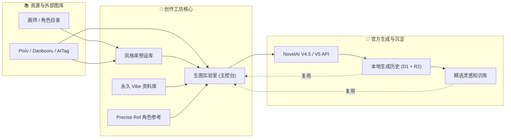
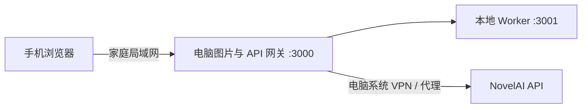
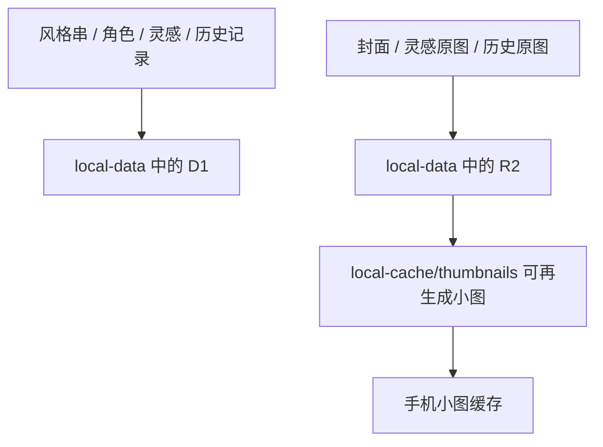

<div align="center">
  

  # NAI Atelier

  **面向 NovelAI 的个人本地创作工坊**

  [](./CHANGELOG.md)
  [](https://novelai.net/)
  [](#-本地数据与图片存储)
  [](#-手机局域网访问)
  [](./LICENSE)

  [项目定位](#-项目定位) · [界面预览](#-界面预览) · [核心能力](#-核心能力总览) · [功能地图](#-功能地图) · [创作工作流](#-核心创作工作流) · [资源资料库](#-tag-与资源资料库) · [SillyTavern 互通](#-sillytavern-互通nai-atelier-连接器) · [手机访问](#-手机局域网访问) · [数据存储](#-本地数据与图片存储) · [数据备份](#-备份与恢复) · [更新日志](./CHANGELOG.md)

  > NAI Atelier 基于 [kirafishy/NaiPromptManager](https://github.com/kirafishy/NaiPromptManager) 二次开发并独立维护，面向本地单人使用；原项目见上方链接。
</div>

---

## 🧭 项目定位

NAI Atelier 是一套运行在个人电脑上的 NovelAI 创作工坊。它不是单纯的 Prompt 输入框，而是围绕长期个人使用建立的完整工作流：

> **收集画师与角色 → 组合 Prompt → 调用 NovelAI → 保存原图和参数 → 整理历史与灵感 → 在电脑和手机之间继续使用。**

> [!IMPORTANT]
> **适用范围：本项目仅面向 NovelAI Opus 档位订阅会员。** 费用估算、免费额度判定、Opus 限额显示与免费门槛逻辑均按 Opus 档位设计；其他订阅档位（Paper / Tablet / Scroll）与第三方中转服务**未做适配**——非 Opus 档位下"免费"判定与实际扣费可能不符，请勿依赖本项目显示的免费标识。

当前版本的四个核心原则：

| 原则 | 含义 |
| :--- | :--- |
| 🖥️ **电脑是数据主机** | 原图、数据库、历史、风格串和角色资料都以电脑为准 |
| 🏠 **只服务个人与家庭局域网** | 电脑本机免密，手机使用四位密码，不开放公网 |
| 🧩 **功能围绕创作工作流组织** | 画师、角色、Tag、Pixiv、Danbooru、AITag、实验室、历史和灵感可以互相导入与复用 |
| 📚 **资料库可自生长** | 画师目录、角色目录、灵感库都由使用过程持续沉淀，不再依赖外部静态数据 |

---

## 🖼️ 界面预览

> [!NOTE]
> 为保护创作者隐私，所有界面预览均在开启全局安全模式（自动虚化图片与占位符保护）状态下截取；点击预览图可查看高清原图。

### 🖥️ 桌面端：全功能创作工坊

| 🎨 风格串与创作预设资产库 | 🧪 生图实验室与项目 Agent 联动工作台 |
| :---: | :---: |
| [](./docs/screenshots/desktop-presets-gallery.webp) | [](./docs/screenshots/desktop-lab-agent.webp) |
| *自适应比例瀑布流、封面固定、模块化提示词管理* | *调参控制台、官方免费尺寸适配、深度图像观察与 Agent 工具联动* |

<div align="center">
  <p><strong>🗃️ 外部作品检索与参数反查（AITag）</strong></p>
  <a href="./docs/screenshots/desktop-aitag-browser.webp">
    
  </a>
  <p><em>全量 NovelAI 作品检索、完整生成参数反推、一键导入工坊</em></p>
</div>

### 📱 手机端：家庭局域网移动端触控界面

<div align="center">
  <a href="./docs/screenshots/mobile-touch-ui.webp">
    
  </a>
  <p><em>44px 触控热区、底部固定单手手势导航、全模式三段式 Tab 流程、电脑端系统 VPN 与数据直通</em></p>
</div>

---

## ⚙️ 核心能力总览

| 能力 | 说明 |
| :--- | :--- |
| 🔑 免账号启动 | 无账号体系，启动后直接使用，数据全部落在本机 `local-data` |
| 🗄️ 多密钥保管箱 | 多把 NovelAI Key 本地命名保管、随时热切换、失效/格式感知，独立跟踪每个 Key 的 Anlas 预算 |
| 🕘 生图历史 | 生成原图与完整参数保存在电脑本地 D1 + R2，浏览器清空后仍保留，按追加式瀑布流连续浏览 |
| 📱 手机访问 | 家庭局域网、四位密码、30 天授权、独立手机 UI，图片经电脑缩略图网关 |
| 🌐 外部图库三件套 | **Pixiv**（原站全量作品、榜单、画师主页）、**Danbooru**（通用级素材与 Tag 参考）、**AITag**（AI 作品与生成参数），统一瀑布流浏览与一键导入 |
| 🔐 Pixiv 网页登录 | 适配 Pixiv 官方 OAuth 流程（含新版 `pixiv://` 回调），登录后 refresh token 加密保存本机，浏览器与图库全链路可用 |
| 🧰 图片反推 Tag | 本地 WD Tagger 模型识别，图库任意图片一键反推，结果可复制或直接送往实验室 |
| 📚 Tag 与权重交互 | 31 万余条中英 Tag 本地分片、连续权重胶囊一体式调节、多选自动组合数值组、Agent 极速补译缺失项 |
| 🎨 封面体系 | 画师/角色封面从 Danbooru 候选图选取、图钉固定保存；封面缩略图固定本地保留，不受缓存上限淘汰 |
| ⚡ 图库加载优化 | 缩略图后台预热（滚动即缓存命中）、固定封面本地持久化、瀑布流真实比例显示、提前两屏预取 |
| 🌌 Vibe Transfer | 付费编码一次、本地永久保存、1～4 个组合、官方文件导入导出 |
| 🧬 Precise Reference | 电脑保存参考原图、三种官方参考类型、最多 4 张并准确计算费用 |
| 🚦 拼车公共队列 | 与 st-chatu8 按相同 Key 指纹协调生图顺序，减少共享账号并发错误 |
| 🔗 SillyTavern 互通 | 仓库收录「NAI Atelier 连接器」扩展，智能检测酒馆目录、一键安装/更新/导出，杜绝跨域阻断与死循环 |
| 🛡️ 安全模式 | 全局遮挡图片，作品名称可按设置选择是否同时隐藏，并可设置启动时默认开启；点击后临时显示 |
| ✦ 项目 Agent | 用 DeepSeek、Gemini、Grok 等模型查看历史图片并操作资料库、设置、实验室与生图流程 |

### 整体架构



---

## 🗺️ 功能地图

| 页面 | 核心用途 | 可以流向哪里 |
| --- | --- | --- |
| 🎨 **风格串** | 保存可复用画风、模块、参数和封面 | 实验室、其他预设 |
| 👤 **角色库** | 查找官方角色 Tag，维护自定义角色外貌还原 | 实验室、自定义角色 |
| 🖌️ **画师 Tag** | 搜索、排序、收藏、抽卡和生成画师基准图 | 画师组合、实验室 |
| 🗃️ **AITag** | 检索外部 AI 作品，缓存图片与元数据 | 实验室、风格串、灵感 |
| 🖼️ **Danbooru** | 检索通用级图片与分类 Tag，补全画师和角色预览 | 实验室、灵感 |
| 🎌 **Pixiv** | 原站全量作品：推荐、日/周/月榜、Tag 搜索、画师作品 | 实验室、灵感、反推 |
| 💡 **灵感** | 保存值得复用的图片、提示词和参数 | 实验室 |
| 🧪 **实验室** | 组合提示词、引用预设、生成与预览 | 历史、风格串、下载 |
| ✦ **项目 Agent** | 用 DeepSeek、Gemini、Grok 等模型查看历史图片并操作资料库、设置、实验室与生图流程 | 整个项目 |
| 🌌 **Vibe Transfer** | 永久保存 NovelAI 画风编码并组合强度 | 实验室、风格串、历史 |
| 🧬 **角色参考** | 保存人物参考图并使用 NovelAI Precise Reference | 实验室、风格串、历史 |
| 🚦 **拼车公共队列** | 与 st-chatu8 按相同 Key 指纹协调生图顺序，减少共享账号并发错误 | 全部生图入口、电脑与手机 |
| 🕘 **历史** | 管理电脑保存的生成原图和完整参数 | 实验室、灵感、下载 |
| ⚙️ **全局设置** | 管理主题、安全模式、启动偏好、API Key、Tag 词库和手机缓存 | 全项目生效 |

---

## 🧪 核心创作工作流

### 风格串：可复用的创作预设

风格串是项目的核心数据结构，用于把一套可复用的创作配置保存下来。

每个风格串可以包含：

- 基础画风 Prompt
- 可单独开关的提示词模块
- 主体或变量 Prompt
- 全局负面 Prompt
- 多角色 Prompt 与角色专属负面 Prompt
- 尺寸、Steps、CFG、采样器、Seed 等参数
- 封面、名称、说明和分类 Tag

风格串并不是单纯的“画师名字列表”，它更接近一份可以不断修改、组合和引用的 NovelAI 创作预设。

### 生图实验室：组合与验证中心

实验室负责把资源库中的内容真正组合成一次生成请求。

#### 全局内容

- 基础画风
- 提示词模块
- 主体、场景和变量内容
- 全局负面 Prompt

#### 角色内容

- 多角色管理
- 每个角色的正面与负面 Prompt
- AI 自动构图或手动坐标
- 角色预设导入
- Precise Reference 角色参考：角色、画风、角色与画风三种模式

#### 参数与预览

- 图片尺寸支持竖屏、横屏、方形与 64 像素步进的自定义宽高；可联动另一边，最大化利用 Opus 免费像素范围并实时显示总像素
- 图生图、局部重绘与扩图支持上传、从历史选择或直接拖入 PNG／JPEG／WebP 底图，尺寸不符合编辑接口时提供规范化处理
- 图片编辑使用独立的整图提示词，不会携带文生图中的多角色提示词与坐标
- 采样器、Steps、CFG、CFG Rescale、Variety+ 和 Seed
- NovelAI V4.5 正面质量标签与负面预设
- 生成结果预览、本地历史切换、下载和封面设置
- 从 NovelAI PNG / JSON 元数据恢复 Prompt、对应模型与参数；可在全局设置中选择自动拆分风格与主体，或使用单一“全局提示词”原样导入

### 📌 预设引用：按板块记录来源

引用功能位于编辑器右上角，是全局操作，而不是“基础画风”的附属按钮：

- **细粒度多来源追踪**：可以引用画风、人物、模块、角色、负面 Prompt 和参数，各板块分别记录自己的来源。
- **多预设追加融合**：追加多个预设时可同时显示并管理多个来源。
- **修改状态显式标记**：手动编辑引用内容后，对应来源标记为“已修改”。
- **上下文自动清理**：重置、切换串或导入完整配置时，自动清理不再适用的来源信息。

### 🕘 生成历史：每一次生成都可追溯

- **全量无损归档**：自动保存生成原图、Prompt、负面 Prompt、Seed 和完整参数，直接落盘电脑本地 D1 + R2，不依赖易失效的浏览器缓存。
- **流畅检索与筛选**：支持即时刷新、日期范围筛选、分页、跳页和失败快速重试。
- **批量与清理**：支持单张删除、批量勾选删除、清理过期旧历史和一键清空全部。
- **创作中转站**：历史图片可一键重新导入实验室、标记收藏、加入灵感库或下载原图；历史收藏用于零摩擦标记，加入灵感库后再做系统归档。

### 💡 灵感库：可复用的创作知识库

- **收件箱与资料库分离**：历史收藏作为轻量标记收件箱，灵感库作为精选创作资料库，支持保存标题、图片、完整 Prompt 与参数。
- **多维分类整理**：支持灵感板、标签、备注、评分、置顶和归档，支持智能分类与多维组合搜索。
- **零存储冗余**：从历史或已缓存 AITag 加入时直接复用原图存储，不重复占用磁盘空间。
- **灵感辐射复用**：同一张灵感图可继续一键创建风格串、角色参考、Vibe 编码，或设为现有风格串封面；详情自动推荐相似灵感并记录使用频次。

### ✦ 项目 Agent：业务联动多会话工作台

桌面侧栏、手机资源库和实验室右上角均可打开基于 [pi.dev](https://pi.dev/) 轻量核心的项目 Agent。它不是一个需要手动复制 Prompt 的旁路聊天框，而是能直接读取电脑中的项目资料、观察历史原图并调用工坊业务工具的智能助理。

#### 智能模型与凭据管理
- **模型与供应商对接**：遵循 pi 官方 `/login → /model → /logout` 规范，直接接入主流 LLM（DeepSeek、Gemini、Grok、OpenAI、Claude 等）或自定义兼接口，并在设置中按模型模糊搜索。
- **自动化能力探测**：自定义接口“获取模型”优先读取返回的模态元数据并保守推断，自动识别识图、推理、上下文长度与输出限制。
- **本地安全加密**：LLM API Key 采用 AES-256-GCM 加密存储于 `local-data`（密钥文件 `local-data/prompt-agent.key`），局域网重置密码不失效，且密钥绝不写入浏览器或回传移动端。
- **安全请求头注入**：自定义接口支持安全附加头（如 `HTTP-Referer`），敏感鉴权头严格走加密存储，避免明文泄露。

#### 独立全局多会话工作台
- **跨端持久对话**：多会话工作台独立于具体风格串，支持新建、重命名、搜索与删除；电脑与手机局域网可无缝接续同一会话。
- **独立参数记忆**：每个会话独立记忆供应商、模型、思考强度（Thinking），并在顶部展示实际 Token 消耗、模型费用与停止原因。
- **交互控制与回放**：支持 Steering（转向当前任务）与 Follow-up（完成后继续）；支持编辑任意历史消息并重新执行、重新生成回答与单步回退快照；任务事件批量异步落盘，断线重连支持完整回放。

#### 多模态视觉图像观察
- **图片附件支持**：输入框支持直接附加最多 4 张图片（PNG/JPEG/WebP/GIF），图片由电脑端安全处理，手机端不缓存原图。
- **智能视觉眼分工**：主文本模型缺乏识图能力时，自动匹配同供应商或跨服务的多模态视觉模型作为“眼睛”，先行提炼视觉特征再交由主模型推理。
- **生成历史深度观察**：Agent 可直接读取电脑本地生成历史的真机原图；能够先比对观察上一张图的构图缺陷，再精准修改用户指定的局部 Prompt 或画风。

#### 全项目业务工具联动
- **全方位资产搜索与维护**：可查询并更新本地 Tag、风格串、角色库、画师资料、灵感库、AITag、永久 Vibe 与 Precise Reference。
- **生成参数与实验室调优**：精准调整基础画风、主体、负面词、提示词模块、多角色坐标、采样器与 Seed，未涉及的高级参数安全保留。
- **工坊全局控制**：支持切换界面主题、安全模式遮罩、图片布局与手机缓存，并在任务完成后自动导航至目标页面。

#### 安全沙盒与事务提交
- **纯业务沙盒**：Agent 仅具备项目提供的结构化业务工具，严禁接触本地文件系统、命令行、系统进程或浏览器底层；联网能力仅限本轮搜索提取的公网 HTTPS 页面，阻断内网与私有端口。
- **危险与付费确认握手**：删除历史、清空资料、Vibe 编码与真实生图等消耗 Anlas 的操作，必须由用户在前端确认面板明确点击通过后才可执行，严防误触。
- **事务性隔离提交**：实验室修改先在隔离草稿中完成全部步骤，成功且无外部编辑冲突时一次性应用，避免留下半成品改动。

### 🌌 永久 Vibe Transfer：编码一次，长期复用

实验室“全局”页内置永久 Vibe 资料库。它会调用 NovelAI V4.5 Full 的 Vibe 编码接口，将参考图转换成不可逆编码；每个新的 Information Extracted 数值编码一次需消耗 **2 Anlas**，以后使用该编码生图不再重复支付编码费用。

- 上传 PNG、JPEG 或 WebP，默认以 `Information Extracted = 1.00` 建立永久编码。
- 每次产生新编码前都使用项目内确认面板明确显示 **2 Anlas**，不提供跳过提醒。
- 同一原图、模型与提取量通过 SHA-256 去重；重复选择直接复用，快速重复点击也只会建立一个付费任务。
- 同一个 Vibe 可追加其他提取量变体；不含原图的编码型 Vibe 仍可生成，但不能追加变体。
- 一次可启用 1～4 个 Vibe，每个独立设置 Strength；总强度超过 1 时默认按比例归一化。
- 支持命名组合、载入、覆盖、重命名、另存和删除组合；组合删除不会删除 Vibe 编码。
- 支持导入与导出官方 `.naiv4vibe`，未知模型编码会保留，等待未来兼容。
- “删除”采用归档：资料库暂时隐藏资产，但风格串和历史中的旧快照仍能继续复现。
- 风格串、实验室预设和生成历史保存独立选择快照，之后修改全局组合不会反向改变旧配置。
- 手机只读取电脑生成的缩略图；生图时由电脑直接读取永久编码并请求 NovelAI，手机不下载原图或编码，也不需要单独开启 VPN。

原图、缩略图、编码、组合与恢复记录均位于电脑的 `local-data` 持久化区域。若 NovelAI 已完成付费编码、但本地数据库在最后一步暂时写入失败，网关会先把结果保存到 `local-data/vibe-recovery`，重启后自动完成入库，避免再次付费。

### 🧬 Precise Reference：每次生图的角色与风格参考

实验室“角色”页内置 NovelAI 官方所称的 **Precise Reference**。参考图原件保存在电脑，手机列表只读取缩略图；生图时由电脑读取原图、适配官方画布并组装请求，手机无需保存原图或单独开启 VPN。

- 支持 `角色`、`画风`、`角色与画风` 三种官方类型，一次最多选择 4 张。
- 每张参考图、每张生成图固定额外消耗 **5 Anlas**；生成按钮和确认面板会显示本次费用明细，成功后才扣除项目内预算。
- 每张图分别设置 Strength 与 Fidelity；高级数字输入支持 `-1.00～2.00`，Fidelity 会按官网协议转换为 secondary strength。
- 参考图会自动旋转，并按比例放入最接近的官方竖图、方图或横图画布，不会被强制拉伸。
- 角色参考与 Vibe Transfer 按 NovelAI 当前限制双向互斥：启用其中一个会关闭另一个。
- 多张非纯画风参考会被 NovelAI 混合为一个角色，不代表多个参考图自动对应多个独立人物；界面会明确提醒。
- 风格串、灵感和历史随完整参数保存参考 ID、名称、类型和数值快照；归档只从默认资料库隐藏，不会删除旧记录。
- Agent 只能选择电脑资料库中已经存在的参考 ID，也可以把项目生成历史中的原图保存为新的角色参考，不能借此读取任意网址或文件。

### 🚦 多人拼车公共队列

全局设置的 NovelAI 连接区域可以启用与 st-chatu8 兼容的公共队列。使用相同 NovelAI Key、并接入同一公共服务的客户端会进入同一条生成队列；轮到当前任务后，电脑才通过自己的网络和 VPN 请求 NovelAI。

- 队列服务只接收 Key 的 SHA-256 指纹、随机客户端标识、任务标识和可选个性语，不接收原始 Key、Prompt、参考图、Vibe 编码或生成结果。
- 设置页可以修改公共队列服务地址，默认保留现有的 `https://st-chatu-novelai-queue.hf.space`；也可填写自行部署的兼容服务。
- 排队位置、当前使用者个性语和取消入口会显示在全局状态条；获得许可后自动开始生成。
- 设置保存在电脑 `local-data`，因此电脑和通过局域网连接的手机统一生效。
- 公共队列不可用时停止本次请求并明确报错，不会静默绕过队列产生并发冲突。
- 该机制只能协调已经接入公共队列的客户端；直接使用 NovelAI 官网或未接入队列的软件仍不受控制。

---

## 📚 Tag 与资源资料库

### Tag 自动补全、权重胶囊与中文词库

项目内置 31 万余条本地 Tag 数据（中英对照与画师/角色目录源自 [ffdkj-Danbooru_Tag-Chinese-English-Translation-Table](https://github.com/ffdkj/ffdkj-Danbooru_Tag-Chinese-English-Translation-Table) 的 tag.sqlite，NovelAI 专属 Tag 来自官方列表；详见[来源与许可](#-来源与许可)）：

- **海量词库与即时补全**：Danbooru 中英对照 Tag、NovelAI V4.5 专属 Tag，支持中英双向前缀实时搜索、热度提示与中文解释插入。
- **一体式连续权重胶囊**：编辑器内 Tag 呈现为可视化胶囊，集成滑动与步进增减权重，直观指示强化 `{}`、弱化 `[]` 或精准数值权重。
- **多选自动组合数值组**：支持批量选中多个 Tag 一键打包为带括号或统一系数的数值权重组，调节整体氛围更高效。
- **底栏三选一类型转换**：支持在「正面提示词 / 负面提示词 / 前缀 (Prefix)」三态间一键快速转换词条归属。
- **AI 智能缺失项补译**：遇到未收录的新生 Tag 或复杂短语时，可唤起后台/本地 LLM 极速补齐中文翻译，并自动持久化写入本地增量翻译缓存（`tag-translations.json`）。

词库按前缀拆分成小型 JSON 分片，只加载当前搜索需要的部分。补全菜单支持鼠标滚轮、触摸滑动、键盘上下选择；手机端使用双击确认，避免滑动时误选。

#### 更新方式

可以在“全局设置 → Tag 补全词库”中检查更新，也可以运行：

```bash
npm run update:tags
```

更新流程会检查上游版本、下载数据库、生成中英分片并自动应用。GitHub Raw 不稳定时会重试并切换到 jsDelivr；更新失败不会覆盖当前可用词库。

### 画师 Tag：自维护画师目录

当前画师目录不再依赖长期未维护的 `twoearcat/nai-artists` 静态图片仓库。

#### 目录能力

- 约 14.6 万画师 Tag
- 中文名称与英文 Tag 搜索
- Danbooru 关联作品数作为热度
- 热度升序、热度降序、名称 A–Z 和 Z–A
- 每批 500 条滚动加载，不一次渲染完整目录
- 收藏、批量选择、画师权重组合和 `artist:` 前缀控制

#### 随机抽卡

- 每次抽取 6、12 或 24 位画师
- 惊喜混合、完全随机、热门画师三种卡池
- 最近五批自动避重
- 返回目录时恢复原来的滚动位置

#### 预览生成

目录数据本身不预存全部图片。缺少预览时，可以使用 NovelAI V4.5 按统一测试 Prompt 生成基准图；只有生成成功后才保存画师记录与本地预览。

### 角色库：官方 Tag 与手工还原并存

角色库包含两类内容：

1. **官方角色 Tag**：NovelAI / Danbooru 已收录的标准角色名。
2. **自定义还原角色**：没有官方 Tag 时，手工组合外貌、服装和特征 Prompt。

#### 搜索能力

- 中文名、英文 Tag、作品名与括号变体
- 多关键词组合，例如“原神 胡桃”“碧蓝档案 泳装”
- 相关性优先，再按热度或名称排序
- 显示搜索命中的字段来源

#### 角色操作

- 收藏、复制、生成预览和导入实验室
- 官方角色可跳转 Danbooru
- 自定义角色可编辑外貌还原内容
- 支持混合、仅官方 Tag、仅自定义角色三种抽卡范围

### AITag：外部作品与生成参数资料库

AITag 是连接 [aitag.win](https://aitag.win/) 的独立作品检索、缓存与参数复用系统，不是普通图片墙。

#### 检索与目录

- 每页读取 60 个带 Pixiv 信息和 AI 元数据的作品
- 搜索作品 ID、作者 ID、标题、Tag、日期和模型
- 只检索 NovelAI 来源作品，不混入 Stable Diffusion 或 ComfyUI 内容
- 单独搜索 NovelAI 元数据中的 Prompt
- 浏览最新作品或月榜
- 选择当前月份、历史月份和更早目录

#### 本地索引与离线缓存

- 默认渐进索引最多 500 页，每次只同步少量页面
- 分别记录作品摘要、详情、首图和完整图片缓存状态
- 卡片用不同色调表示未缓存、已缓存首图和已缓存全部
- 按收藏、首图缓存或完整缓存过滤
- aitag.win 暂时不可用时自动切换到本地缓存
- 已缓存的作品、详情和图片在离线状态下仍可浏览

#### 元数据识别

作品详情会显示全部图片，并尝试识别：

- 使用模型
- 文生图（Text to Image）
- 图生图（Image to Image）
- 局部重绘（Inpainting）
- Vibe Transfer
- 角色参考（Character Reference）
- Prompt、负面 Prompt、尺寸、Seed、Steps 和采样器

#### 三条复用路径

| 操作 | 结果 |
| --- | --- |
| **导入实验室** | 把识别出的 Prompt 和参数带入实验室继续生成 |
| **保存到风格串** | 把图片、Prompt、负面 Prompt 和参数保存为可编辑预设 |
| **加入灵感库** | 把图片、完整生成配置和 AITag 来源存进个人灵感库，之后继续分类与复用 |

详情中保留 aitag.win 和 Pixiv 原作品入口，便于回到来源核对。

### Danbooru：通用级素材与 Tag 参考

Danbooru 页面连接 `safebooru.donmai.us`，只展示其通用级作品，并保留原帖来源入口。它适合查构图、角色、画师和标准 Tag，不等同于把外部图片收归项目所有。

- 支持英文 Tag、中文精确匹配和最多两个 Tag 的组合检索；中文会先匹配项目本地中英词典，再转换为 Danbooru 标准 Tag。
- 详情按画师、作品、角色、通用和元 Tag 分类展示，可复制或把角色与通用 Tag 追加到实验室。
- 画师 Tag 和角色 Tag 卡片可左右切换查看同一精确 Tag 的全部可用候选图，按 Danbooru 热度降序逐页加载；角色候选会继续排除多人图、漫画、文字梗、玩偶和特殊服装等干扰。首次默认图即为热度最高的合格候选；选中某张候选后可点右上角图钉设为固定封面，图片会保存到项目自己的存储中。老师、提督等没有可靠单人形象的泛角色宁可留空，不强行误配；候选结果缓存 14 天。
- 外部图片经过电脑媒体网关提供给局域网设备，并继续受全局安全模式的模糊规则控制。

### 图片反推 Tag：本地 WD Tagger

实验室的图片导入栏可以选择 PNG、JPEG 或 WebP，让电脑本地反推 Danbooru 风格 Tag。首次使用会下载约 379 MB 的 `SmilingWolf/wd-vit-tagger-v3` 模型到被 Git 忽略的 `local-cache/models`，以后直接复用；图片只在自己的电脑上用 CPU 推理，不上传给第三方识图服务。结果可以调整通用 Tag 与角色 Tag 阈值、按置信度筛选，再追加到实验室主体 Prompt。

- **图库一键反推**：Pixiv、Danbooru、AITag 详情里的任意图片都可以直接反推（经本机媒体网关读取，无需先下载到本地）。
- **送往实验室**：任何页面反推完成后，选中 Tag 可一键写入实验室主体 Prompt 并自动跳转。

### Pixiv 图库：原站全量作品浏览

Pixiv 页面连接 Pixiv 官方 App API，提供推荐、日榜、周榜、月榜、标签搜索与画师作品浏览，作品详情可切换多页、查看标签与画师、跳转原站。

- **登录**：在默认浏览器（推荐 Edge 等已登录账号的浏览器）完成 Pixiv 官方 OAuth 登录，NAI Atelier 自动捕获新版 `pixiv://` 回调并换取令牌；refresh token 以独立密钥 AES-256-GCM 加密保存在本机 `local-data`，重启免登录，断开后重新登录即可。
- **瀑布流浏览**：卡片按作品真实宽高比显示、零裁剪，滚动接近底部自动连续追加，支持游标无限翻页（推荐流的 `viewed[]` 去重列表自动裁剪，翻页不设上限）；分页器保留为显式跳转工具（游标 API 无页码概念，仅搜索类不可跳页）。
- **导入与沉淀**：详情可直接导入实验室、加入灵感库、进入该作者全部作品、打开 Pixiv 原站；任意图片可一键反推 Tag。
- **图片来源**：所有图片经本机媒体网关抓取（自动携带官方 Referer），缩略图后台预热并写入磁盘缓存，浏览时缓存命中秒出；图片受全局安全模式控制。

---

## 🔗 SillyTavern 互通（NAI Atelier 连接器）

项目可以与本机（如 `D:\SillyTavern`）及局域网中的 [st-chatu8](https://github.com/damoshen123/st-chatu8) 无缝配套使用。

### 扩展简介与一键安装

- **NAI Atelier 连接器（NAI Atelier Connector）**：项目内置配套扩展（源码位于 `third-party/sillytavern-extension`，平滑兼容并自动清理旧版 `npm-bridge`）。
- **智能路径检测**：控制台与网关自动嗅探本机标准安装路径（`D:\SillyTavern`、`C:\SillyTavern`、上级工作区等），无需手工翻找扩展目录。
- **一键安装与更新**：在前端设置中可一键将连接器安装/更新至 SillyTavern 扩展库；对于跨设备或容器环境，亦支持一键导出离线 ZIP 安装包。
- **自动化双向桥接**：启动后由电脑图片网关提供受限桥接接口自动同步，也可在 SillyTavern 的扩展面板中随时点击“立即同步”。

### 数据同步内容与规则

| 数据 | 方向 | 规则 |
| :--- | :--- | :--- |
| 风格串 Prompt | 双向 | 同名或已关联资料冲突时以 st-chatu8 为准 |
| 风格串配图 | 双向 | 保留原封面；只有图片真正变化时才重新上传 |
| 永久 Vibe | 双向 | 按原图二进制 SHA-256 去重，避免不同导出器 ID 造成重复 |
| Vibe 组合 | 双向 | 使用 st-chatu8 的组合结构作为权威来源 |
| 生图历史 | st-chatu8 → 本项目 | 只索引原图，不导入 `thumbnail_path` 缩略图 |

NAI Atelier 独有的新风格串可以先同步到 st-chatu8；一旦进入 st-chatu8，后续修改和冲突判断都以 st-chatu8 数据为准。这样在 SillyTavern 聊天生图和本项目实验室之间切换时，不需要手工复制风格串或 Vibe。

### 图片与磁盘存储策略

- **零重复占用**：st-chatu8 历史图片不会复制进 NAI Atelier，而是由桥接层记录原文件位置，避免额外占用磁盘空间（原库约 11 GB）。
- **干净隔离历史**：NAI Atelier 历史页只展示 st-chatu8 的原图记录；st-chatu8 生成的本地缩略图不会作为独立历史混入。
- **封面无缝复用**：风格串封面作为资料本身同步，两边均可正常显示；重复同步自动复用已有封面，不产生冗余文件。
- **规范二进制去重**：Vibe 使用图片内容哈希去重，自动识别 st-chatu8 与官方兼容文件对同一图片采用不同 ID 的情况。

### 协议兼容与实现声明

- **Precise Reference（角色参考）**与**永久 Vibe 数据流**的实现参考了 NovelAI 官方文档、官网请求协议以及 [st-chatu8](https://github.com/damoshen123/st-chatu8) 的可读实现，据此确认官方请求结构（如 `reference_image_multiple_cached`）与费用规则。
- **多人拼车公共队列**使用与 st-chatu8 一致的 NovelAI Key SHA-256 指纹协议，双方客户端可进入同一条公共队列互操作。
- **Vibe 内容去重**兼容 st-chatu8 对 Base64 文本哈希与官方兼容导出器字节哈希的差异，统一以图片字节哈希为规范键。
- 上述参考与兼容均为协议层面的实现借鉴，不包含 st-chatu8 的代码或数据；具体同步接口由本项目的 `scripts/st-chatu8-bridge.mjs` 独立实现。

### 本机同步规模验证

截至 2026-07-29 的实际验证结果：

- 134 个风格串，其中 13 个带配图。
- 6 个永久 Vibe。
- 6687 张 st-chatu8 生成原图已接入历史。
- 重复同步后数量不增长，历史缩略图混入数为 0。

---

## 📱 手机局域网访问

这一部分负责“手机如何安全地使用电脑里的同一套项目和数据”，与手机页面排版是两套不同机制。

### 访问方式

启动项目后，窗口会显示类似下面的局域网地址：

```text
http://192.168.0.105:3000
```

手机和电脑连接同一个家庭网络后，在手机浏览器打开该地址即可。

### 认证规则

| 场景 | 行为 |
| --- | --- |
| 电脑访问 `localhost:3000` | 本机免密 |
| 手机或其他局域网设备 | 首次输入四位数字密码 |
| 验证成功 | 当前设备保持授权 30 天 |
| 连续输错 5 次 | 暂停验证 1 分钟 |
| 未授权请求图片或 API | 直接拒绝，不允许绕过密码页 |

四位密码和签名密钥保存在 `local-data/lan-access.json`，不会提交到 Git。

### 手机生图与电脑 VPN

手机不会直接连接 NovelAI。请求链路是：



因此：

- 电脑已经连接系统 VPN 时，手机通常不需要再次开启 VPN。
- 仅安装在浏览器里的代理扩展无法被 Node 服务使用。
- 电脑休眠、关机或项目后台停止后，手机无法继续访问。
- 当前方案只面向可信家庭网络，不提供公网暴露功能。

### 服务端口

| 端口 | 作用 | 监听范围 |
| --- | --- | --- |
| `3000` | 网页、认证、图片网关和 API 入口 | 家庭局域网 |
| `3001` | Wrangler 内部 Worker | 仅 `127.0.0.1` |
| `3002` | Tag 词库更新服务 | 仅本机 |

---

## 📲 手机 UI 设计

手机 UI 是单独设计的触控界面，不是把桌面页面压缩到窄屏。

### 全局交互规范

- 手机断点为 `< 768px`。
- 主要按钮和图标的有效触控区域至少 44×44px。
- 顶栏、底栏、全屏详情和操作栏适配刘海与底部手势安全区。
- 搜索和高频操作直接展示；排序、筛选和低频工具进入底部抽屉。
- 图片详情、设置和编辑器打开时隐藏无关的全局导航。
- Android 返回键优先关闭抽屉、详情和设置层。
- 打开详情再返回时恢复搜索条件、分页和滚动位置。

### 手机导航

- 底部保留风格串、资源库、实验室、历史和设置等高频入口。
- 资源库二级面板集中画师 Tag、角色库、AITag 和灵感库。
- 安全模式和主题切换放在全局设置，避免重复占据导航位置。
- 当前页面使用细色条与图标状态标记，不重复增加大块顶部标题。

### 各页面的手机布局

| 页面 | 手机布局 |
| --- | --- |
| 风格串 | 双列瀑布流，突出封面和名称，弱化描述与日期 |
| 角色库 | 双列角色卡片，搜索与分类紧凑排列，详情全屏 |
| 画师 Tag | 双列预览，搜索和抽卡直接显示，复杂筛选进入抽屉 |
| AITag | 只显示作品列表；点击后打开全屏详情，不保留空白双栏 |
| 灵感 | 双列图片卡片，移动端筛选抽屉，全屏整理板、标签、备注、来源与复用动作 |
| 历史 | 可调瀑布流/方形/竖向布局，分页位于列表底部 |
| 实验室 | 桌面与移动端统一三段式「文生图 / 图生图 / 局部重绘与扩图」模式切换；移动端按全局、角色、参数折叠组织，贴身画布触控工具栏，生成按钮避开软键盘 |
| 设置 | 手机全屏页面，按外观、NovelAI、词库和缓存分组 |

### 手机图片显示偏好

全局设置中可以选择：

- 瀑布流、竖向卡片或方形图片
- 自动、1 列、2 列或 3 列
- 关闭、25 MB、50 MB 或 100 MB 手机小图缓存

这些选项只影响列表展示；详情、下载、元数据读取和导入始终使用正确的原图版本。

---

## 🖼️ 本地数据与图片存储

### 电脑是唯一的数据主副本



### 存储边界

| 位置 | 保存内容 | 是否需要备份 |
| --- | --- | --- |
| `local-data` | D1、R2、原图、历史、局域网认证 | **需要** |
| `local-cache/thumbnails` | 电脑按需生成的 WebP 小图 | 不需要 |
| 手机浏览器缓存 | 最多 100 MB 可再获取小图 | 不需要 |
### local-data 内部构成（一律不可删除、改名或移动）

| 路径 | 内容 | 可再生成 |
| --- | --- | --- |
| `v3/d1/miniflare-D1DatabaseObject/*.sqlite` | D1 数据库：风格串、角色、灵感、8,900+ 历史记录、设置（含多密钥保管箱 `nai_key_vault`）、Vibe | 否，核心 |
| `v3/r2/nai-assets/blobs/` | 全部原图：历史图片、封面、灵感图（数 GB） | 否，核心 |
| `lan-access.json` | 局域网四位密码与签名密钥 | 否，删除后需重新授权所有设备 |
| `pixiv-tokens.json` + `pixiv.key` | Pixiv OAuth 令牌（AES 加密） | 否，删除后需重新登录 |
| `prompt-agent.key` | LLM 密钥的加密主密钥 | 否，删除后已存模型凭据无法解密 |
| `prompt-agent.json` / `prompt-agent-logs/` / `prompt-agent-sessions/` / `prompt-agent-tasks/` | Agent 配置、会话与事件记录 | 否（会话与过程记录会消失） |
| `st-chatu8-bridge.json` | SillyTavern 桥接同步状态 | 可重建（重新同步） |
| `novelai-webapp-sync.json` / `tag-translations.json` / `cloud-queue.json` / `vibe-recovery/` | 增量缓存与恢复记录 | 是 |
| `v3/cache/` / `v3/workflows/` | 运行时缓存 | 是 |

> 警告：`wrangler.toml` 的 `database_id` 是本地 D1 存储键（与 `database_name` 共同决定加载哪个 SQLite 文件），删除或更改会让本地模式改加载全新空库，界面数据“消失”——真实文件仍在但不再被加载。完整备份时整体复制 `local-data`，不要只挑看起来像配置的文件。AI 侧红线见 `AGENTS.md`「数据边界」。

### 缩略图网关

- 列表根据卡片实际列宽自动请求 320px 或 640px WebP，保持比例并自动纠正方向。
- 原图不迁移、不重编码，不损失 NovelAI PNG 元数据。
- 电脑缩略图缓存上限 1 GB，超过后按最近最少使用清理到约 900 MB；**画师/角色封面缩略图标记为固定保留，不参与清理**。
- 手机小图缓存默认上限 100 MB，超过后清理到约 90 MB。
- 远程 AITag 大图先由电脑获取和缩小，手机列表不直接下载全部远程原图。
- **后台预热**：Pixiv / Danbooru 图库每页返回后，网关在后台按低并发把该批缩略图抓好写入磁盘缓存，滚动浏览时直接命中（毫秒级）；画师/角色目录打开时自动预取当前页封面候选并固定保存。

---

## 🛡️ 安全模式与隐私

### 图片安全模式

- 开启后，内容图片默认模糊、压暗并降低饱和度。
- 第一次点击只临时显示图片，不触发详情。
- 鼠标离开对应图片区域后立即重新模糊。
- 切换页面、窗口失焦、页面隐藏或按 `Esc` 时恢复模糊。
- 应用调色盘 Logo 等品牌资源不会被安全模式隐藏。
- 手机端入口位于全局设置，桌面端保留侧栏快捷按钮。
- 全局设置可单独控制“启动时自动开启安全模式”，默认开启；关闭后项目启动时保持关闭，当前会话仍可手动切换。

### 多密钥保管箱与隐私安全

- **本地 D1 集中保管**：NovelAI Key 统一存入电脑本地 D1 数据库（`settings` 表 `nai_key_vault`），不再依赖易丢失的浏览器单机 LocalStorage；电脑与局域网连接的手机无缝共享。
- **多 Key 别名与独立管理**：支持录入多个 Key，可分别标注名称（如主账号、拼车号、备份号）；可在全局设置或生图实验室顶栏随时一键切换当前生效的活动 Key。
- **安全脱敏与显隐控制**：界面中密钥默认以脱敏星号掩码展示（只显示首尾字符），支持一键显隐与快速复制，避免录屏或展示时泄露。
- **独立额度与状态监测**：每个 Key 均独立查询与展示实时 Anlas 余额、Opus 免费档资格与账户订阅状态；排队调度时基于各 Key 的 SHA-256 指纹分别管理。
- **零外部泄露**：Key 仅随本地生成请求通过后端/网关向 NovelAI 官方接口发送，无任何第三方云端遥测或明文日志输出。

### 项目内确认面板

删除、清空、重置、替换封面和放弃未保存修改等危险操作统一使用项目内确认面板：

- 桌面端居中显示。
- 手机端从底部弹出。
- 危险操作使用红色按钮。
- 默认焦点放在取消，支持 `Esc` 和点击遮罩关闭。
- 不调用浏览器原生 `confirm`、`alert` 或 `prompt`。

---

## 💾 备份与恢复

### 应该备份什么

最重要的是完整复制：

```text
D:\NaiPromptManager\local-data
```

这里包含数据库、R2 原图和局域网认证信息。仅复制项目源码、浏览器缓存或 `local-cache` 都不能代替数据备份。

### 不需要备份什么

- `local-cache`
- `dist`
- `node_modules`
- 手机浏览器中的小图缓存

它们都可以通过源码、依赖或电脑原图重新生成。

### GitHub 不等于数据备份

私密 GitHub 仓库保存代码与版本历史，但 `.gitignore` 会排除 `local-data`、API Key、局域网密码、缩略图缓存和个人生成图片。需要单独备份重要数据目录。

---

## 🚀 日常启动

### Windows 桌面启动器

双击桌面的 `NAI Atelier` 调色盘快捷方式即可。

启动器会：

1. 检查项目目录和 Git 分支。
2. 判断是否需要重新构建。
3. 启动 Worker、图片网关和 Tag 更新服务。
4. 自动打开 `http://localhost:3000`。
5. 发现已有实例时只打开网页，不重复启动端口。

底层 BAT 仍保留在桌面，但被设为隐藏；快捷方式负责提供统一图标和双击入口。

### 命令行启动

```bash
npm install
npm run dev:local
```

### 开发监听

```bash
npm run dev:local:watch
```

### 完整工程检查

```bash
npm run build
git diff --check
```

---

## 🛠️ 技术架构

| 层级 | 技术 |
| --- | --- |
| 前端 | React 19、TypeScript、Tailwind CSS、Vite |
| 本地 Worker | Cloudflare Workers / Wrangler 本地运行时 |
| 数据库 | 本地 D1（SQLite） |
| 原图存储 | 本地 R2 兼容对象存储 |
| 图片网关 | Node.js、Sharp、WebP 按需缩略图 |
| 局域网认证 | 四位密码、签名 Cookie、错误次数限制 |
| NovelAI 请求 | 浏览器 → 本地网关 → 电脑网络/VPN → NovelAI API |

### 常用脚本

| 命令 | 用途 |
| --- | --- |
| `npm run dev:local` | 启动完整本地服务 |
| `npm run dev:local:watch` | 监听前端和 Worker 源码变化 |
| `npm run build` | TypeScript 检查、前端构建和 Worker 构建 |
| `npm run update:tags` | 更新并重新生成中英 Tag 分片 |

### 重要目录

```text
NAI Atelier/
├─ components/          React 页面与交互组件
├─ services/            API、历史、元数据、AITag 与图片缓存服务
├─ worker/              本地 Worker、D1/R2、局域网和 AITag 缓存接口
├─ scripts/             启动、Tag 更新和本地服务脚本
├─ public/tag-data/     本地中英 Tag 分片与索引
├─ local-data/          重要个人数据（Git 忽略）
├─ local-cache/         可再生成缩略图（Git 忽略）
├─ CHANGELOG.md         按真实日期倒序记录的修改历史
├─ AGENTS.md            AI 协作强制规则（提交、版本、CHANGELOG、工作日志）
├─ AI_WORKLOG.md        AI 工作日志，按模型与日期登记每次修改
└─ README.md            项目总览与使用说明
```

---

## 📌 使用边界

- 当前版本面向个人本地使用，不建议部署成公开网站。
- 局域网访问只适合可信家庭网络，不要配置公网端口转发。
- 电脑关闭、休眠或服务停止时，手机无法访问。
- NovelAI 生成仍需要有效 API Key，并受 NovelAI 服务规则与网络状态影响。
- AITag 内容来自外部服务；远端不可用时只能访问已缓存内容。
- Danbooru 预览和检索依赖外部服务；图片版权与使用条件由原作者和来源页面决定，项目只保存来源链接与按需缓存。
- 项目不会自动把 `local-data` 上传到 GitHub。

---

## 📄 来源与许可

### 项目来源

- NAI Atelier 基于 [kirafishy/NaiPromptManager](https://github.com/kirafishy/NaiPromptManager) 二次开发并独立维护；原项目 README 声明采用 MIT License，本项目保留该许可与来源说明。
- 当前版本围绕个人长期使用、本地数据安全、手机局域网与 NovelAI 创作效率持续演进，新增 Pixiv 图库、外部图库统一浏览、图片反推、封面固定与加载优化等能力。
- 开源协议：[MIT License](./LICENSE)

### 第三方数据与资源

- **Tag 中英词典、画师目录与角色目录**：[ffdkj-Danbooru_Tag-Chinese-English-Translation-Table](https://github.com/ffdkj/ffdkj-Danbooru_Tag-Chinese-English-Translation-Table)
  - 项目的 Tag 自动补全词库、约 14.6 万画师 Tag 目录、约 9.9 万官方角色 Tag 目录均由该项目的 `tag.sqlite` 数据库生成（`scripts/update-tag-dictionary.mjs` 下载并转换）。
  - 该上游项目**未在仓库中声明开源许可**；本项目仅将数据用于个人本地使用，不随源码重新分发其数据库文件。
- **NovelAI 特殊 Tag（风格年份等）**：来自 NovelAI 官方 Tag 列表 `data/novelai-v45-tags.json`（项目内文件）。
- **互通与协议参考**：[st-chatu8](https://github.com/damoshen123/st-chatu8)（NovelAI 扩展，Precise Reference / Vibe 数据流与拼车队列指纹协议实现参考；仅协议层借鉴，不含其代码）
- **互通平台**：[SillyTavern](https://github.com/SillyTavern/SillyTavern)（本项目的 st-chatu8 互通以其扩展平台为载体，扩展侧 `npm-bridge` 安装于 SillyTavern）
- **NovelAI 官方文档与模型规范**：[NovelAI Documentation](https://docs.novelai.net/)
- AITag 作品与元数据：[aitag.win](https://aitag.win/)
- Pixiv 作品与图片：[Pixiv](https://www.pixiv.net/)（图片权利归各自作者或权利人所有，仅经本机网关按官方规则抓取）
- Danbooru 数据与图片：[Danbooru / Safebooru](https://safebooru.donmai.us/)（图片权利归各自作者或权利人所有）
- 图片反推 Tag 模型：[SmilingWolf/wd-vit-tagger-v3](https://huggingface.co/SmilingWolf/wd-vit-tagger-v3)（Apache-2.0）
- 本地 ONNX 推理：[microsoft/onnxruntime](https://github.com/microsoft/onnxruntime)（MIT）
- 预处理与推理实现参考：[pythongosssss/ComfyUI-WD14-Tagger](https://github.com/pythongosssss/ComfyUI-WD14-Tagger)（MIT）
- 应用图标：Microsoft Fluent Emoji，详见 [第三方资源说明](./docs/THIRD_PARTY_ASSETS.md)

感谢原项目作者提供的基础实现。

---

<div align="center">
  <strong>详细修改过程请查看 <a href="./CHANGELOG.md">CHANGELOG.md</a></strong>
</div>
