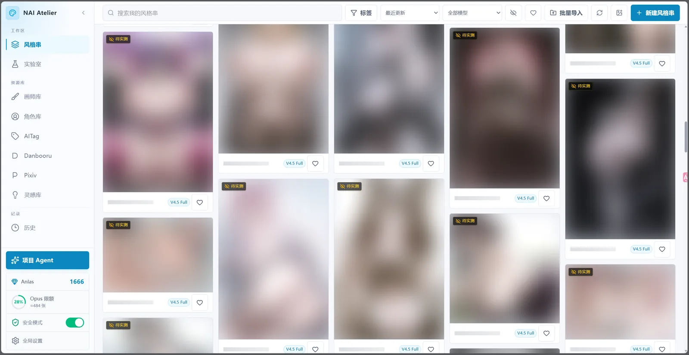
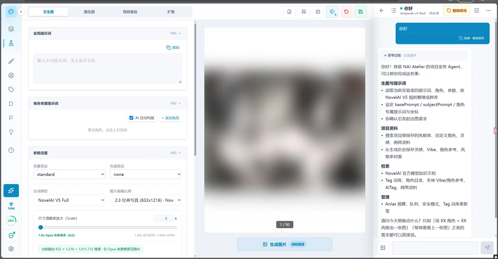
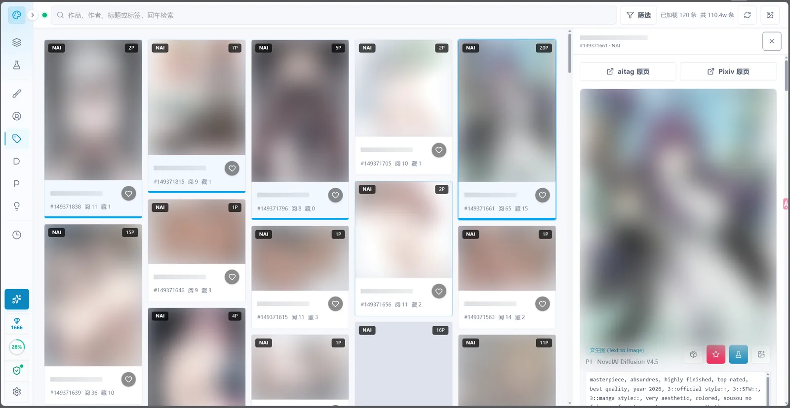
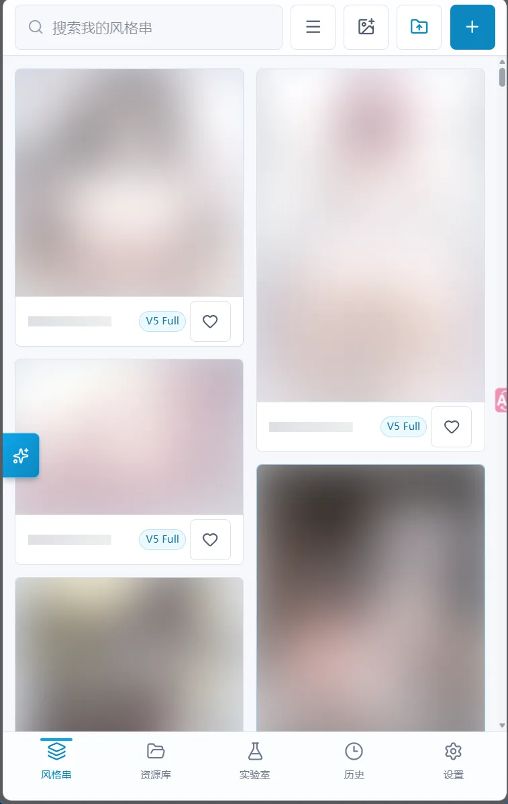
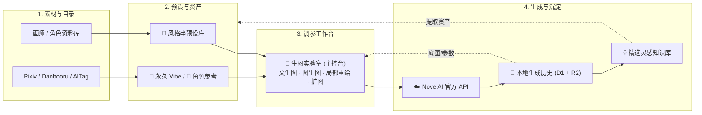
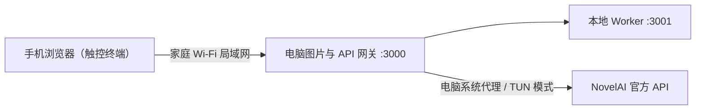
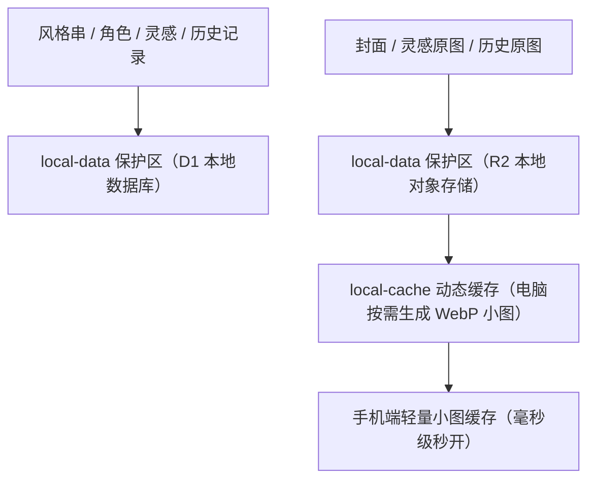

<div align="center">
  

  # NAI Atelier

  **面向 NovelAI 的个人本地创作工坊**

  [](./CHANGELOG.md)
  [](https://novelai.net/)
  [](#-本地数据与图片存储)
  [](#-手机局域网访问)
  [](./LICENSE)

  [项目定位](#-项目定位) · [界面预览](#-界面预览) · [核心能力](#-核心能力总览) · [功能地图](#-功能地图) · [创作工作流](#-核心创作工作流) · [资源资料库](#-tag-与资源资料库) · [st-chatu8 互通](#-sillytavern--st-chatu8-互通nai-atelier-连接器) · [手机访问](#-手机局域网访问) · [数据存储](#-本地数据与图片存储) · [数据备份](#-备份与数据持久化) · [更新日志](./CHANGELOG.md)

  > NAI Atelier 基于 [kirafishy/NaiPromptManager](https://github.com/kirafishy/NaiPromptManager) 二次开发并独立维护，面向本地单人使用；原项目见上方链接。
</div>

---

## 🧭 项目定位

NAI Atelier 是一套运行在个人电脑上的 NovelAI 创作工坊。它不是单纯的 Prompt 输入框，而是围绕长期个人使用建立的完整工作流：

> **收集画师与角色 → 组合 Prompt → 调用 NovelAI → 保存原图和参数 → 整理历史与灵感 → 在电脑和手机之间继续使用。**

> [!IMPORTANT]
> **适用范围：本项目仅面向 NovelAI Opus 档位订阅会员。** 费用估算、免费额度判定、Opus 限额显示与免费门槛逻辑均按 Opus 档位设计；其他订阅档位（Paper / Tablet / Scroll）与第三方中转服务**未做适配**——非 Opus 档位下"免费"判定与实际扣费可能不符，请勿依赖本项目显示的免费标识。

当前版本的四个核心原则：

| 原则 | 含义 |
| :--- | :--- |
| 🖥️ **电脑是数据主机** | 原图、数据库、历史、风格串和角色资料都以电脑为准 |
| 🏠 **只服务个人与家庭局域网** | 电脑本机免密，手机使用四位密码，不开放公网 |
| 🧩 **功能围绕创作工作流组织** | 画师、角色、Tag、Pixiv、Danbooru、AITag、实验室、历史和灵感可以互相导入与复用 |
| 📚 **资料库可自生长** | 画师目录、角色目录、灵感库都由使用过程持续沉淀，不再依赖外部静态数据 |

---

## 🖼️ 界面预览

> [!NOTE]
> 为保护创作者隐私，所有界面预览均在开启全局安全模式（自动虚化图片与占位符保护）状态下截取；点击预览图可查看高清原图。

### 🖥️ 桌面端：全功能创作工坊

| 🎨 风格串与创作预设资产库 | 🧪 生图实验室与项目 Agent 联动工作台 |
| :---: | :---: |
| [](./docs/screenshots/desktop-presets-gallery.webp) | [](./docs/screenshots/desktop-lab-agent.webp) |
| *自适应比例瀑布流、封面固定、模块化提示词管理* | *调参控制台、官方免费尺寸适配、深度图像观察与 Agent 工具联动* |

<div align="center">
  <p><strong>🗃️ 外部作品检索与参数反查（AITag）</strong></p>
  <a href="./docs/screenshots/desktop-aitag-browser.webp">
    
  </a>
  <p><em>全量 NovelAI 作品检索、完整生成参数反推、一键导入工坊</em></p>
</div>

### 📱 手机端：家庭局域网移动端触控界面

<div align="center">
  <a href="./docs/screenshots/mobile-touch-ui.webp">
    
  </a>
  <p><em>44px 触控热区、底部固定单手手势导航、全模式三段式 Tab 流程、电脑端系统 VPN 与数据直通</em></p>
</div>

---

## ⚙️ 核心能力总览

| 能力 | 说明 |
| :--- | :--- |
| 🔑 免账号启动 | 无账号体系，启动后直接使用，数据全部落在本机 `local-data` |
| 🗄️ 多密钥保管箱 | 多把 NovelAI Key 本地命名保管、随时热切换、失效/格式感知，独立跟踪每个 Key 的 Anlas 预算 |
| 🕘 生图历史 | 生成原图与完整参数保存在电脑本地 D1 + R2，浏览器清空后仍保留，按追加式瀑布流连续浏览 |
| 📱 手机访问 | 家庭局域网、四位密码、30 天授权、独立手机 UI，图片经电脑缩略图网关 |
| 🌐 外部图库三件套 | **Pixiv**（原站全量作品、榜单、画师主页）、**Danbooru**（通用级素材与 Tag 参考）、**AITag**（AI 作品与生成参数），统一瀑布流浏览与一键导入 |
| 🔐 Pixiv 网页登录 | 适配 Pixiv 官方 OAuth 流程（含新版 `pixiv://` 回调），登录后 refresh token 加密保存本机，浏览器与图库全链路可用 |
| 🧰 图片反推 Tag | 本地 WD Tagger 模型识别，图库任意图片一键反推，结果可复制或直接送往实验室 |
| 📚 Tag 与权重交互 | 31 万余条中英 Tag 本地分片、连续权重胶囊一体式调节、多选自动组合数值组、Agent 极速补译缺失项 |
| 🎨 封面体系 | 画师/角色封面从 Danbooru 候选图选取、图钉固定保存；封面缩略图固定本地保留，不受缓存上限淘汰 |
| ⚡ 图库加载优化 | 缩略图后台预热（滚动即缓存命中）、固定封面本地持久化、瀑布流真实比例显示、提前两屏预取 |
| 🌌 Vibe Transfer | 付费编码一次、本地永久保存、1～4 个组合、官方文件导入导出 |
| 🧬 Precise Reference | 电脑保存参考原图、三种官方参考类型、最多 4 张并准确计算费用 |
| 🚦 拼车公共队列 | 与 st-chatu8 按相同 Key 指纹协调生图顺序，减少共享账号并发错误 |
| 🔗 st-chatu8 插件互通 | 专为酒馆知名插件 st-chatu8 定制连接器与双向桥接，打通画师预设、Vibe 与历史原图，智能检测目录一键安装 |
| 🛡️ 安全模式 | 全局遮挡图片，作品名称可按设置选择是否同时隐藏，并可设置启动时默认开启；点击后临时显示 |
| ✦ 项目 Agent | 用 DeepSeek、Gemini、Grok 等模型查看历史图片并操作资料库、设置、实验室与生图流程 |

### 整体架构



---

## 🗺️ 功能地图

| 页面 | 核心用途 | 可以流向哪里 |
| --- | --- | --- |
| 🎨 **风格串** | 保存可复用画风、模块、参数和封面 | 实验室、其他预设 |
| 👤 **角色库** | 查找官方角色 Tag，维护自定义角色外貌还原 | 实验室、自定义角色 |
| 🖌️ **画师 Tag** | 搜索、排序、收藏、抽卡和生成画师基准图 | 画师组合、实验室 |
| 🗃️ **AITag** | 检索外部 AI 作品，缓存图片与元数据 | 实验室、风格串、灵感 |
| 🖼️ **Danbooru** | 检索通用级图片与分类 Tag，补全画师和角色预览 | 实验室、灵感 |
| 🎌 **Pixiv** | 原站全量作品：推荐、日/周/月榜、Tag 搜索、画师作品 | 实验室、灵感、反推 |
| 💡 **灵感** | 保存值得复用的图片、提示词和参数 | 实验室 |
| 🧪 **实验室** | 组合提示词、引用预设、生成与预览 | 历史、风格串、下载 |
| ✦ **项目 Agent** | 用 DeepSeek、Gemini、Grok 等模型查看历史图片并操作资料库、设置、实验室与生图流程 | 整个项目 |
| 🌌 **Vibe Transfer** | 永久保存 NovelAI 画风编码并组合强度 | 实验室、风格串、历史 |
| 🧬 **角色参考** | 保存人物参考图并使用 NovelAI Precise Reference | 实验室、风格串、历史 |
| 🚦 **拼车公共队列** | 与 st-chatu8 按相同 Key 指纹协调生图顺序，减少共享账号并发错误 | 全部生图入口、电脑与手机 |
| 🕘 **历史** | 管理电脑保存的生成原图和完整参数 | 实验室、灵感、下载 |
| ⚙️ **全局设置** | 管理主题、安全模式、启动偏好、API Key、Tag 词库和手机缓存 | 全项目生效 |

---

## 🧪 核心创作工作流

### 🎨 风格串：可复用的创作预设

风格串是工坊的核心预设载体：把一套验证成熟的画风、角色特征、负面词与生成参数完整保存下来，随时一键调用或派生新作品。

它不是单纯的画师名字堆砌，而是一套支持模块化拆装的完整配方：

- **画风与模块解耦**：基础画风、主体变量、可单独开关的提示词模块与全局负面词清晰分层。
- **多角色独立管理**：每个角色拥有专属正负面提示词，支持 AI 构图或精准坐标定位。
- **全套参数同捆**：画面尺寸、Steps、CFG、CFG Rescale、Variety+、采样器与 Seed 一并封存。
- **资产视觉归档**：支持自定义封面、标题、说明备注与分类标签，在卡片画廊中一目了然。

### 🧪 生图实验室：组合与验证中心

实验室是实际调参生图的主控台，完整支持四大创作模式：**文生图**、**图生图**、**局部重绘**与**扩图**，将预设、外部素材与灵感组装为生成请求，直连 NovelAI 实时获得高分辨率渲染反馈。

#### 1. 文生图（Text to Image）：多角色与参数调优
- **全局与多角色独立图层**：顶层统领全局提示词与全局负面提示词；多角色模式下，各角色拥有独立正负面词、X/Y 相对坐标定位与画幅占比控制，支持从角色库直接导入。
- **动态免费像素锁**：预设竖屏、横屏、方形及 64 像素步进微调；拖动单边可等比联动锁定，极限榨干 Opus 1,011,712 像素免费额度（如 `832 × 1216`、`1024 × 1024`），并在界面上实时计算总像素与点数预估。
- **步数与采样锁定**：默认将 Steps 上限严格控制在 28 步以内，杜绝因无意识堆叠步数触发 Anlas 额外计费。
- **透明通道生成**：一键开启透明背景生成，适配立绘、二创贴纸与表情包制作。
- **无损 PNG 参数反解**：拖入任意由 NovelAI 生成的无损 PNG 原图或 JSON 元数据，毫秒级反解出完整 Prompt、Seed、采样器与 CFG 参数，支持智能拆分画风/主体或全局直接回填。

#### 2. 图生图（Image to Image）：底图继承与变化控制
- **底图提示词与元数据自动继承**：支持从灵感库、生成历史一键直通或本地拖入底图，自动继承原始 Prompt 与生成参数。
- **强度与噪声微调**：提供精确的重绘强度（Strength）与噪声（Noise）滑块，精准平衡原图结构保留度与 AI 创意发散度。
- **SSE 流式过程图即时预览**：完整接入流式生图端点，实时接收 NovelAI 过程图（`intermediate`）与进度反馈，提前预判画面走向。

#### 3. 局部重绘（Inpainting & Focused Inpainting）：涂抹修补与聚焦放大
- **沉浸式画板涂抹**：配备画笔、橡皮擦、笔刷尺寸无级微调与撤销/重做历史栈，顺滑涂抹待修改区域。
- **官方级 Focused Inpainting（聚焦重绘）**：
  - 针对微小面部或细节瑕疵，自动开启 32~96px 官方上下文智能裁切放大；
  - **精准复刻官方客户端合成羽化算法**：从内部 1/8 mask 构建 4px 膨胀、8x 最近邻放大与 20px 定点定步模糊羽化层，并显式关闭服务端原图回贴（`add_original_image: false`），杜绝接缝瑕疵与双重合成衰减；
  - **Opus 免费档智能识别**：聚焦区域在满足官方面积限制且未透支时，精准点亮「Opus 免费」并不扣除点数。
- **空蒙版防跑拦截**：画板未涂抹任何笔迹（全透明蒙版）时，前端直接拦截生成并友好提示，绝不因误点导致无意义扣费。

#### 4. 扩图（Outpainting）：无缝延展画面边界
- **四向自由扩展画布**：支持在底图的上下左右四个方向自由设定扩展像素；
- **智能规整与回贴**：点击「应用画布扩展」后，系统自动将画布尺寸补齐规整为 64 的整倍数并对齐免费面积规格；
- 结合 Inpainting 算法实现外延区域的高质量填补与边缘无缝衔接。

#### 5. 编辑模式状态隔离与移动端专属交互
- **独立草稿与蒙版状态隔离**：文生图、图生图、局部重绘与扩图四种模式的底图、蒙版、提示词与调参草稿各自独立保存；自由切换模式绝不丢草稿，也杜绝旧蒙版在不同模式间窜扰误发。
- **移动端三段式 Tab 流程**：窄屏视口下自动收敛为高效的三段式 Tab 导航（图生图为「底图/提示/参数」，局部重绘为「画板/提示/参数」，扩图为「画布/提示/参数」）；画笔工具箱贴身附着于画板边缘，彻底消除长距离手势滑动与画板涂抹误触的冲突。

### 📌 预设引用：按板块记录来源

在编辑器右上角点击「引用」，可以按需单独借用其他风格串的局部资产：

- **细粒度按需引用**：可单独勾选引用画风、主体、模块、角色、负面词或生成参数，各板块清晰显示其原始来源。
- **多预设叠加融合**：支持同时引用多个不同预设的局部优势，来源变更时显式标记为“已修改”。
- **安全解耦清理**：重置配置或切换预设时，自动清理已失效的来源快照，不留幽灵数据。

### 🕘 生成历史：每一次生成都可追溯

- **原图与参数永不丢失**：生成的 PNG 原图、完整 Prompt、Seed 与各种参数直接落盘电脑本地 D1 数据库与 R2 存储，即使清空浏览器缓存也安然无恙。
- **丝滑浏览与筛选**：支持按日期范围筛选、分页跳转、即时刷新与失败快速重试。
- **批量管理与清理**：支持单张删除、批量勾选清理旧历史或一键清空全部。
- **创作枢纽中转**：历史图片可一键送回实验室继续微调、随手标记收藏、永久收入灵感库，或直接下载无损原图。

### 💡 灵感库：可复用的创作知识库

- **双层收纳哲学**：历史里的「收藏」是随手点赞的轻量收件箱；「灵感库」才是精挑细选的个人知识库，支持打标签、写备注、分灵感板和评分。
- **立体多维检索**：支持按灵感板、标签、评分、置顶、归档与来源多维组合筛选，迅速找回当年的满意配方。
- **零存储冗余**：从历史或已缓存 AITag 收录时直接复用电脑中的原图路径，绝不重复拷贝浪费硬盘。
- **全链路资产盘活**：同一张灵感图可一键派生为风格串、角色参考图、永久 Vibe 编码，或设为现有预设封面；详情自动推荐提示词相近的灵感。

### ✦ 项目 Agent：业务联动多会话工作台

桌面侧栏、手机资源库和实验室右上角均可打开基于 [pi.dev](https://pi.dev/) 轻量核心的项目 Agent。它不是一个需要您手动复制 Prompt 的旁路聊天框，而是能直接读取电脑资料、观察历史原图并调用工坊工具的业务级 AI 助手。

#### 智能模型与凭据管理
- **主流模型即接即用**：直接对接主流 LLM 厂商（DeepSeek、Gemini、Grok、OpenAI、Claude 等）或任意兼容 API，配置直观，支持按模型名模糊搜索。
- **模态能力自适应探测**：点击「获取模型」自动探测接口返回的元数据，智能识别模型是否支持识图、长上下文与推理思考（Thinking）。
- **本地高强度加密**：LLM API Key 采用 AES-256-GCM 加密保存在电脑本地（密钥文件 `local-data/prompt-agent.key`），局域网重置密码不影响，凭据绝不上云、绝不回传手机。
- **安全请求头注入**：自定义兼容接口支持安全附加请求头（如 `HTTP-Referer`），敏感鉴权头严格走加密存储，杜绝明文混入。

#### 独立全局多会话工作台
- **跨设备无缝接续**：多会话工作台独立于具体风格串，支持新建、重命名、搜索与删除；电脑与手机局域网可随时接续同一对话。
- **独立参数记忆**：每个会话独立记住模型、思考强度与供应商，面板顶部清晰展示实际 Token 开销、模型费用与停止原因。
- **灵活交互与无损回放**：支持 Steering（转向当前任务）与 Follow-up（完成后追加）；支持编辑任意历史轮次重新执行、重新生成回答与单步回退快照；任务事件异步批量落盘，网络闪断重连可完整回放。

#### 多模态视觉图像观察
- **多图附件随心传**：输入框支持直接拖入或上传最多 4 张图片（PNG/JPEG/WebP/GIF），图片由电脑端安全处理，手机端不缓存原图。
- **双模型视觉协同**：如果主对话模型（如纯文本模型）不具备识图能力，工坊会自动指派一个多模态模型充当「眼睛」，先观察画面细节，再交给主模型进行逻辑推理。
- **生成历史深度观察**：Agent 可直接读取电脑本地生成历史的真机原图；能够先比对观察上一张图的构图缺陷，再精准修改用户指定的局部 Prompt 或画风。

#### 全项目业务工具联动
- **全项目资产读写**：可直接查询与更新本地 Tag、风格串、角色库、画师目录、灵感库、AITag、永久 Vibe 与角色参考。
- **精准调参避雷**：精细修改基础画风、主体、负面词、提示词模块、多角色坐标、采样器与 Seed，未提及的高级参数安全保留。
- **全局环境控制**：支持切换界面主题、安全模式遮罩、图片布局与手机缓存，任务完成后可自动导航至目标页面。

#### 安全沙盒与事务提交
- **纯业务沙盒隔离**：Agent 仅拥有工坊提供的结构化业务工具，绝对无法触碰电脑文件系统、命令行、系统进程或底层终端；联网能力仅限本轮搜索提取的公网 HTTPS 页面，严格阻断内网与私有端口。
- **危险与付费确认握手**：删除历史、清空资料、Vibe 编码与实际调用 NovelAI 生图等涉及 Anlas 消耗的操作，必须在前端由创作者亲自点击确认面板方可执行，严防误触。
- **草稿箱式事务安全**：实验室修改先在后台草稿中推演，全部步骤成功、且没有与您正在手动输入的内容冲突时才一次性应用，绝不改到一半留下混乱改动。

### 🌌 永久 Vibe Transfer：编码一次，长期复用

实验室“全局”页内置永久 Vibe 资料库。它会调用 NovelAI V4.5 Full 的 Vibe 编码接口，将参考图转换成不可逆编码；每个新的 Information Extracted 数值编码一次需消耗 **2 Anlas**，以后使用该编码生图不再重复支付编码费用。

- 上传 PNG、JPEG 或 WebP，默认以 `Information Extracted = 1.00` 建立永久编码。
- 每次产生新编码前都使用项目内确认面板明确显示 **2 Anlas**，不提供跳过提醒。
- 同一原图、模型与提取量通过 SHA-256 去重；重复选择直接复用，快速重复点击也只会建立一个付费任务。
- 同一个 Vibe 可追加其他提取量变体；不含原图的编码型 Vibe 仍可生成，但不能追加变体。
- 一次可启用 1～4 个 Vibe，每个独立设置 Strength；总强度超过 1 时默认按比例归一化。
- 支持命名组合、载入、覆盖、重命名、另存和删除组合；组合删除不会删除 Vibe 编码。
- 支持导入与导出官方 `.naiv4vibe`，未知模型编码会保留，等待未来兼容。
- “删除”采用归档：资料库暂时隐藏资产，但风格串和历史中的旧快照仍能继续复现。
- 风格串、实验室预设和生成历史保存独立选择快照，之后修改全局组合不会反向改变旧配置。
- 手机只读取电脑生成的缩略图；生图时由电脑直接读取永久编码并请求 NovelAI，手机不下载原图或编码，也不需要单独开启 VPN。

原图、缩略图、编码、组合与恢复记录均位于电脑的 `local-data` 持久化区域。若 NovelAI 已完成付费编码、但本地数据库在最后一步暂时写入失败，网关会先把结果保存到 `local-data/vibe-recovery`，重启后自动完成入库，避免再次付费。

### 🧬 Precise Reference：每次生图的角色与风格参考

实验室“角色”页内置 NovelAI 官方所称的 **Precise Reference**。参考图原件保存在电脑，手机列表只读取缩略图；生图时由电脑读取原图、适配官方画布并组装请求，手机无需保存原图或单独开启 VPN。

- 支持 `角色`、`画风`、`角色与画风` 三种官方类型，一次最多选择 4 张。
- 每张参考图、每张生成图固定额外消耗 **5 Anlas**；生成按钮和确认面板会显示本次费用明细，成功后才扣除项目内预算。
- 每张图分别设置 Strength 与 Fidelity；高级数字输入支持 `-1.00～2.00`，Fidelity 会按官网协议转换为 secondary strength。
- 参考图会自动旋转，并按比例放入最接近的官方竖图、方图或横图画布，不会被强制拉伸。
- 角色参考与 Vibe Transfer 按 NovelAI 当前限制双向互斥：启用其中一个会关闭另一个。
- 多张非纯画风参考会被 NovelAI 混合为一个角色，不代表多个参考图自动对应多个独立人物；界面会明确提醒。
- 风格串、灵感和历史随完整参数保存参考 ID、名称、类型和数值快照；归档只从默认资料库隐藏，不会删除旧记录。
- Agent 只能选择电脑资料库中已经存在的参考 ID，也可以把项目生成历史中的原图保存为新的角色参考，不能借此读取任意网址或文件。

### 🚦 多人拼车公共队列

全局设置的 NovelAI 连接区域可以启用与 st-chatu8 兼容的公共队列。使用相同 NovelAI Key、并接入同一公共服务的客户端会进入同一条生成队列；轮到当前任务后，电脑才通过自己的网络和 VPN 请求 NovelAI。

- 队列服务只接收 Key 的 SHA-256 指纹、随机客户端标识、任务标识和可选个性语，不接收原始 Key、Prompt、参考图、Vibe 编码或生成结果。
- 项目不内置任何公共队列服务器地址；如需多人拼车排队，请在全局设置中填入你自建或车队共用的 st-chatu8 兼容队列服务地址。
- 排队位置、当前使用者个性语和取消入口会显示在全局状态条；获得许可后自动开始生成。
- 设置保存在电脑 `local-data`，因此电脑和通过局域网连接的手机统一生效。
- 公共队列不可用时停止本次请求并明确报错，绝不静默绕过队列引发并发冲突。
- 注意：排队机制只对接入了公共队列的客户端生效；如果在官网或未经排队的第三方工具直接并发调用该 Key，仍可能引发并发冲突。

---

## 📚 Tag 与资源资料库

### Tag 自动补全、连续权重胶囊与操作台

项目内置 31 万余条本地 Tag 数据（中英对照与画师/角色目录源自 [ffdkj-Danbooru_Tag-Chinese-English-Translation-Table](https://github.com/ffdkj/ffdkj-Danbooru_Tag-Chinese-English-Translation-Table) 的 tag.sqlite，NovelAI 专属 Tag 来自官方列表；详见[来源与许可](#-来源与许可)）：

- **海量词库与即时补全**：Danbooru 中英对照 Tag、NovelAI 官方专属 Tag，支持中英双向前缀实时搜索、热度排序与中文字意插入；手机端采用双击确认，杜绝滑动手势误选。
- **一体式连续权重胶囊（Capsule）**：同一对权重包裹的多个 Tag 自动合并为一个无缝连续胶囊，开口与闭合语法渲染于首尾两端，整组贯穿强调色与描边；散落的花括号与方括号不破坏词条美感。
- **整组选择 vs 散词多选**：点击胶囊内任一 Tag 即整组高亮选中，再次点击整组解除；散 Tag 仍支持自由单独选择与多选。
- **多选自动复合数值组**：多选多个散 Tag 点击添加数值权重时，系统自动连结为一个整体复合数值组（例如 `1.2::A, B, C::`），告别每个词分别单独套括号的冗余。
- **常驻底栏一体化权重工具条**：
  - **三态类型无损转换**：底栏直出 `{ }`（花括号增强）、`[ ]`（方括号减弱）、`数值`（`1.1::tag::`）三选一选择器，支持在三种语法体系间一键互转；
  - **告别弹窗的内联输入**：彻底移除浏览器原生 `prompt` 弹窗阻断，直接在底栏数值框输入任意数值回车即生效；
  - **高精微调步进（±0.1 / ±0.01）**：常规点击 `+` / `-` 按钮按 `±0.1` 步进调节；**按住 Shift 点击则触发 `±0.01` 极高精度微调**；
  - **平滑降权与一键清除**：减权按括号层级逐步简化（`{{tag}}` → `{tag}` → `[tag]`），亦可一键剥除权重还原为原始裸词。
- **双行还原翻译与 AI 极速补译**：
  - 提示词下方按原始 Prompt 词序紧凑双行展示英文词项与中文含义，精准识别各类复杂嵌套权重；
  - 遇到未收录的新生 Tag 或复杂短语，一键调 LLM 极速补齐中文翻译，并自动持久化写入本地增量翻译缓存（`tag-translations.json`）。

词库按前缀拆分成小型 JSON 分片，只加载当前搜索需要的部分。补全菜单支持鼠标滚轮、触摸滑动、键盘上下选择；手机端使用双击确认，避免滑动时误选。

#### 更新方式

可以在“全局设置 → Tag 补全词库”中检查更新，也可以运行：

```bash
npm run update:tags
```

更新流程会检查上游版本、下载数据库、生成中英分片并自动应用。GitHub Raw 不稳定时会重试并切换到 jsDelivr；更新失败不会覆盖当前可用词库。

### 画师 Tag：自维护画师目录

项目收录约 14.6 万画师条目，由本地数据库持续维护，不再依赖外部过期的静态图包：

#### 目录能力

- 约 14.6 万画师 Tag
- 中文名称与英文 Tag 搜索
- Danbooru 关联作品数作为热度
- 热度升序、热度降序、名称 A–Z 和 Z–A
- 每批 500 条滚动加载，不一次渲染完整目录
- 收藏、批量选择、画师权重组合和 `artist:` 前缀控制

#### 随机抽卡（打破惯性）

- 每次抽取 6、12 或 24 位画师
- 惊喜混合、完全随机、热门画师三种卡池
- 最近五批自动避重
- 返回目录时恢复原来的滚动位置

#### 预览生成

词库不预装动辄几十 GB 的庞大静态图包。遇到缺少封面的画师时，可一键调用 NovelAI 按统一测试 Prompt 生成基准图；生成成功后自动保存在本地，下次秒开。

### 角色库：官方 Tag 与手工还原并存

角色库包含两类内容：

1. **官方角色 Tag**：NovelAI / Danbooru 已收录的标准角色名。
2. **自定义还原角色**：没有官方 Tag 时，手工组合外貌、服装和特征 Prompt。

#### 搜索能力

- 中文名、英文 Tag、作品名与括号变体
- 多关键词组合，例如“原神 胡桃”“碧蓝档案 泳装”
- 相关性优先，再按热度或名称排序
- 显示搜索命中的字段来源

#### 角色操作

- 收藏、复制、生成预览和导入实验室
- 官方角色可跳转 Danbooru
- 自定义角色可编辑外貌还原内容
- 支持混合、仅官方 Tag、仅自定义角色三种抽卡范围

### AITag：外部作品与生成参数资料库

直连 [aitag.win](https://aitag.win/) 社区，专门检索纯正的 NovelAI 作品；不仅能看图，更能直接反查并复用原作者的完整 Prompt 与生成参数。

#### 检索与目录

- 每页读取 60 个带 Pixiv 信息和 AI 元数据的作品
- 搜索作品 ID、作者 ID、标题、Tag、日期和模型
- 只检索 NovelAI 来源作品，不混入 Stable Diffusion 或 ComfyUI 内容
- 单独搜索 NovelAI 元数据中的 Prompt
- 浏览最新作品或月榜
- 选择当前月份、历史月份和更早目录

#### 本地索引与离线缓存

- 默认渐进索引最多 500 页，每次只同步少量页面
- 分别记录作品摘要、详情、首图和完整图片缓存状态
- 卡片用不同色调表示未缓存、已缓存首图和已缓存全部
- 按收藏、首图缓存或完整缓存过滤
- aitag.win 暂时不可用时自动切换到本地缓存
- 已缓存的作品、详情和图片在离线状态下仍可浏览

#### 元数据识别

作品详情会显示全部图片，并尝试识别：

- 使用模型
- 文生图（Text to Image）
- 图生图（Image to Image）
- 局部重绘（Inpainting）
- Vibe Transfer
- 角色参考（Character Reference）
- Prompt、负面 Prompt、尺寸、Seed、Steps 和采样器

#### 三条复用路径

| 操作 | 结果 |
| :--- | :--- |
| **导入实验室** | 把识别出的 Prompt 和参数带入实验室继续生成 |
| **保存到风格串** | 把图片、Prompt、负面 Prompt 和参数保存为可编辑预设 |
| **加入灵感库** | 把图片、完整生成配置和 AITag 来源存进个人灵感库，之后继续分类与复用 |

详情中保留 aitag.win 和 Pixiv 原作品入口，便于回到来源核对。

### Danbooru：通用级素材与 Tag 参考

接入 Safebooru 全年龄图库，适合寻找构图灵感、查验 Danbooru 标准 Tag 与画师代表作；图片经电脑媒体网关实时抓取并按需缓存，不占用本地大容量存储。

- 支持英文 Tag、中文精确匹配和最多两个 Tag 的组合检索；中文会先匹配项目本地中英词典，再转换为 Danbooru 标准 Tag。
- 详情按画师、作品、角色、通用和元 Tag 分类展示，可复制或把角色与通用 Tag 追加到实验室。
- 画师 Tag 和角色 Tag 卡片可左右切换查看同一精确 Tag 的全部可用候选图，按 Danbooru 热度降序逐页加载；角色候选会继续排除多人图、漫画、文字梗、玩偶和特殊服装等干扰。首次默认图即为热度最高的合格候选；选中某张候选后可点右上角图钉设为固定封面，图片会保存到项目自己的存储中。老师、提督等没有可靠单人形象的泛角色宁可留空，不强行误配；候选结果缓存 14 天。
- 外部图片经过电脑媒体网关提供给局域网设备，并继续受全局安全模式的模糊规则控制。

### 图片反推 Tag：本地 WD Tagger

直接在电脑本地用 CPU 反推图片的 Danbooru Tag，无需上传第三方云端。首次使用自动下载约 379 MB 的 WD Tagger V3 模型（存入本地缓存目录 `local-cache/models`）；支持微调通用词与角色词置信度阈值，过滤掉误识别杂词后一键送入生图实验室。

- **图库一键反推**：Pixiv、Danbooru、AITag 详情里的任意图片都可以直接反推（经本机媒体网关读取，无需先下载到本地）。
- **送往实验室**：任何页面反推完成后，选中 Tag 可一键写入实验室主体 Prompt 并自动跳转。

### Pixiv 图库：原站全量作品浏览

Pixiv 页面连接 Pixiv 官方 App API，提供推荐、日榜、周榜、月榜、标签搜索与画师作品浏览，作品详情可切换多页、查看标签与画师、跳转原站。

- **登录**：在默认浏览器（推荐 Edge 等已登录账号的浏览器）完成 Pixiv 官方 OAuth 登录，NAI Atelier 自动捕获新版 `pixiv://` 回调并换取令牌；refresh token 以独立密钥 AES-256-GCM 加密保存在本机 `local-data`，重启免登录，断开后重新登录即可。
- **瀑布流浏览**：卡片按作品真实宽高比显示、零裁剪，滚动接近底部自动连续追加，支持游标无限翻页（推荐流的 `viewed[]` 去重列表自动裁剪，翻页不设上限）；分页器保留为显式跳转工具（游标 API 无页码概念，仅搜索类不可跳页）。
- **导入与沉淀**：详情可直接导入实验室、加入灵感库、进入该作者全部作品、打开 Pixiv 原站；任意图片可一键反推 Tag。
- **图片来源**：所有图片经本机媒体网关抓取（自动携带官方 Referer），缩略图后台预热并写入磁盘缓存，浏览时缓存命中秒出；图片受全局安全模式控制。

---

## 🔗 SillyTavern / st-chatu8 互通（NAI Atelier 连接器）

本项目内置的连接器与双向桥接机制，**是专门针对 SillyTavern 生态中最流行的生图插件 [st-chatu8](https://github.com/damoshen123/st-chatu8) 定向定制开发**。它可以与本机（如 `D:\SillyTavern`）及局域网中的 SillyTavern 实例无缝配套，彻底打通酒馆 RP 角色扮演生图与本工坊深度打磨之间的资产壁垒。

### 扩展简介与一键安装

- **NAI Atelier 连接器（NAI Atelier Connector）**：项目内置的酒馆专属第三方扩展（源码位于 `third-party/sillytavern-extension`，平滑兼容并自动清理旧版 `npm-bridge`）。
- **智能路径检测**：控制台与网关自动嗅探本机标准安装路径（`D:\SillyTavern`、`C:\SillyTavern`、上级工作区等），无需手工翻找扩展目录。
- **一键安装与更新**：在前端设置中可一键将连接器安装/更新至 SillyTavern 扩展库；对于跨设备或容器环境，亦支持一键导出离线 ZIP 安装包。
- **自动化双向桥接**：启动后由电脑图片网关提供受限桥接接口自动同步，也可在 SillyTavern 的扩展面板中随时点击“立即同步”。

### 数据同步内容与规则

| 数据 | 方向 | 规则 |
| :--- | :--- | :--- |
| 风格串 Prompt | 双向 | 同名或已关联资料冲突时以 st-chatu8 为准 |
| 风格串配图 | 双向 | 保留原封面；只有图片真正变化时才重新上传 |
| 永久 Vibe | 双向 | 按原图二进制 SHA-256 去重，避免不同导出器 ID 造成重复 |
| Vibe 组合 | 双向 | 使用 st-chatu8 的组合结构作为权威来源 |
| 生图历史 | st-chatu8 → 本项目 | 只索引原图，不导入 `thumbnail_path` 缩略图 |

NAI Atelier 独有的新风格串可以先同步到 st-chatu8；一旦进入 st-chatu8，后续修改和冲突判断都以 st-chatu8 数据为准。这样在 SillyTavern 聊天生图和本项目实验室之间切换时，不需要手工复制风格串或 Vibe。

### 图片与磁盘存储策略

- **零重复占用**：st-chatu8 历史图片不会复制进 NAI Atelier，而是由桥接层记录原文件位置，避免额外占用磁盘空间（原库约 11 GB）。
- **干净隔离历史**：NAI Atelier 历史页只展示 st-chatu8 的原图记录；st-chatu8 生成的本地缩略图不会作为独立历史混入。
- **封面无缝复用**：风格串封面作为资料本身同步，两边均可正常显示；重复同步自动复用已有封面，不产生冗余文件。
- **规范二进制去重**：Vibe 使用图片内容哈希去重，自动识别 st-chatu8 与官方兼容文件对同一图片采用不同 ID 的情况。

### 协议兼容与实现声明

- **Precise Reference（角色参考）**与**永久 Vibe 数据流**的实现参考了 NovelAI 官方文档、官网请求协议以及 [st-chatu8](https://github.com/damoshen123/st-chatu8) 的可读实现，据此确认官方请求结构（如 `reference_image_multiple_cached`）与费用规则。
- **多人拼车公共队列**使用与 st-chatu8 一致的 NovelAI Key SHA-256 指纹协议，双方客户端可进入同一条公共队列互操作。
- **Vibe 内容去重**兼容 st-chatu8 对 Base64 文本哈希与官方兼容导出器字节哈希的差异，统一以图片字节哈希为规范键。
- 上述参考与兼容均为协议层面的实现借鉴，不包含 st-chatu8 的代码或数据；具体同步接口由本项目的 `scripts/st-chatu8-bridge.mjs` 独立实现。

### 本机同步规模验证

截至 2026-07-29 的实际验证结果：

- 134 个风格串，其中 13 个带配图。
- 6 个永久 Vibe。
- 6687 张 st-chatu8 生成原图已接入历史。
- 重复同步后数量不增长，历史缩略图混入数为 0。

---

## 📱 手机局域网访问

随时随地窝在沙发或床上用手机搓图、挑图是最高频的心流体验。电脑负责充当本地工作站（运行 Worker、网关与存储核心），手机只要连上同一个 Wi-Fi，就能无缝操控电脑里的所有预设、原图与历史。

### 访问方式

在电脑启动项目后，终端窗口会直接打印出当前本机的局域网地址：

```text
http://192.168.0.105:3000
```

手机连接同一个家庭 Wi-Fi 后，在手机自带或常用浏览器直接打开该地址即可。

### 局域网安全与轻量认证

为了防止同一局域网下的陌生设备随意调阅你的图库与资产，项目内置了轻量安全的四位 PIN 码认证：

| 场景 | 认证行为 |
| --- | --- |
| 电脑本机访问 `localhost:3000` | 本机完全免密 |
| 手机或其他局域网设备首次访问 | 仅需输入 4 位数字密码即可绑定 |
| 验证通过 | 当前设备获得签名 Cookie，30 天免再次输入 |
| 连续输错 5 次 | 自动触发安全冷冻，暂停验证 1 分钟防暴力试探 |
| 未授权直接请求静态图片或 API | 网关直接拒绝响应，杜绝越过认证盗图 |

> 初始随机密码与签名密钥保存在 `local-data/lan-access.json` 中，严禁提交至 Git。

### 手机生图与网络代理机制

**手机本身无需单独开启代理或导入证书**。整个链路中，手机只充当轻量触控终端，实际与 NovelAI 通信的始终是电脑后端：



- **电脑已开全局代理时，手机直接畅玩**：只要电脑的网络能正常连接 NovelAI，手机连上局域网后无需任何网络折腾即可点下生成。
- **代理客户端注意事项**：Node.js 网关运行在操作系统级，仅安装在浏览器内的「插件型扩展代理」对其无效；请确保电脑代理客户端开启了 **TUN 虚拟网卡模式** 或 **系统级代理**。

### 本地服务端口分工

| 端口 | 职责定位 | 监听范围 | 说明 |
| --- | --- | --- | --- |
| `3000` | Web 界面、认证、图片网关与 API 入口 | 局域网 (`0.0.0.0`) | 手机与电脑统一访问的前台主端口 |
| `3001` | Wrangler 本地 Worker 运行时 | 仅本机 (`127.0.0.1`) | 保护 D1 数据库与 R2 原图存储，不直接对网内公开 |
| `3002` | Tag 词库更新与本地管理服务 | 仅本机 (`127.0.0.1`) | 本地工具链按需调用 |

---

## 📲 手机 UI 触控设计

移动端并非机械地缩放桌面界面，而是为单手握持与触控心流深度重构的操作台。

### 全局触控交互规范

- **单手操作与触控盲操**：主要按钮、图标与操作开关的有效触控面积均满足至少 44×44px，大幅减少误触。
- **全屏安全区避让**：顶栏、底部常驻栏、画板工具箱均严密适配 iOS/Android 刘海屏、挖孔及手势条安全区。
- **高频外露，低频抽屉**：搜索与即时操作直接外露；复杂的排序、多维筛选和批量工具统一收纳在顺滑的底部抽屉中。
- **原生层级与物理返回**：Android 物理/手势返回键会逐层关闭当前展开的抽屉、详情页与弹窗；从大图详情返回后，原本的滚动进度、筛选状态与分页位置完好保留。

### 移动端底部主导航

- 底部常驻核心主入口：**风格串**、**资源库**（集成画师、角色、AITag 与灵感库）、**生图实验室**、**生成历史**与**系统设置**。
- 安全模式与主题切换收纳于设置页，避免常驻顶底栏占用珍贵的垂直看图视野。
- 极简顶栏：当前所处模块通过灵动图标与彩色细条状态提示，不挤占首屏宝贵空间。

### 各功能模块移动端适配

| 功能模块 | 移动端专属布局 |
| --- | --- |
| **风格串** | 双列瀑布流，聚焦大封面与配方名称，紧凑清晰 |
| **角色库** | 双列角色卡片，顶部直出快速搜索与分类标签，点击全屏查看详细设定与关联画师 |
| **画师 Tag** | 双列预览网格，一键抽卡灵感直达，多维标签与流派筛选收入底部抽屉 |
| **AITag** | 移动端直接展示瀑布流图墙，点击沉浸式展开参数提取板，剔除桌面双栏留白 |
| **灵感库** | 双列图墙搭配移动筛选抽屉，全屏收纳板支持单手快捷标记、改写备注与一键回填到实验室 |
| **生成历史** | 自由切换单列瀑布流、方形网格或竖向卡片，底部分页栏触手可及 |
| **生图实验室** | 统一桌面与移动端三段式工作流（文生图 / 图生图 / 局部重绘与扩图）；提示词与角色按折叠卡片展开，画布浮动触控栏贴近 thumb 拇指区，底部生成操作固定且避开软键盘弹出 |
| **系统设置** | 移动端专属全屏列表，分模块集中管理多 Key、外观主题、安全模式与缓存上限 |

### 移动端图片性能与显示偏好

在移动端设置中，可以按网络和设备性能自主配置：
- **卡片形态**：自适应瀑布流、紧凑竖向卡片或规整方形网格。
- **列数控制**：自适应、单列大图、双列并排或三列密实图墙。
- **移动端缓存池**：支持关闭或设定 25 MB、50 MB、100 MB 本地轻量小图缓存池（超出自动按 LRU 释放旧图）。

> 💡 缓存与列数设置仅优化列表快速翻阅时的流畅度与流量占用；当你点击大图查看详情、下载或导入参数时，系统始终直接调用电脑本地存储的原始 PNG 无损元数据。

---

## 🖼️ 本地数据与图片存储

### 电脑是唯一事实源（真身在本地）

你的所有作品、灵感与核心资产全部安全保存在电脑硬盘中，手机与其他设备只负责显示与操作：



### 数据存储边界

| 存储位置 | 承载内容 | 备份建议 |
| --- | --- | --- |
| `local-data/` | D1 数据库、R2 对象存储、数千张原图、生成历史、多 Key 保管箱、局域网认证 | **核心资产，务必定期备份！** |
| `local-cache/` | 电脑根据原图实时渲染的 WebP 缩略图、WD Tagger 模型缓存 | 纯临时缓存，无需备份，删掉可随时全自动再生成 |
| 手机端浏览器缓存 | 列表翻阅时暂存的小图（≤ 100 MB） | 临时前端缓存，清空无任何影响 |

### local-data 核心资产构成（禁止随意删除或改名）

`local-data/` 是工坊唯一的持久化基石，其内部结构由本地 Worker 与底层存储强绑定：

| 关键路径 | 承载资产 | 是否可再生成 |
| --- | --- | --- |
| `v3/d1/miniflare-D1DatabaseObject/*.sqlite` | **D1 核心数据库**：风格串、角色库、灵感库、全量历史记录、系统设置（含多 Key 保管箱 `nai_key_vault`）、永久 Vibe 索引 | **否，绝不可再生（核心）** |
| `v3/r2/nai-assets/blobs/` | **R2 原图仓库**：历次生成原图、灵感原图、自定封面等无损图像文件（通常数 GB） | **否，绝不可再生（核心）** |
| `lan-access.json` | 局域网访问四位 PIN 码与签名秘钥 | 否（若误删需重新为所有局域网设备授权） |
| `pixiv-tokens.json` + `pixiv.key` | Pixiv OAuth 访问令牌（AES-256 加密保存） | 否（若删除需重新授权登录 Pixiv） |
| `prompt-agent.key` | 项目 Agent 对各第三方 LLM Key 进行 AES 加密的主密钥 | **否（若删除将导致已配置的 Agent 密钥全部无法解密）** |
| `prompt-agent.json` / `prompt-agent-*/` | Agent 模型配置、历史对话会话与任务事件记录 | 否（误删会导致历史 Agent 会话丢失） |
| `st-chatu8-bridge.json` | SillyTavern 桥接同步状态与历史增量游标 | 可重建（再次触发同步即可重构） |
| `novelai-webapp-sync.json` / `cloud-queue.json` 等 | 官方应用常量增量缓存与云端队列快照 | 是，运行时可按需更新 |

> ⚠️ **高危提醒：`wrangler.toml` 中的 `database_id` 是本地存储键**
>
> 在本地开发模式下，Wrangler 依赖 `database_name` 与 `database_id` 的哈希值精确定位 SQLite 文件。**擅自修改或删除 `database_id` 会导致 Worker 直接加载全新的空库**，在界面上表现为所有历史与预设“瞬间消失”（虽然真实文件依然躺在硬盘上）。备份或迁移时，请**完整打包复制整个 `local-data` 文件夹**，不要只挑选个别文件。详细红线见 `AGENTS.md`「数据边界」。

### 缩略图网关与高性能预热

- **按需 WebP 转码**：列表根据当前屏幕列宽动态请求 320px 或 640px WebP 缩略图，自动校正 EXIF 旋转方向，秒开不卡顿。
- **无损 PNG 承诺**：所有生成原图与灵感原图原封不动保存在本地 R2，绝对不进行二次压缩或改写，保留完整的 NovelAI 生成元数据与透明度。
- **智能淘汰与封面常驻**：电脑端缩略图缓存池默认上限 1 GB，超出后按 LRU（最近最少使用）自动释放；**所有由你指定的画师与角色封面均已打上永久图钉，绝不参与淘汰清理**。
- **列表丝滑预热**：在浏览 Pixiv 或 Danbooru 时，网关在收到列表的第一时间就会以低并发在后台把下一批预览图预写到磁盘，滚动翻页时毫秒级瞬开；打开画师目录时亦会自动预取候选封面并固定落盘。

---

## 🛡️ 安全模式与防窥隐私

### 沉浸式防窥（图片安全模式）

在公共场合、办公室或与人合屏时，随时一键隐匿敏感画面：
- **三重遮罩防护**：开启后所有画作与作品封面默认应用高强度模糊、深度压暗与饱和度归零，杜绝意外社死。
- **临时窥视机制**：点击单张图片仅临时解除遮罩预览，不会误触发弹窗详情；鼠标移开对应区域后瞬间恢复模糊。
- **状态失焦自锁**：切换标签页、应用失去焦点、页面最小化或轻按 `Esc`，遮罩立即全自动重置闭合。
- **配置持久可控**：支持在系统设置中设定「启动时默认开启防窥」，手机与桌面端均可一键即时启闭。

### 多密钥保管箱（Key Vault）

- **本地集中落库**：所有 NovelAI Key 均统一收纳于电脑本地 D1 数据库（`nai_key_vault`），告别随浏览器清理易失的 LocalStorage，手机与电脑局域网无缝共享。
- **多账号别名管理**：支持录入多组 Key 并添加备注（如「Opus 个人主号」、「小队拼车号」、「备份试用号」）；在生图实验室顶栏可随时一键切换当前活动的扣费账号。
- **脱敏显示与防录屏泄露**：界面上密钥默认以掩码脱敏遮盖（仅展示首尾关键字符），需要查看时一键显隐或复制，录屏演示毫无心理负担。
- **独立额度与订阅监听**：切换各 Key 时，系统自动独立轮询对应的 Anlas 余额、Opus 免费额度生效状态与到期时间，排队调度器亦基于各自的哈希指纹独立节流。
- **绝对隐私零上传**：密钥仅用于向 NovelAI 官方端点代发绘图请求，不经过任何第三方云端代理，本地亦无任何明文 Key 日志。

### 项目内防误触确认机制

删除历史、清空灵感、重置参数或放弃未保存编辑等高危动作，均由工坊内置的优雅确认面板接管（桌面端悬浮居中、移动端底部滑出），彻底抛弃浏览器原生简陋失控的 `alert` / `confirm`。

---

## 💾 备份与数据持久化

### 数据唯一备份目标：`local-data/`

**备份本工坊有且仅需完整拷贝一个文件夹：**

```text
D:\NaiPromptManager\local-data
```

这里完整汇聚了你的 D1 关系数据库、R2 原图仓库、局域网密钥与个人 Agent 会话记录。只要它在，即使电脑重装、项目源码重新拉取，工坊的所有资产也能完好如初。

### 明确不需要备份的目录

- `local-cache/`（根据原图按需转码的 WebP 小图缓存，删了会随浏览自动重新生成）
- `node_modules/` 与 `dist/`（项目依赖与构建包，运行 `npm install` / `npm run build` 即可重构）
- 手机端浏览器的离线缓存

### 为什么 GitHub 不能代替本地备份

即便将项目推送到私有 GitHub 仓库，`.gitignore` 也会从安全角度默认将 `local-data/`、API Key、原图及所有生成资产绝对排除在外。**GitHub 只备份代码，不备份你的画作与个人数据**。请务必将 `local-data` 目录定期拷贝到外接硬盘或私有网盘中。

---

## 🚀 日常启动

### Windows 桌面启动器

双击桌面的 `NAI Atelier` 调色盘快捷方式即可。

启动器会：

1. 检查项目目录和 Git 分支。
2. 判断是否需要重新构建。
3. 启动 Worker、图片网关和 Tag 更新服务。
4. 自动打开 `http://localhost:3000`。
5. 发现已有实例时只打开网页，不重复启动端口。

底层 BAT 仍保留在桌面，但被设为隐藏；快捷方式负责提供统一图标和双击入口。

### 命令行启动

```bash
npm install
npm run dev:local
```

### 开发监听

```bash
npm run dev:local:watch
```

### 完整工程检查

```bash
npm run build
git diff --check
```

---

## 🛠️ 技术架构

| 层级 | 技术 |
| --- | --- |
| 前端 | React 19、TypeScript、Tailwind CSS、Vite |
| 本地 Worker | Cloudflare Workers / Wrangler 本地运行时 |
| 数据库 | 本地 D1（SQLite） |
| 原图存储 | 本地 R2 兼容对象存储 |
| 图片网关 | Node.js、Sharp、WebP 按需缩略图 |
| 局域网认证 | 四位密码、签名 Cookie、错误次数限制 |
| NovelAI 请求 | 浏览器 → 本地网关 → 电脑网络/VPN → NovelAI API |

### 常用脚本

| 命令 | 用途 |
| --- | --- |
| `npm run dev:local` | 启动完整本地服务 |
| `npm run dev:local:watch` | 监听前端和 Worker 源码变化 |
| `npm run build` | TypeScript 检查、前端构建和 Worker 构建 |
| `npm run update:tags` | 更新并重新生成中英 Tag 分片 |

### 重要目录

```text
NAI Atelier/
├─ components/          React 页面与交互组件
├─ services/            API、历史、元数据、AITag 与图片缓存服务
├─ worker/              本地 Worker、D1/R2、局域网和 AITag 缓存接口
├─ scripts/             启动、Tag 更新和本地服务脚本
├─ public/tag-data/     本地中英 Tag 分片与索引
├─ local-data/          重要个人数据（Git 忽略）
├─ local-cache/         可再生成缩略图（Git 忽略）
├─ CHANGELOG.md         按真实日期倒序记录的修改历史
├─ AGENTS.md            AI 协作强制规则（提交、版本、CHANGELOG、工作日志）
├─ AI_WORKLOG.md        AI 工作日志，按模型与日期登记每次修改
└─ README.md            项目总览与使用说明
```

---

## 📌 创作者须知与安全边界

- **纯个人本地私有工具**：NAI Atelier 定位为个人专属的本地创作工坊，未针对公网暴露做多租户隔离与防 DDoS 加固；局域网访问仅推荐在可信的家庭 Wi-Fi 下使用，**切勿随意开启路由器公网端口转发或做公网穿透**。
- **网络与服务依赖**：生图与反推最终仍依赖 NovelAI 官方 API 的可用性及本地到官方服务器的网络连通度；外部图库（Pixiv / Danbooru / AITag）同样依赖远端服务，若遇外部网络波动或服务故障，仅能浏览本地已抓取和缓存的离线资源。
- **数据主权在你自己手中**：代码仓库与 GitHub 只负责存放开源源码；你的所有生成历史、作品原图、灵感记录与 API Key 均严格封闭在本地电脑的 `local-data/` 目录中，项目绝无任何静默上传或第三方遥测行为。请建立良好的数据习惯，**定期手动打包备份 `local-data` 目录**。
- **第三方资源版权**：Pixiv 与 Danbooru / Safebooru 展示的所有插画与作品版权均归各自创作者或版权方所有，工具仅提供辅助检索、学习参考与个人画风研究通道。

---

## 📄 来源与许可

### 项目来源

- NAI Atelier 基于 [kirafishy/NaiPromptManager](https://github.com/kirafishy/NaiPromptManager) 二次开发并独立维护；原项目 README 声明采用 MIT License，本项目保留该许可与来源说明。
- 当前版本围绕个人长期使用、本地数据安全、手机局域网与 NovelAI 创作效率持续演进，新增 Pixiv 图库、外部图库统一浏览、图片反推、封面固定与加载优化等能力。
- 开源协议：[MIT License](./LICENSE)

### 第三方数据与资源

- **Tag 中英词典、画师目录与角色目录**：[ffdkj-Danbooru_Tag-Chinese-English-Translation-Table](https://github.com/ffdkj/ffdkj-Danbooru_Tag-Chinese-English-Translation-Table)
  - 项目的 Tag 自动补全词库、约 14.6 万画师 Tag 目录、约 9.9 万官方角色 Tag 目录均由该项目的 `tag.sqlite` 数据库生成（`scripts/update-tag-dictionary.mjs` 下载并转换）。
  - 该上游项目**未在仓库中声明开源许可**；本项目仅将数据用于个人本地使用，不随源码重新分发其数据库文件。
- **NovelAI 特殊 Tag（风格年份等）**：来自 NovelAI 官方 Tag 列表 `data/novelai-v45-tags.json`（项目内文件）。
- **互通与协议参考**：[st-chatu8](https://github.com/damoshen123/st-chatu8)（NovelAI 扩展，Precise Reference / Vibe 数据流与拼车队列指纹协议实现参考；仅协议层借鉴，不含其代码）
- **互通平台**：[SillyTavern](https://github.com/SillyTavern/SillyTavern)（本项目的 st-chatu8 互通以其扩展平台为载体，扩展侧 `npm-bridge` 安装于 SillyTavern）
- **NovelAI 官方文档与模型规范**：[NovelAI Documentation](https://docs.novelai.net/)
- AITag 作品与元数据：[aitag.win](https://aitag.win/)
- Pixiv 作品与图片：[Pixiv](https://www.pixiv.net/)（图片权利归各自作者或权利人所有，仅经本机网关按官方规则抓取）
- Danbooru 数据与图片：[Danbooru / Safebooru](https://safebooru.donmai.us/)（图片权利归各自作者或权利人所有）
- 图片反推 Tag 模型：[SmilingWolf/wd-vit-tagger-v3](https://huggingface.co/SmilingWolf/wd-vit-tagger-v3)（Apache-2.0）
- 本地 ONNX 推理：[microsoft/onnxruntime](https://github.com/microsoft/onnxruntime)（MIT）
- 预处理与推理实现参考：[pythongosssss/ComfyUI-WD14-Tagger](https://github.com/pythongosssss/ComfyUI-WD14-Tagger)（MIT）
- 应用图标：Microsoft Fluent Emoji，详见 [第三方资源说明](./docs/THIRD_PARTY_ASSETS.md)

### 致谢

- 感谢原项目作者 [kirafishy](https://github.com/kirafishy) 提供的基础实现与灵感起点。
- 感谢 [st-chatu8](https://github.com/damoshen123/st-chatu8) 作者 [@damoshen123](https://github.com/damoshen123)：本项目基于 NovelAI Key SHA-256 指纹的多人拼车排队机制、Precise Reference 与 Vibe 数据互通协议，深受其优秀设计与开源实践的启发。

### 一点个人吐槽

novelai直到4.5系列的模型都还是opus档会员可以无限生小图（28步，1216*832这个像素尺寸内的）<br>
但8月下旬更新的5系列模型却一改之前的政策，搞了个及其傻逼的电池机制，限额<br>
novelai我给你老冯飞了<br>
去你discord讨论就禁言，去你推特下面反映就拉黑<br>
真是纯野狗公司吧<br>
一个破小说模型训练大半年搞炸炉端出来一坨屎<br>
生图模型也是一直装死不更新，一更新就加限额机制<br>
你和你的孝子贤孙全家飞天

---

<div align="center">
  <strong>详细修改过程请查看 <a href="./CHANGELOG.md">CHANGELOG.md</a></strong>
</div>
