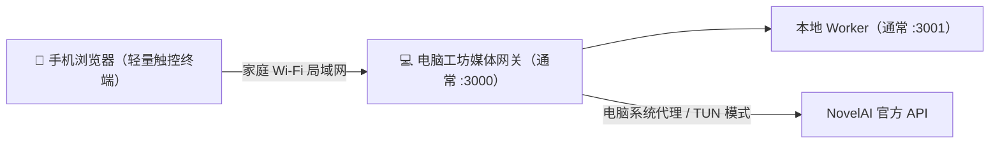
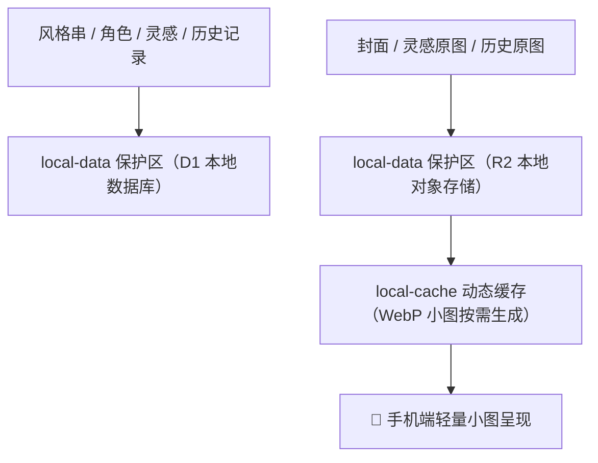

<div align="center">
  

  # NAI Atelier

  **面向 NovelAI 的个人本地创作工坊**

  **[简体中文](./README.md) · [繁體中文](./README.zh-TW.md) · [English](./README.en.md) · [日本語](./README.ja.md) · [한국어](./README.ko.md)**

  [](./CHANGELOG.md)
  [](https://novelai.net/)
  [](#-本地数据主权与备份)
  [](#-手机局域网创作体验)
  [](./LICENSE)

  [项目定位](#-项目定位) · [界面预览](#-界面预览) · [快速上手](#-快速上手) · [语言](#-界面与助手语言) · [手机创作](#-手机局域网创作体验) · [核心工作流](#-核心创作工作流) · [资源资料库](#-tag-与资源资料库) · [费用与隐私](#-费用密钥与安全守卫) · [数据主权](#-本地数据主权与备份) · [生态互通](#-生态互通与扩展st-chatu8-联动) · [技术架构](#-技术架构) · [更新日志](./CHANGELOG.md)

  > NAI Atelier 基于 [kirafishy/NaiPromptManager](https://github.com/kirafishy/NaiPromptManager) 二次开发并独立维护，面向本地单人创作；原项目见上方链接。
</div>

---

## 🧭 项目定位

NAI Atelier 是一套运行在个人电脑或 Android 手机上的 NovelAI 本地创作工坊。它围绕长期个人使用建立完整创作工作流：

> **寻找素材灵感 → 模块化组合 Prompt → 单张生成与流式反馈 → 局部加工与微调 → 沉淀为个人资产 → 随时在电脑与手机上继续创作。**

工坊以「生成一张 → 观察 → 微调 → 再生成」为默认心流节奏，帮助创作者保留判断与选择。常规探索优先使用官方免费面积与步数范围，复用已有 Vibe；需要消耗 Anlas 时先展示明确估算与二次确认。

| 核心创作体验 | 带来的便利 |
| :--- | :--- |
| 🎨 **完整创作闭环** | 从 Pixiv、Danbooru、AITag 找素材，组合提示词，生成或局部修补，将满意作品一键沉淀为个人资料库 |
| 📚 **个人资产持续复用** | 风格串、角色特征、Vibe 画风编码与历史原图保存在运行工坊的设备，创作配置持续积累 |
| 📱 **沙发/床上手机搓图** | 电脑充当本地工作站，手机连接家庭 Wi-Fi 即可全功能操控，触控优化、免配代理、4 位 PIN 轻量保护 |
| 🔋 **费用可见、过程可控** | 自动换算 Opus 电池剩余张数，自主设定本地点数预算，查看费用估算与付费确认，单张观察、拒绝盲目消耗 |

> [!IMPORTANT]
> **适用范围**：常规免费创作以 NovelAI 活跃 **Opus** 订阅为前提（非活跃 Opus 按付费档估算）。文档中的 **Anlas** 即官方代币（点数）；**Opus 限额** 即官方为 V5 模型引入的电池型免费生成配额。通用 NovelAI 兼容中转已接通普通／流式生图，第三方订阅、余额与额外计费规则尚未适配；界面沿用官方费用估算，不代表中转站实际收费。

---

## 🖼️ 界面预览

> 💡 **防窥保护提示**：为保护创作者隐私，预览截图均在开启全局安全模式（自动虚化作品与敏感占位符保护）状态下截取；点击预览图可查看高清原图。

### 🖥️ 桌面端：核心功能页面展示

<div align="center">
  <p><strong>🎨 风格串与创作预设资产库</strong></p>
  <a href="./docs/screenshots/desktop-presets-gallery.webp">
    
  </a>
  <p><em>自适应瀑布流、展开式侧栏、Opus 电池实时换算、智慧姬同步与收集模式</em></p>
</div>

<div align="center">
  <p><strong>🧪 生图实验室调参控制台</strong></p>
  <a href="./docs/screenshots/desktop-lab-workbench.webp">
    
  </a>
  <p><em>四大模式切换、官方免费尺寸与步数适配、引导控制与零点数安全指示</em></p>
</div>

<div align="center">
  <p><strong>🕘 本地原图生成历史画廊</strong></p>
  <a href="./docs/screenshots/desktop-history-gallery.webp">
    
  </a>
  <p><em>按可见范围加载本地作品、沉浸式大图浏览、收藏筛选与随机重新洗牌</em></p>
</div>

<div align="center">
  <p><strong>🗃️ 公网作品索引与参数参考（AITag）</strong></p>
  <a href="./docs/screenshots/desktop-aitag-browser.webp">
    
  </a>
  <p><em>精选生成案例检索、Prompt 与模型参数构成参考、一键载入工坊深入研究</em></p>
</div>

### 📱 手机端：家庭局域网移动端触控界面

<div align="center">
  <a href="./docs/screenshots/mobile-presets-gallery.webp">
    
  </a>
  &nbsp;&nbsp;&nbsp;&nbsp;
  <a href="./docs/screenshots/mobile-resources-modal.webp">
    
  </a>
  <p><em>44px 舒适触控、双列瀑布流、底部单手手势导航、全套资源库一触即达</em></p>
</div>

---

## 🚀 快速上手

工坊提供 **Windows EXE 安装版**、**源码本地部署** 与 **Android 独立 APK**：

| 使用方式 | 适合人群 | 运行准备 | 开启入口 |
| :--- | :--- | :--- | :--- |
| **EXE 安装版** | 普通使用者（推荐） | Windows 10/11 x64，无需配置 Node.js/Git | [下载已发布安装包](https://github.com/HelloQun54321/nai-atelier/releases)，双击安装向导 |
| **源码本地部署** | 开发者 / 自由定制者 | Node.js 22+ (推荐 24.x) 与 Git | 克隆仓库并执行本地启动命令 |
| **Android 独立 APK** | 希望手机独立创作的使用者 | Android 8.0+、64 位 ARM、手机自身网络 | 安装本地构建的 APK；使用和构建见 [Android 说明](./docs/ANDROID_STANDALONE.md) |

项目显示版本只随电脑端迭代，Android 适配通过独立安装构建号更新，同签名 APK 可直接覆盖安装并保留手机资料。手机图片长按显露下载／复制等原位操作，详情点按进入大图，支持双指缩放、双击放大／复原与放大后拖动。

### 方式一：Windows EXE 安装版（推荐）

1. 前往 **[GitHub Releases 下载页](https://github.com/HelloQun54321/nai-atelier/releases)**，选择最新正式发行的 `NAI-Atelier-Setup-*.exe` 安装包和对应 `.sha256` 文件；公开可下载版本以该页面附件为准，README 顶部版本徽章表示当前源码版本，本地构建不等于已经发布；
2. 双击运行安装程序，自主选择程序安装位置（首次运行会检查微软 VC++ x64 运行库）；
3. 安装完成后从桌面图标打开 **NAI Atelier**，按下方引导开启创作。

> 💡 个人数据保存在 `%LOCALAPPDATA%\NAI Atelier\workspace\local-data`，独立于程序安装目录，卸载时默认安全保留。详细说明见 [Windows 安装版文档](./docs/WINDOWS_DESKTOP.md)。

### 方式二：源码本地部署

```bash
git clone https://github.com/HelloQun54321/nai-atelier.git
cd nai-atelier
npm ci
npm run dev:local
```

安装依赖后，Windows 环境会自动在桌面生成晴空蓝调色盘图标的 `NAI Atelier` 快捷方式。等待终端显示服务就绪后，在浏览器打开 [http://localhost:3000](http://localhost:3000) 即可开始。

### 更新工坊

- **EXE 安装版**：在「全局设置 → 数据与维护 → 应用更新」检查并下载新版，再选择「重启并安装」。只检查 GitHub 已发布版本，尚未发布的本地构建不会出现在更新列表。启动时会安静检查，普通退出不会自动安装。安装前完成生成、Agent、收集、备份与词库任务；个人数据保留，手机连接暂时中断。当前默认接收预发布，可关闭该选项。
- **源码本地部署**：完成任务并关闭源码服务窗口，双击项目根目录的 `更新 NAI Atelier.bat`。入口检查已发布版本、安装锁定依赖、构建并启动；本地修改、定制分支或分叉会停止更新。macOS／Linux 可运行 `sh scripts/update-local.sh`。ZIP 源码没有 Git 更新环境，需从下载页取得新版并按备份说明保留个人数据。
- **旧版首次升级**：没有更新入口的旧 EXE 需手动运行一次新版安装包；旧源码部署需先取得包含更新入口的新版代码。之后即可使用上述入口。主要版本或数据结构变化需要完整备份并按发行说明手动升级。

### 🎨 生成第一张图（5 步直达心流）

1. **添加 Key**：打开「全局设置 → NovelAI 与 Anlas」，添加自己的 `pst-` 密钥，设置该 Key 的 **Anlas 本地预算**；
2. **下载词库**：在「全局设置 → 数据与维护 → Tag 补全词库」点击「检查并更新」，下载并生成本地中英双向 Tag 词典；
3. **文生图测试**：进入「实验室 → 文生图」，输入提示词，选择模型、尺寸与步数，查看当前费用提示；免费资格取决于实际参数、订阅、Opus 额度和参考配置；
4. **生成与观察**：点击生成，实时观察渲染成图，确认无误后可一键将满意配置「保存为风格串」；
5. **开启局域网（可选）**：手机连接同一 Wi-Fi，在「全局设置 → 数据与维护 → 局域网访问」复制手机访问地址，输入 4 位密码继续创作；独立 Android 工坊直接使用手机网络。

### 🌐 界面与助手语言

在「全局设置 → 外观与画廊 → 语言」选择简体中文、繁體中文、English、日本語或 한국어，即时切换界面并记住选择。安装版的标题、启动页、菜单、托盘与收集悬浮窗也跟随；各浏览器／设备可独立选择。

项目 Agent 从下一次请求起使用所选语言交流，已有聊天、创作 Prompt／Tag 和自定义资料名称保留原文，用户明确要求的创作产物语言优先。译文随应用提供，不依赖运行时在线翻译；Tag 补全词库仍为中英对照，界面语言切换不会改写词库或外站内容。README 顶部提供五种语言的使用说明，专项技术文档与变更日志目前以简中维护。

---

## 📱 手机局域网创作体验

随时随地窝在沙发或床上用手机搓图、挑图是最高频的心流体验。电脑负责充当本地工作站（运行服务、网关与存储核心），手机连上同一个家庭 Wi-Fi 即可全功能操控：


```mermaid
flowchart LR
    P["📱 手机浏览器（轻量触控终端）"] -->|家庭 Wi-Fi 局域网| G["💻 电脑工坊媒体网关（通常 :3000）"]
    G --> W["本地 Worker（通常 :3001）"]
    G -->|电脑系统代理 / TUN 模式| N["NovelAI 官方 API"]
```

### 极简连接体验

- **生图请求复用电脑网络**：局域网模式的生成和网关代理请求由电脑发起，手机无需另配 NovelAI 代理；浏览器直接访问的外站仍取决于手机网络。安装版遇到端口冲突会另选端口，手机地址以设置页／本次启动日志为准；
- **轻量安全的 4 位 PIN 码**：局域网设备首次访问只需输入电脑终端/启动日志中打印的 4 位密码即可绑定（30 天内免重复输入），电脑本机免密访问；
- **单手触控心流适配**：
  - 核心操作区域满足至少 44×44px 舒适触控，避开全面屏防误触手势区；
  - 列表悬浮辅助按钮在触屏下采用**长按原位显露**，松手保留，不占用紧凑的看图视野；
  - AITag、Pixiv、Danbooru 的作品详情在手机上覆盖当前图库；页面返回与系统返回收起详情并继续原作品位置，多层窗口逐层返回，后台页面保留浏览状态；
  - 实验室四模式在手机端自动收敛为高效的**三段式 Tab 导航**（底图/提示/参数），贴近单手大拇指舒适操作区。

---

## 🧪 核心创作工作流

### 🎨 风格串：可复用的创作配方

风格串是工坊的核心预设载体：将一套经过实践验证的画风、角色特征、负面词与生成参数完整封存，随时一键调用或派生新作品。

- **模块化解耦分层**：全局提示词、可独立开关的风格模块与全局负面词清晰分层，避免反复手动拼词；
- **多角色独立图层**：每个角色拥有独立正负面词，文生图与编辑模式均支持直观的 X/Y 构图定位（V4/V4.5 格点吸附，V5 自由定位）；
- **参数全套封存**：画面比例、尺寸、Steps、CFG、Variety+、采样器与 Seed 一并封存；
- **风格串收集模式（Windows 懒人置顶窗）**：在 Discord 频道或网页中浏览心仪作品时，开启置顶小窗后只需右键「复制图片链接」，工坊在后台自动静默下载并提取原图内嵌的隐写元数据（Stealth PNGInfo），完整还原提示词、结构化角色与生成参数，无需切回工坊窗口即可自动沉淀为新预设。

<div align="center">
  <a href="./docs/screenshots/desktop-collection-float.webp">
    
  </a>
  <p><em>Windows 桌面置顶小窗：复制图片直链，后台静默解析参数入库</em></p>
</div>

---

### 🧪 生图实验室：四大创作模式

实验室是实际调参生图的主控台，支持四大创作模式，通过 NovelAI 或自行配置的兼容中转获得生成结果：

#### 1. 文生图（Text to Image）：构图与参数探索
- **多角色独立控制**：各角色拥有专属提示词与画面占比，可直接从角色库导入；
- **透明通道生成**：在支持该能力的模型（如 V5）下一键开启透明背景生成，适配立绘、表情包与贴纸制作；
- **推荐参数与免费步数锁**：按模型提供推荐步数，可在生图偏好中启用或关闭免费步数锁；尺寸、步数与参考仍由创作者决定，最终费用按当前同步规则和实际请求估算，默认参数不保证每次都零 Anlas。

#### 2. 图生图（Image to Image）：底图继承与变化
- **底图与提示词独立**：上传、拖入图片、点击「文生图最新」或通过 `Ctrl+V`／「粘贴」换底图，保留图生图当前的提示词、负面词、角色配置与参数；
- **输出尺寸自主选择**：在「参数设置 → 输出尺寸」选择保留底图尺寸、等比缩至当前官方免费像素范围或自定义宽高；手机在「参数」页签。默认保留原尺寸，选择随草稿恢复，宽高按接口要求为 64 的倍数。提交时只缩放副本，完整保留画面、比例不同处填白，角色定位同步转换，原图及当前草稿不变；费用提示与历史均使用实际输出尺寸。免费像素范围不代表必然零 Anlas，仍取决于步数、订阅／Opus 额度和参考配置；
- **主动复用原图配置**：需要原图提示词与参数时，使用顶栏「导入图片或 JSON 配置」，或在历史详情通过「导入到实验室」完整载入；
- **SSE 流式过程图即时预览**：接入流式生图端点，生图过程中实时查看画面演变走向，提前预判效果。

#### 3. 局部重绘：涂抹修补与聚焦放大
- **顺滑涂抹画板**：聚焦与普通重绘均可在画板下方通过滑条或数值调节画笔／橡皮擦大小，配备多级撤销/重做栈，涂抹待修改区域；
- **默认聚焦重绘**：先框选区域，再按需涂抹蒙版，局部裁切放大生成后羽化回贴，适合面部精修与手指细节修补；符合 Opus 条件时零 Anlas，V5 仍消耗 Opus 额度。可手动关闭以使用普通重绘，已有草稿／历史保留原选择；
- **空蒙版防跑拦截**：普通重绘未涂抹蒙版、聚焦重绘未框选区域时阻止生成；聚焦选区内没有笔迹时重绘整个有效选区。

#### 4. 扩图（Outpainting）：无缝延展画面边界
- **四向自由扩展**：自由设定上下左右扩展像素，基于原图自动重建画布；
- **32px 智能接缝过渡**：向原图边缘自动重绘 32 像素接缝，极大消除新增画面与原图之间的生硬分界。

---

### 🕘 生成历史与资产沉淀

- **无损原图与参数本地落盘**：每次生成的原图与全套 Prompt、Seed、采样参数即时保存入本地 D1 数据库与 R2 存储，清空浏览器缓存绝不丢失；
- **连续沉浸式翻阅**：支持大图上一张/下一张连续浏览、键盘方向键切换与 100% 原始尺寸像素级查验；
- **一键回填与微调**：大图详情直接提供「导入到实验室」，可指定送往文生图、图生图或局部重绘继续加工；
- **统一图片取用**：AITag、Pixiv、Danbooru、画师库、角色库、灵感库与风格串封面都可直接下载、复制图片；卡片、详情和大图统一在图片区右上按「下载 → 复制」竖排，桌面悬停／键盘聚焦显露，触屏长按显露。风格串与自定义角色卡片在同列最下方放透明铅笔编辑，收藏位于名称旁，无封面仍可编辑；移除白色按钮组和独立风格串内容复制弹窗，通过复制图片携带其中的创作信息。外站作品卡片取首图，详情按对应图片／当前页取用，目录翻图后取当前显示的图片；Tag 与角色提示词复制保持各自入口。
- **图片分享与隐私保护**：各入口共用图片分享设置。在设置中开启「分享图片时移除生成信息」后，分享出的图片会自动清洗隐藏元数据；原始资产和完整生成信息保留，清洗失败会明确提示。
- **创作预览操作**：小图与全屏大图的辅助按钮统一圆形图标，移除当前图片保留红底，设为封面保留主题色底，清空历史组与上传使用中性深色底；设封面排在下载／复制下方，上传位于右下。提示名称区分单图移除与整组清空，历史页原图均保留；触控命中区域至少 44px，封面处理中显示旋转图标并禁止重复操作。

---

### ✦ 项目 Agent：业务联动 AI 助手

点击界面侧栏或浮钮可一键唤醒基于轻量核心的项目 Agent。它不是简单的聊天框，而是真正连接工坊内部工具的创作助手：

- **本地素材目录读写**：可直接查看电脑指定目录中的素材图片（例如：`看看 D:\Pictures\参考图 里的图片`），或将满意作品一键导出到指定文件夹；
- **三档权限安全掌控**：支持 **只读**、**标准**（首次写入目录时弹窗确认）、**完全访问** 三档权限模式；生图、删除与清空始终由创作者亲自确认；
- **实时页面感知与画布命令**：Agent 自动感知当前正在浏览的作品或实验室模式，能够直接调用像素级画布工具绘制蒙版、设置选区、调整参数草稿；
- **上下文与执行安全**：支持思考过程与工具折叠，具备多步任务超时与防上下文膨胀保护。

<div align="center">
  <a href="./docs/screenshots/desktop-agent-chat.webp">
    
  </a>
  <p><em>感知实验室状态、代写/优化提示词、本地素材读写与三档权限安全掌控</em></p>
</div>

---

### 🌌 永久 Vibe 与 🧬 角色参考

- **Vibe Transfer 与本地编码复用**：在支持该能力的模型上，调用 NovelAI 接口提取画风编码并保存到当前工坊。新编码确认当前同步费用，已有编码可反复复用；参考数量附加费按动态规则估算，支持最多 16 个 Vibe 混合与调权。模型能力以实际界面为准，不把 V4／V4.5 的能力套用到 V5；
- **Precise Reference（角色参考）**：在支持该能力的模型上提供角色与风格参考，按官方要求适配参考画布，用于保持角色一致性。

---

## 📚 Tag 与资源资料库

AITag、Pixiv、Danbooru、画师库与角色库统一突出选中卡片，其余卡片适度变暗；关闭详情或清空选择后恢复，方便辨认当前查看的作品与已选素材。

### 🏷️ 智能 Tag 补全与连续权重胶囊

- **本地中英词库**：整合 Danbooru 中英对照与 NovelAI 专属 Tag，支持前缀联想与热度排序；条目数量以当前安装的词库为准；
- **一体式连续权重胶囊**：同一对花括号或方括号包裹的多个 Tag 自动合并为一个无缝胶囊视觉组件，整洁优雅；
- **内联高精度调权**：直出 `{}`、`[]` 与数值权重转换；常规点击按 `±0.1` 调节，**按住 Shift 点击支持 `±0.01` 极高精度微调**；
- **AI 补译**：遇到未收录的 Tag，可调用已配置的 LLM 补齐中文含义并保存到本地翻译缓存；模型服务按自己的计费规则收费。

### 🎨 画师库与 👤 角色库

- **画师库**：使用当前词库中的画师 Tag，支持按热度与字母检索，以及 **随机抽卡**（惊喜混合／热门卡池）；
- **角色库**：结合角色 Tag 与自定义角色配方，可将特征 Prompt 送入实验室；目录数量随词库版本变化。风格串和自定义角色卡片的左上角提供红色删除按钮，桌面悬停／键盘聚焦或手机长按后显露，确认后删除条目及本地预览，无封面也可操作；角色 Tag 词库条目不提供删除。

### 🌐 外部素材发现：Pixiv · Danbooru · AITag

- **AITag 索引**：聚合公网 NovelAI 生成案例与元数据索引，方便创作者横向对比不同画风的实际渲染表现，直观查阅作品的 Prompt 组织与参数结构，作为构图与角色设计的灵感参考；
- **Pixiv 图库**：直连官方 App API，支持日/周/月榜、Tag 搜索与画师作品，详情图片一键反推 Tag 并收入灵感库；Windows 在默认浏览器登录并允许外部应用回调，安全保存成功后自动打开「Pixiv 已连接」完成页；
- **Danbooru 素材库**：通用级构图与标签参考，具备本地智能调度与防限流保护。

### 🔍 本地图片反推 Tag（WD Tagger）

在运行工坊的设备上以 CPU 反推 Danbooru Tag，**无需上传第三方云端推理，零 Anlas 消耗**；局域网模式由电脑处理，独立 Android 由手机处理。支持 WD ViT V3、WD SwinV2 V3、WD EVA02-Large V3 模型，首次按需下载后可离线执行反推，获取外站图片仍需网络：
- **模型管理**：在「全局设置 → 生图偏好与实验室」底部下载、选择或删除模型；删除只清理对应模型缓存，再次使用时重新下载。
- **角色框粘贴反推（Paste-to-Tag）**：在目标角色中按 `Ctrl+V` 或点击「粘贴反推」，识别结果追加到该角色的提示词；处理耗时取决于模型和设备性能。

---

## 🛡️ 费用、密钥与安全守卫

### 🔋 Opus 电池限额自动换算（告别心算）

- **全自动静默轮询**：后台自动同步官方 `/user/subscription` 订阅状态与 Opus 电池限额；
- **动态换算剩余可搓张数**：按当前同步的官方系数显示百分比与估算可用张数，换算随规则更新，不将固定示例当成永久额度；
- **三色警报感知**：充裕时翡翠绿，低于 20% 琥珀黄预警，透支标红示警。

### 💰 Anlas 预算、费用估算与付费确认

- **本地预算**：创作者自主设定期望分配给工坊的本地安全预算（默认 1666 点）；
- **四模式统一计费依据**：文生图、图生图、普通／聚焦重绘与扩图按真实请求尺寸、步数、活跃 Opus、模型额度和参考配置判断免费资格。图像编辑也可能零 Anlas；聚焦看裁剪后的请求区域，扩图看最终画布，V5 等受限模型的免费档仍消耗共享 Opus 额度。
- **生成状态统一**：桌面和手机四模式统一「生成」与费用提示：免费、消耗 Opus 额度或预计 Anlas 数值；订阅尚未知时显示「费用确认中…／费用未知」，已有快照后台刷新时继续使用估算。缺底图、选区、蒙版及未应用扩图直接提示下一步；排队区分准备、加入、等待与即将生成，显示采样步数并支持「取消排队／取消中…」，桌面编辑也有完整队列入口，任务结束立即恢复操作。
- **规则自动同步**：启动后和每日从 NovelAI 官方 Web 应用同步免费门槛／资格／张数、成本系数、模型倍率、SMEA 倍率及编码／参考附加费；前端、内置助手与网关共用规则，保持打开的实验室也接收更新。可识别的数值调整自动生效，提取失效保留最近完整快照、短间隔重试并在侧栏示警。联网自检执行官方实际费用调用，避免把重试条件误当成价格条件；当前精确参考按每张、每个参考另收附加费，不因此取消基础免费资格。
- **生成前费用确认**：进入付费或启用付费参考时，生成前展示完整估算与确认，预算不足示警，由用户决定是否继续。Key 激活与启动不等待官方规则同步；普通生成复用已有订阅快照并后台刷新，不追加联网校验、费用上限拦截或同步异常确认。成功按生成前已有快照记本地用量，订阅未知时不猜测本地扣费；记账失败保留图片或编码并单独提示，避免重复消费。本地预算和「个人估算消耗 Anlas」不代表官方实际扣费；更新计费规则不自动修改历史预算和旧统计。

- **创作参数由你决定**：四模式和当前模型支持的参考能力直接可用，保留当前尺寸、步数、Strength 与参考配置；支持 Vibe 的模型最多使用 16 个参考。生图偏好中的免费步数锁可单独调整，局部重绘的「聚焦重绘」可随时切换。

### 🕶️ 沉浸式防窥（图片安全模式）与外观个性化

在公共场合、办公室或与人合屏时，随时一键隐匿敏感画面，并支持高度自由的外观治理：
- **三重遮罩防护**：所有作品与封面默认应用高强度模糊、深度压暗与色彩归零；
- **临时窥视机制**：点击单张图片仅临时解除遮罩预览，鼠标移开后立即恢复模糊；
- **失焦自锁保护**：切换标签页、应用失去焦点或轻按 `Esc`，遮罩全自动重置闭合；
- **布局列数自由掌控**：电脑／手机均可调整列数或使用自适应布局，并选择瀑布流、竖向卡片或方形列表；
- **全站个性化主题**：内置明暗模式、透光毛玻璃材质、圆角与字号密度、自定义强调色。

<div align="center">
  <a href="./docs/screenshots/desktop-appearance-settings.webp">
    
  </a>
  <p><em>全局安全模式配置、移动/桌面端瀑布流列数自定义与透光个性化主题</em></p>
</div>

### 🗄️ 多密钥保管箱（Key Vault）

- 支持录入多组 NovelAI Key 并标注别名（如「Opus 主号」、「拼车号」），在实验室顶栏一键秒切；
- 界面上密钥默认掩码脱敏，防止屏幕共享与录屏泄露。

---

## 💾 本地数据主权与备份

### 运行设备持有自己的事实源

电脑安装版与源码部署以各自工作区的 `local-data` 为事实源；通过局域网访问的手机使用同一电脑工坊。独立 Android 工坊则以手机私有 SQLite 与原图文件为事实源，独立于电脑，不自动同步或合并资料。下面是电脑／局域网模式的存储关系：


```mermaid
flowchart TD
    A["风格串 / 角色 / 灵感 / 历史记录"] --> D["local-data 保护区（D1 本地数据库）"]
    B["封面 / 灵感原图 / 历史原图"] --> R["local-data 保护区（R2 本地对象存储）"]
    R --> T["local-cache 动态缓存（WebP 小图按需生成）"]
    T --> M["📱 手机端轻量小图呈现"]
```

> ⚠️ **高危提醒：`local-data` 是绝对保护区，禁止随意改动！**
> 
> `wrangler.toml` 中的 `database_id` 是本地存储哈希定位键。**擅自修改或删除 `database_id` 会导致 Worker 加载全新空库，界面表现为历史与预设“瞬间消失”**。备份或迁移时，请**完整打包复制整个 `local-data` 文件夹**！

### 数据备份与恢复

| 使用方式 | 持久化数据所在绝对路径 |
| :--- | :--- |
| **EXE 安装版** | `%LOCALAPPDATA%\NAI Atelier\workspace\local-data` |
| **源码本地部署** | `<项目根目录>/local-data/` |
| **独立 Android** | 手机应用私有 SQLite 与文件；通过应用内加密备份导出，不使用电脑的 `local-data` |

- **电脑应用内备份**：打开「全局设置 → 数据与维护 → 重要数据备份」，设定备份目录后点击「立即完整备份」；
- **电脑停服手动备份**：安装版通过托盘「退出工坊」，源码版关闭服务，再完整复制对应工坊的 `local-data/`；仅关闭安装版窗口不会停止后台；
- **Android 完整备份**：在「全局设置 → 数据与维护」的备份入口设置至少 8 位密码，导出加密 `.naiatelier` 文件。手机卸载会删除应用私有资料，卸载／换机前先导出；丢失密码无法恢复，详见 [独立 Android 说明](./docs/ANDROID_STANDALONE.md)；
- **不同入口的资料边界**：源码版、Windows 安装版与独立 Android 各有自己的工坊；第一次打开另一入口看到空库，不代表原资料被覆盖。浏览器尚未保存的草稿不属于 D1／R2 完整备份，跨工坊迁移另行处理。

---

## 🔗 生态互通与扩展（st-chatu8 联动）

- **智慧姬资产互通（SillyTavern 角色扮演无缝联动）**：
  - 深度参考并对接 SillyTavern 生图扩展 [st-chatu8](https://github.com/damoshen123/st-chatu8)；
  - 支持工坊精选风格串、永久 Vibe 画风编码与历史原图的双向无缝桥接，打通酒馆 RP 沉浸对话与工坊精细打磨之间的资产壁垒；
  - 详细同步规则、二进制去重与协议实现请参阅 [**SillyTavern 桥接技术指南**](./docs/SILLYTAVERN_BRIDGE.md)。
- **👥 多人拼车公共排队与通用生图中转**：
  - **st-chatu 协议排队**：在「NovelAI 与 Anlas → 多人拼车公共队列」填写兼容服务的基础地址，例如 `https://st-chatu-novelai-queue.hf.space/`；只用 Key 的 SHA-256 指纹协调顺序，取得许可后由工坊请求 NovelAI，不向队列上传原始 Key、提示词或图片。支持排队人数、自定义 15 字个性语及「显示当前使用者的个性语」，等待阶段可以取消；
  - **通用生图中转**：同一输入框也可填写任意兼容服务的完整 `/ai/generate-image` 地址，例如 `https://nai.ry.mk/ai/generate-image`，支持路径前缀及对应流式接口；启用后直接把生图请求交给中转服务排队，不调用 st-chatu 的握手接口。中转会接收当前 Key、提示词及本次参考内容，填写地址时明确提示；
  - **准确显示状态**：中转等待显示「中转排队／生成中…」，不猜测服务端人数，隐藏仅对 st-chatu 生效的个性语输入及显示开关。可「停止等待」中断本次连接，实际生成是否停止由服务端决定；失败不自动重发或回退官方，费用仍按已有官方规则估算。

---

## 🛠️ 技术架构

| 层级 | 技术方案 |
| :--- | :--- |
| **前端架构** | React 19、TypeScript、Tailwind CSS、Vite |
| **本地后端** | Cloudflare Workers / Wrangler 本地运行时、Node.js 媒体网关 |
| **持久存储** | 本地 D1 (SQLite) 数据库、本地 R2 兼容对象存储 |
| **图像处理** | Sharp (WebP 按需缩略图转码)、本地 ONNX Runtime (WD Tagger) |
| **局域网认证** | 4 位 PIN、HMAC 签名 Cookie 与登录失败限流；用于可信局域网 |

### 源码版常用维护命令

| 命令 | 用途 |
| :--- | :--- |
| `npm run dev:local` | 启动完整本地服务（前端 + Worker + 网关 + 词库） |
| `npm run update:tags` | 从 GitHub 更新并重新编译中英 Tag 分片 |
| `npm run test -- <路径>` | Vitest 快速定向测试 |
| `npm run test:gateway` | 网关、桥接与本地后端集成测试 |
| `npm run test:live-sync` | 显式联网验证 NovelAI 官方常量提取 |
| `node scripts/bump-version.mjs patch` | 规范化版本号递增 |

---

## 📄 来源与致谢

- 基于 [kirafishy/NaiPromptManager](https://github.com/kirafishy/NaiPromptManager) 二次开发并独立维护，保留原有 [MIT 许可证](./LICENSE)；
- 感谢 [@ffdkj](https://github.com/ffdkj) 维护的高质量 [Danbooru 中英对照翻译数据库](https://github.com/ffdkj/ffdkj-Danbooru_Tag-Chinese-English-Translation-Table)；
- 特别感谢 [@damoshen123](https://github.com/damoshen123) 的开源项目 [st-chatu8](https://github.com/damoshen123/st-chatu8)：工坊的「智慧姬互通联动」与「多人拼车云端排队协同」功能的设计与实现均深度参考了该项目；
- 本地反推模型：[SmilingWolf WD ViT Tagger V3](https://huggingface.co/SmilingWolf/wd-vit-tagger-v3) (Apache-2.0)。

### 一点个人吐槽

以下保留作者个人观点原文；当前免费资格和收费以应用同步结果及 NovelAI 实际结算为准。

novelai直到4.5系列的模型都还是opus档会员可以无限生小图（28步，1216*832这个像素尺寸内的）<br>
但8月下旬更新的5系列模型却一改之前的政策，搞了个及其傻逼的电池机制，限额<br>
novelai我给你老冯飞了<br>
去你discord讨论就禁言，去你推特下面反映就拉黑<br>
真是纯野狗公司吧<br>
一个破小说模型训练大半年搞炸炉端出来一坨屎<br>
生图模型也是一直装死不更新，一更新就加限额机制<br>
你和你的孝子贤孙全家飞天

---

<div align="center">
  <strong>详细修改过程请查看 <a href="./CHANGELOG.md">CHANGELOG.md</a></strong>
</div>
