<div align="center">
  

  # NAI Atelier

  **面向 NovelAI 的个人本地创作工坊**

  [](./CHANGELOG.md)
  [](https://novelai.net/)
  [](#-本地数据主权与备份)
  [](#-手机局域网创作体验)
  [](./LICENSE)

  [项目定位](#-项目定位) · [界面预览](#-界面预览) · [快速上手](#-快速上手) · [手机创作](#-手机局域网创作体验) · [核心工作流](#-核心创作工作流) · [资源资料库](#-tag-与资源资料库) · [费用与隐私](#-费用密钥与安全守卫) · [数据主权](#-本地数据主权与备份) · [生态互通](#-生态互通与扩展) · [技术架构](#-技术架构) · [更新日志](./CHANGELOG.md)

  > NAI Atelier 基于 [kirafishy/NaiPromptManager](https://github.com/kirafishy/NaiPromptManager) 二次开发并独立维护，面向本地单人创作；原项目见上方链接。
</div>

---

## 🧭 项目定位

NAI Atelier 是一套运行在个人电脑上的 NovelAI 本地创作工坊。它不是单纯的提示词输入框，而是围绕长期个人使用建立的完整创作工作流：

> **寻找素材灵感 → 模块化组合 Prompt → 单张生成与流式反馈 → 局部加工与微调 → 沉淀为个人资产 → 随时在电脑与手机上继续创作。**

工坊以「生成一张 → 观察 → 微调 → 再生成」为默认心流节奏，帮助创作者保留判断与选择。常规探索优先使用官方免费面积与步数范围，复用已有 Vibe；需要消耗 Anlas 时先展示明确估算与二次确认。

| 核心创作体验 | 带来的便利 |
| :--- | :--- |
| 🎨 **完整创作闭环** | 从 Pixiv、Danbooru、AITag 找素材，组合提示词，生成或局部修补，将满意作品一键沉淀为个人资料库 |
| 📚 **个人资产持续复用** | 风格串、角色特征、Vibe 画风编码与历史原图集中保存在电脑，创作配置越用越丰富 |
| 📱 **沙发/床上手机搓图** | 电脑充当本地工作站，手机连接家庭 Wi-Fi 即可全功能操控，触控优化、免配代理、4 位 PIN 轻量保护 |
| 🔋 **费用可见、过程可控** | 自动换算 Opus 电池剩余张数，自主设定本地点数预算与防超额拦截，单张观察、拒绝盲目消耗 |

> [!IMPORTANT]
> **适用范围**：常规免费创作以 NovelAI 活跃 **Opus** 订阅为前提（非活跃 Opus 按付费档估算）。文档中的 **Anlas** 即官方代币（点数）；**Opus 限额** 即官方为 V5 模型引入的电池型免费生成配额。第三方中转服务未做适配。

---

## 🖼️ 界面预览

> 💡 **防窥保护提示**：为保护创作者隐私，预览截图均在开启全局安全模式（自动虚化作品与敏感占位符保护）状态下截取；点击预览图可查看高清原图。

### 🖥️ 桌面端：核心功能页面展示

<div align="center">
  <p><strong>🎨 风格串与创作预设资产库</strong></p>
  <a href="./docs/screenshots/desktop-presets-gallery.webp">
    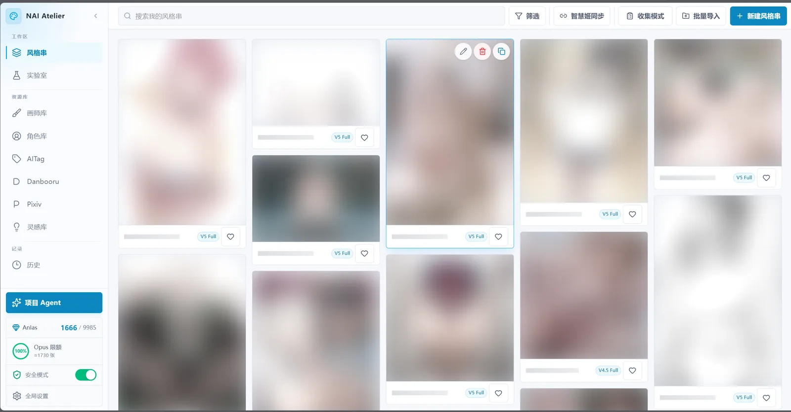
  </a>
  <p><em>自适应瀑布流、展开式侧栏、Opus 电池实时换算、智慧姬同步与收集模式</em></p>
</div>

<div align="center">
  <p><strong>🧪 生图实验室调参控制台</strong></p>
  <a href="./docs/screenshots/desktop-lab-workbench.webp">
    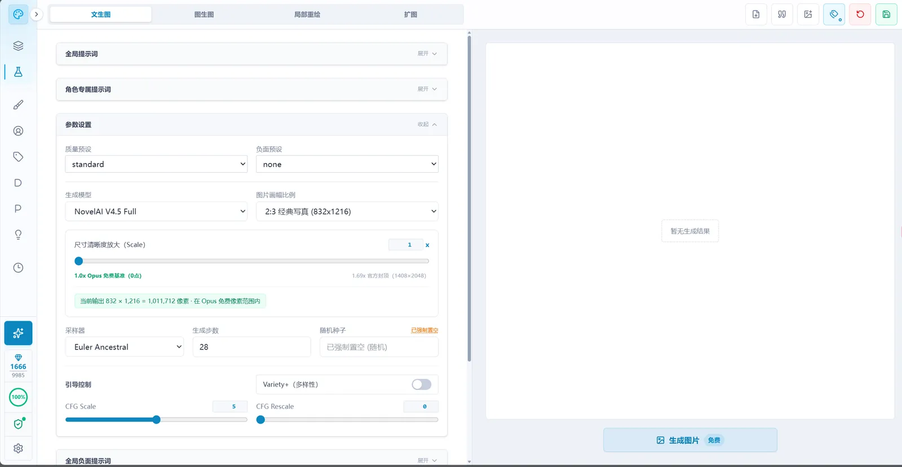
  </a>
  <p><em>四大模式切换、官方免费尺寸与步数适配、引导控制与零点数安全指示</em></p>
</div>

<div align="center">
  <p><strong>🕘 本地原图生成历史画廊</strong></p>
  <a href="./docs/screenshots/desktop-history-gallery.webp">
    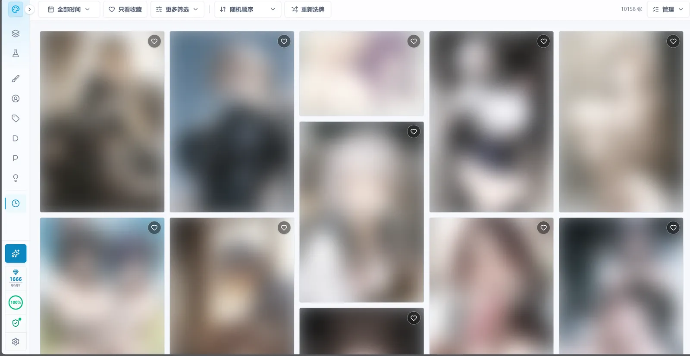
  </a>
  <p><em>万张作品本地瞬间呈现、沉浸式大图浏览、收藏筛选与随机重新洗牌</em></p>
</div>

<div align="center">
  <p><strong>🗃️ 公网作品索引与参数参考（AITag）</strong></p>
  <a href="./docs/screenshots/desktop-aitag-browser.webp">
    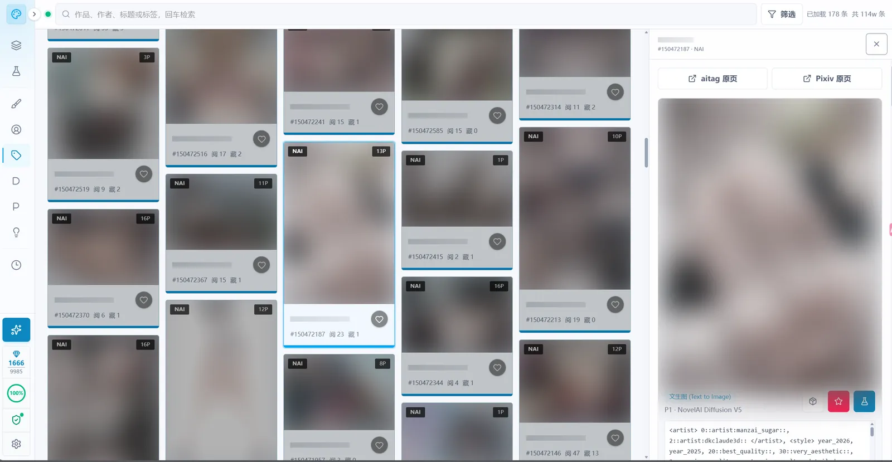
  </a>
  <p><em>精选生成案例检索、Prompt 与模型参数构成参考、一键载入工坊深入研究</em></p>
</div>

### 📱 手机端：家庭局域网移动端触控界面

<div align="center">
  <a href="./docs/screenshots/mobile-presets-gallery.webp">
    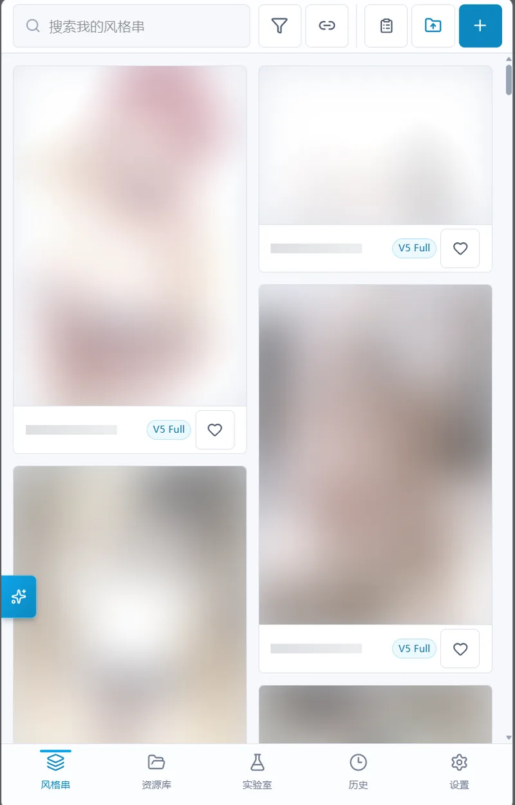
  </a>
  &nbsp;&nbsp;&nbsp;&nbsp;
  <a href="./docs/screenshots/mobile-resources-modal.webp">
    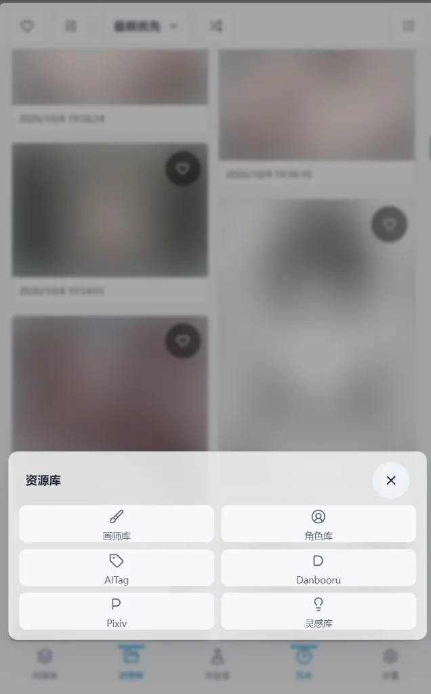
  </a>
  <p><em>44px 舒适触控、双列瀑布流、底部单手手势导航、全套资源库一触即达</em></p>
</div>

---

## 🚀 快速上手

工坊提供 **Windows EXE 安装版** 与 **源码本地部署** 两种方式，两者功能完全一致：

| 使用方式 | 适合人群 | 运行准备 | 开启入口 |
| :--- | :--- | :--- | :--- |
| **EXE 安装版** | 普通使用者（推荐） | Windows 10/11 x64，无需配置 Node.js/Git | [下载已发布安装包](https://github.com/HelloQun54321/nai-atelier/releases)，双击安装向导 |
| **源码本地部署** | 开发者 / 自由定制者 | Node.js 22+ (推荐 24.x) 与 Git | 克隆仓库并执行本地启动命令 |

### 方式一：Windows EXE 安装版（推荐）

1. 前往 **[GitHub Releases 下载页](https://github.com/HelloQun54321/nai-atelier/releases)**，下载 `NAI-Atelier-Setup-*.exe` 安装包（包含预发布版本）；
2. 双击运行安装程序，自主选择程序安装位置（首次运行会检查微软 VC++ x64 运行库）；
3. 安装完成后从桌面图标打开 **NAI Atelier**，按下方引导开启创作。

> 💡 个人数据保存在 `%LOCALAPPDATA%\NAI Atelier\workspace\local-data`，独立于程序安装目录，卸载时默认安全保留。详细说明见 [Windows 安装版文档](./docs/WINDOWS_DESKTOP.md)。

### 方式二：源码本地部署

```bash
git clone https://github.com/HelloQun54321/nai-atelier.git
cd nai-atelier
npm install
npm run dev:local
```

安装依赖后，Windows 环境会自动在桌面生成晴空蓝调色盘图标的 `NAI Atelier` 快捷方式。等待终端显示服务就绪后，在浏览器打开 [http://localhost:3000](http://localhost:3000) 即可开始。

### 更新工坊

- **EXE 安装版**：在「系统设置 → 数据与维护 → 应用更新」检查并下载新版，再选择「重启并安装」。启动时会安静检查，普通退出不会自动安装。安装前完成生成、Agent、收集、备份与词库任务；个人数据保留，手机连接暂时中断。当前默认接收预发布，可关闭该选项。
- **源码本地部署**：完成任务并关闭源码服务窗口，双击项目根目录的 `更新 NAI Atelier.bat`。入口检查已发布版本、安装锁定依赖、构建并启动；本地修改、定制分支或分叉会停止更新。macOS／Linux 可运行 `sh scripts/update-local.sh`。ZIP 源码没有 Git 更新环境，需从下载页取得新版并按备份说明保留个人数据。
- **旧版首次升级**：没有更新入口的旧 EXE 需手动运行一次新版安装包；旧源码部署需先取得包含更新入口的新版代码。之后即可使用上述入口。主要版本或数据结构变化需要完整备份并按发行说明手动升级。

### 🎨 生成第一张图（5 步直达心流）

1. **添加 Key**：打开「系统设置 → NovelAI 与 Anlas」，添加自己的 `pst-` 密钥，设置该 Key 的 **Anlas 安全预算**；
2. **下载词库**：在「Tag 补全词库」点击「检查并更新」，一键下载并生成本地 32 万中英双向 Tag 词典；
3. **文生图测试**：进入「生图实验室 → 文生图」，输入提示词。使用默认 V4.5/V5 尺寸与步数（零 Anlas 免费范围）；
4. **生成与观察**：点击生成，实时观察渲染成图，确认无误后可一键将满意配置「保存为风格串」；
5. **开启局域网**：手机连接同一 Wi-Fi，输入电脑终端显示的 IP 地址与 4 位密码，随时躺在床上继续创作。

---

## 📱 手机局域网创作体验

随时随地窝在沙发或床上用手机搓图、挑图是最高频的心流体验。电脑负责充当本地工作站（运行服务、网关与存储核心），手机连上同一个家庭 Wi-Fi 即可全功能操控：

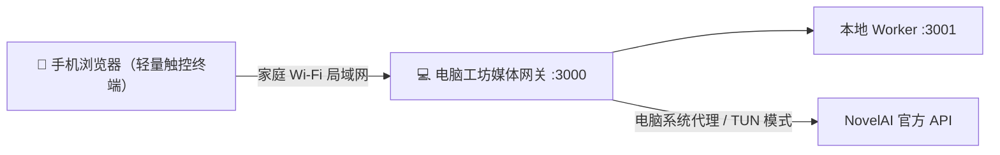
```mermaid
flowchart LR
    P["📱 手机浏览器（轻量触控终端）"] -->|家庭 Wi-Fi 局域网| G["💻 电脑工坊媒体网关 :3000"]
    G --> W["本地 Worker :3001"]
    G -->|电脑系统代理 / TUN 模式| N["NovelAI 官方 API"]
```

### 极简连接体验

- **终端免配置代理**：手机本身无需开启 VPN 或导入根证书。所有网络请求与官方 API 通信均由电脑端发起；只要电脑能访问 NovelAI，手机开箱即连；
- **轻量安全的 4 位 PIN 码**：局域网设备首次访问只需输入电脑终端/启动日志中打印的 4 位密码即可绑定（30 天内免重复输入），电脑本机免密访问；
- **单手触控心流适配**：
  - 核心操作区域满足至少 44×44px 舒适触控，避开全面屏防误触手势区；
  - 列表悬浮辅助按钮在触屏下采用**长按原位显露**，松手保留，不占用紧凑的看图视野；
  - 实验室四模式在手机端自动收敛为高效的**三段式 Tab 导航**（底图/提示/参数），贴近单手大拇指舒适操作区。

---

## 🧪 核心创作工作流

### 🎨 风格串：可复用的创作配方

风格串是工坊的核心预设载体：将一套经过实践验证的画风、角色特征、负面词与生成参数完整封存，随时一键调用或派生新作品。

- **模块化解耦分层**：全局提示词、可独立开关的风格模块与全局负面词清晰分层，避免反复手动拼词；
- **多角色独立图层**：每个角色拥有独立正负面词，文生图与编辑模式均支持直观的 X/Y 构图定位（V4/V4.5 格点吸附，V5 自由定位）；
- **参数全套封存**：画面比例、尺寸、Steps、CFG、Variety+、采样器与 Seed 一并封存；
- **风格串收集模式（Windows 懒人置顶窗）**：在 Discord 频道或网页中浏览心仪作品时，开启置顶小窗后只需右键「复制图片链接」，工坊在后台自动静默下载并提取原图内嵌的隐写元数据（Stealth PNGInfo），完整还原提示词、结构化角色与生成参数，无需切回工坊窗口即可自动沉淀为新预设。

<div align="center">
  <a href="./docs/screenshots/desktop-collection-float.webp">
    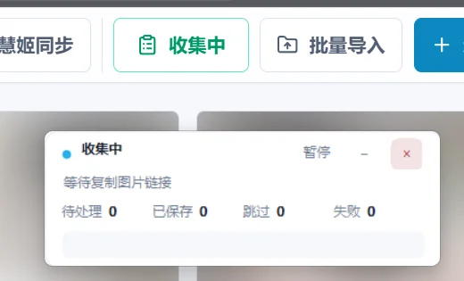
  </a>
  <p><em>Windows 桌面置顶小窗：复制图片直链，后台静默解析参数入库</em></p>
</div>

---

### 🧪 生图实验室：四大创作模式

实验室是实际调参生图的主控台，完整支持四大创作模式，直连 NovelAI 实时获得高分辨率渲染反馈：

#### 1. 文生图（Text to Image）：构图与参数探索
- **多角色独立控制**：各角色拥有专属提示词与画面占比，可直接从角色库导入；
- **透明通道生成**：在支持该能力的模型（如 V5）下一键开启透明背景生成，适配立绘、表情包与贴纸制作；
- **免费边界自动适配**：默认将分辨率与步数锁定在官方免费门槛内（V5 默认推荐 23 步，V4/V4.5 锁定 28 步），避免意外消耗 Anlas。

#### 2. 图生图（Image to Image）：底图继承与变化
- **底图与提示词独立**：上传、拖入图片、点击「文生图最新」或通过 `Ctrl+V`／「粘贴」换底图，保留图生图当前的提示词、负面词、角色配置与参数；
- **主动复用原图配置**：需要原图提示词与参数时，使用顶栏「导入图片或 JSON 配置」，或在历史详情通过「导入到实验室」完整载入；
- **SSE 流式过程图即时预览**：接入流式生图端点，生图过程中实时查看画面演变走向，提前预判效果。

#### 3. 局部重绘：涂抹修补与聚焦放大
- **顺滑涂抹画板**：聚焦与普通重绘均可在画板下方通过滑条或数值调节画笔／橡皮擦大小，配备多级撤销/重做栈，涂抹待修改区域；
- **默认聚焦重绘**：先框选区域，再按需涂抹蒙版，局部裁切放大生成后羽化回贴，适合面部精修与手指细节修补；符合 Opus 条件时零 Anlas，V5 仍消耗 Opus 额度。可手动关闭以使用普通重绘，已有草稿／历史保留原选择；
- **空蒙版防跑拦截**：普通重绘未涂抹蒙版、聚焦重绘未框选区域时阻止生成；聚焦选区内没有笔迹时重绘整个有效选区。

#### 4. 扩图（Outpainting）：无缝延展画面边界
- **四向自由扩展**：自由设定上下左右扩展像素，基于原图自动重建画布；
- **32px 智能接缝过渡**：向原图边缘自动重绘 32 像素接缝，极大消除新增画面与原图之间的生硬分界。

---

### 🕘 生成历史与资产沉淀

- **无损原图与参数本地落盘**：每次生成的原图与全套 Prompt、Seed、采样参数即时保存入本地 D1 数据库与 R2 存储，清空浏览器缓存绝不丢失；
- **连续沉浸式翻阅**：支持大图上一张/下一张连续浏览、键盘方向键切换与 100% 原始尺寸像素级查验；
- **一键回填与微调**：大图详情直接提供「导入到实验室」，可指定送往文生图、图生图或局部重绘继续加工；
- **图片分享与隐私保护**：支持一键复制与下载无损原图。在设置中开启「分享图片时移除生成信息」后，分享出的图片会自动清洗隐藏元数据，保护创作者的核心提示词不被泄露。

---

### ✦ 项目 Agent：业务联动 AI 助手

点击界面侧栏或浮钮可一键唤醒基于轻量核心的项目 Agent。它不是简单的聊天框，而是真正连接工坊内部工具的创作助手：

- **本地素材目录读写**：可直接查看电脑指定目录中的素材图片（例如：`看看 D:\Pictures\参考图 里的图片`），或将满意作品一键导出到指定文件夹；
- **三档权限安全掌控**：支持 **只读**、**标准**（首次写入目录时弹窗确认）、**完全访问** 三档权限模式；生图、删除与清空始终由创作者亲自确认；
- **实时页面感知与画布命令**：Agent 自动感知当前正在浏览的作品或实验室模式，能够直接调用像素级画布工具绘制蒙版、设置选区、调整参数草稿；
- **上下文与执行安全**：支持思考过程与工具折叠，具备多步任务超时与防上下文膨胀保护。

<div align="center">
  <a href="./docs/screenshots/desktop-agent-chat.webp">
    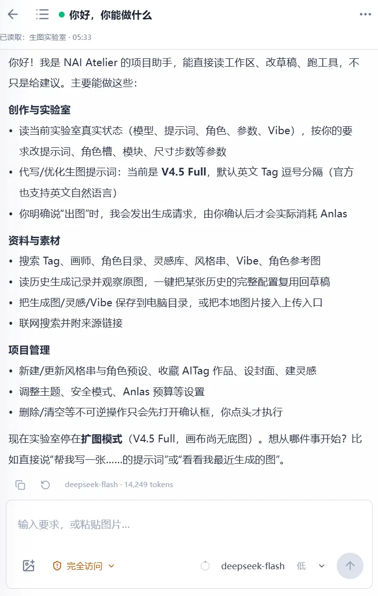
  </a>
  <p><em>感知实验室状态、代写/优化提示词、本地素材读写与三档权限安全掌控</em></p>
</div>

---

### 🌌 永久 Vibe 与 🧬 角色参考

- **Vibe Transfer 官方能力复现与本地永久沉淀**：Vibe Transfer 本身是 NovelAI 官方原生的画风迁移能力，工坊在本地完整复现了该功能，并做了资产化增强——调用官方接口提取编码后（仅首次需 2 Anlas），将特征编码永久落盘保存在电脑本地。后续在工坊中使用该 Vibe 生图无需重复编码扣费，并支持多达 16 个 Vibe 自由混合与调权组合；
- **Precise Reference（角色参考）**：复现官方角色与风格参考能力，自动适配官方竖图/横图画布，生成时无缝保留角色一致性。

---

## 📚 Tag 与资源资料库

AITag、Pixiv、Danbooru、画师库与角色库统一突出选中卡片，其余卡片适度变暗；关闭详情或清空选择后恢复，方便辨认当前查看的作品与已选素材。

### 🏷️ 智能 Tag 补全与连续权重胶囊

- **32 万海量中英词库**：整合 Danbooru 中英对照与 NovelAI 官方专属 Tag，输入中英文均可即时前缀联想与热度排序；
- **一体式连续权重胶囊**：同一对花括号或方括号包裹的多个 Tag 自动合并为一个无缝胶囊视觉组件，整洁优雅；
- **内联高精度调权**：直出 `{}`、`[]` 与数值权重转换；常规点击按 `±0.1` 调节，**按住 Shift 点击支持 `±0.01` 极高精度微调**；
- **AI 极速补译**：遇到未收录的新生冷门 Tag，一键调 LLM 补齐中文含义并持久化写入本地翻译缓存。

### 🎨 画师库与 👤 角色库

- **画师库**：收录约 15.1 万画师 Tag，支持按热度与字母检索；提供 **随机抽卡** 功能（惊喜混合/热门卡池），打破创作思维惯性；
- **角色库**：整合 10.2 万官方标准角色 Tag 与自定义角色配方，支持一键将特征 Prompt 送入实验室。

### 🌐 外部素材发现：Pixiv · Danbooru · AITag

- **AITag 索引**：聚合公网 NovelAI 生成案例与元数据索引，方便创作者横向对比不同画风的实际渲染表现，直观查阅作品的 Prompt 组织与参数结构，作为构图与角色设计的灵感参考；
- **Pixiv 图库**：直连官方 App API，支持日/周/月榜、Tag 搜索与画师作品，详情图片一键反推 Tag 并收入灵感库；
- **Danbooru 素材库**：通用级构图与标签参考，具备本地智能调度与防限流保护。

### 🔍 本地图片反推 Tag（WD Tagger）

直接在电脑本地使用 CPU 对图片反推 Danbooru Tag，**无需上传第三方云端，零 Anlas 消耗**。支持 WD ViT V3、WD SwinV2 V3、WD EVA02-Large V3 模型，首次按需下载后即可离线运行：
- **角色框一键粘贴反推（Paste-to-Tag）**：在多角色创作时，手头有参考图无需单独打开反推面板，直接在目标角色中按 `Ctrl+V` 或点击「粘贴反推」，系统自动识别并把角色特征 Tag 秒级追加到该角色专属提示词中，交互行云流水。

---

## 🛡️ 费用、密钥与安全守卫

### 🔋 Opus 电池限额自动换算（告别心算）

- **全自动静默轮询**：后台自动同步官方 `/user/subscription` 订阅状态与 Opus 电池限额；
- **动态换算剩余可搓张数**：结合官方换算系数，直观显示 **`剩余 28% ≈ 484 张`**，剩余额度一目了然；
- **三色警报感知**：充裕时翡翠绿，低于 20% 琥珀黄预警，透支标红示警。

### 💰 Anlas 点数预算守卫与防误扣

- **本地预算守卫机制**：创作者自主设定期望分配给工坊的本地安全预算（默认 1666 点）；
- **扣费透明阻断**：当免费额度用尽跨入付费、或启用角色参考时，生图按钮会明确切换为「消耗 XX 点」，并在生图前弹出确认面板列明扣费清单，预算不足直接拦截，防止不知情下过度消耗云端点数。

### 🛡️ 低消耗模式（Opus 零点数探索保护伞）

专为不想消耗 Anlas 点数的创作者量身定制的“绝对白嫖保险”：
- **全自动收敛至免费路径**：开启后工作台自动隐藏付费尺寸，隐藏容易扣点的图生图与扩图模式；
- **步数与能力严格封顶**：步数强制锁定在官方免费门槛内（V5 最多 23 步，V4/V4.5 最多 28 步），局部重绘临时固定为零点数的 Focused 模式；
- **资产安全复用**：仅允许使用已有 Vibe 编码，关闭付费角色参考，点数不足或额度异常时直接拦截，杜绝任何意外扣费。

### 🕶️ 沉浸式防窥（图片安全模式）与外观个性化

在公共场合、办公室或与人合屏时，随时一键隐匿敏感画面，并支持高度自由的外观治理：
- **三重遮罩防护**：所有作品与封面默认应用高强度模糊、深度压暗与色彩归零；
- **临时窥视机制**：点击单张图片仅临时解除遮罩预览，鼠标移开后立即恢复模糊；
- **失焦自锁保护**：切换标签页、应用失去焦点或轻按 `Esc`，遮罩全自动重置闭合；
- **布局列数自由掌控**：桌面端支持 1~8 列（默认 5 列）、移动端支持单列或双列瀑布流自由切换；
- **全站个性化主题**：内置明暗模式、透光毛玻璃材质、圆角与字号密度、自定义强调色。

<div align="center">
  <a href="./docs/screenshots/desktop-appearance-settings.webp">
    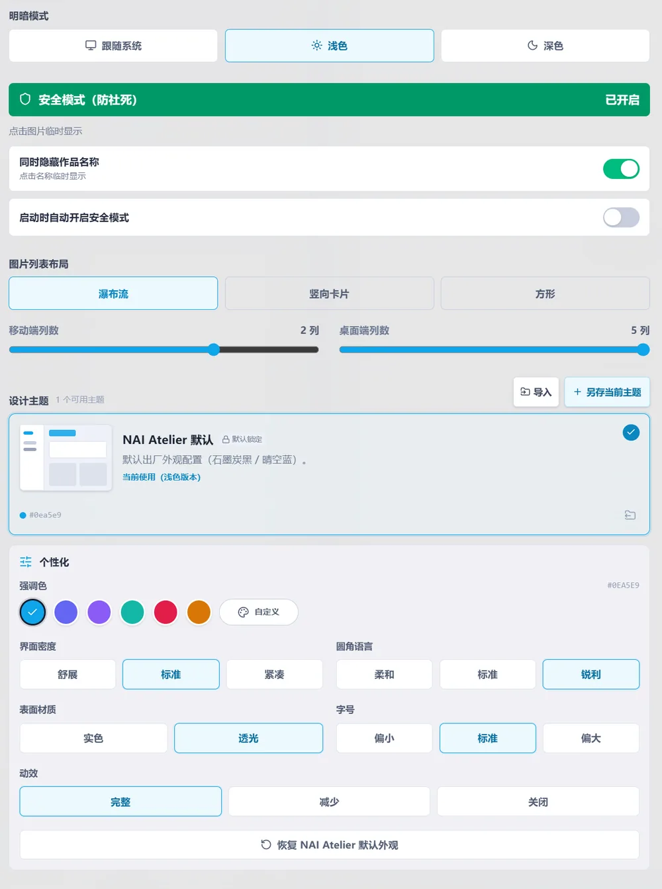
  </a>
  <p><em>全局安全模式配置、移动/桌面端瀑布流列数自定义与透光个性化主题</em></p>
</div>

### 🗄️ 多密钥保管箱（Key Vault）

- 支持录入多组 NovelAI Key 并标注别名（如「Opus 主号」、「拼车号」），在实验室顶栏一键秒切；
- 界面上密钥默认掩码脱敏，防止屏幕共享与录屏泄露。

---

## 💾 本地数据主权与备份

### 电脑是唯一事实源（真身在本地）

工坊保存的作品与核心资料以电脑持久层为准，手机仅负责交互呈现：

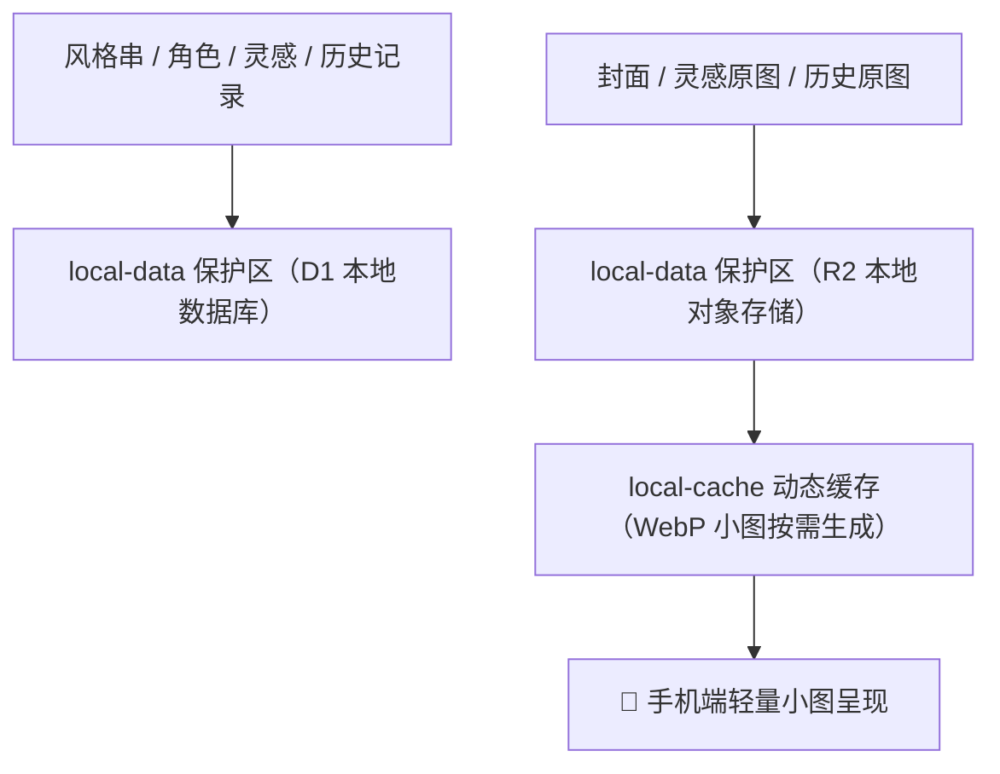
```mermaid
flowchart TD
    A["风格串 / 角色 / 灵感 / 历史记录"] --> D["local-data 保护区（D1 本地数据库）"]
    B["封面 / 灵感原图 / 历史原图"] --> R["local-data 保护区（R2 本地对象存储）"]
    R --> T["local-cache 动态缓存（WebP 小图按需生成）"]
    T --> M["📱 手机端轻量小图呈现"]
```

> ⚠️ **高危提醒：`local-data` 是绝对保护区，禁止随意改动！**
> 
> `wrangler.toml` 中的 `database_id` 是本地存储哈希定位键。**擅自修改或删除 `database_id` 会导致 Worker 加载全新空库，界面表现为历史与预设“瞬间消失”**。备份或迁移时，请**完整打包复制整个 `local-data` 文件夹**！

### 数据备份与恢复

| 使用方式 | 持久化数据所在绝对路径 |
| :--- | :--- |
| **EXE 安装版** | `%LOCALAPPDATA%\NAI Atelier\workspace\local-data` |
| **源码本地部署** | `<项目根目录>/local-data/` |

- **应用内一键备份**：打开「系统设置 → 数据与维护 → 重要数据备份」，设定备份目录后点击「立即完整备份」；
- **停服手动完整备份**：关闭工坊服务，直接将整个 `local-data/` 目录完整拷贝至外部硬盘保存。

---

## 🔗 生态互通与扩展（st-chatu8 联动）

- **智慧姬资产互通（SillyTavern 角色扮演无缝联动）**：
  - 深度参考并对接 SillyTavern 生图扩展 [st-chatu8](https://github.com/damoshen123/st-chatu8)；
  - 支持工坊精选风格串、永久 Vibe 画风编码与历史原图的双向无缝桥接，打通酒馆 RP 沉浸对话与工坊精细打磨之间的资产壁垒；
  - 详细同步规则、二进制去重与协议实现请参阅 [**SillyTavern 桥接技术指南**](./docs/SILLYTAVERN_BRIDGE.md)。
- **👥 多人拼车公共排队（与 st-chatu8 队列协同）**：
  - **并发冲突防护**：当多人共享拼车同一个 NovelAI Opus Key，或工坊与酒馆多端同时出图时，自动接入与 st-chatu8 兼容的云端公共队列服务，按序协调生图请求，防止触发官方并发报错；
  - **Key 哈希安全隔离**：仅使用 Key 的 SHA-256 指纹参与排队握手，绝不向队列服务发送原始 API Key，杜绝凭据泄露；
  - **排队状态实时感知**：生图时直观显示前方等待任务数与柔和渐变动效，支持自定义 15 字「排队个性语」；
  - **随时无损取消**：等待期间随时一键取消排队，不占连接、不扣减额度、不浪费等待时间。

---

## 🛠️ 技术架构

| 层级 | 技术方案 |
| :--- | :--- |
| **前端架构** | React 19、TypeScript、Tailwind CSS、Vite |
| **本地后端** | Cloudflare Workers / Wrangler 本地运行时、Node.js 媒体网关 |
| **持久存储** | 本地 D1 (SQLite) 数据库、本地 R2 兼容对象存储 |
| **图像处理** | Sharp (WebP 按需缩略图转码)、本地 ONNX Runtime (WD Tagger) |
| **局域网认证** | 4 位轻量 PIN 码、HMAC 签名 Cookie、安全暴力破解防冷冻 |

### 源码版常用维护命令

| 命令 | 用途 |
| :--- | :--- |
| `npm run dev:local` | 启动完整本地服务（前端 + Worker + 网关 + 词库） |
| `npm run update:tags` | 从 GitHub 更新并重新编译中英 Tag 分片 |
| `npm run test -- <路径>` | Vitest 快速定向测试 |
| `npm run test:gateway` | 网关、桥接与本地后端集成测试 |
| `npm run test:live-sync` | 显式联网验证 NovelAI 官方常量提取 |
| `node scripts/bump-version.mjs patch` | 规范化版本号递增 |

---

## 📄 来源与致谢

- 基于 [kirafishy/NaiPromptManager](https://github.com/kirafishy/NaiPromptManager) 二次开发并独立维护，保留原有 [MIT 许可证](./LICENSE)；
- 感谢 [@ffdkj](https://github.com/ffdkj) 维护的高质量 [Danbooru 中英对照翻译数据库](https://github.com/ffdkj/ffdkj-Danbooru_Tag-Chinese-English-Translation-Table)；
- 特别感谢 [@damoshen123](https://github.com/damoshen123) 的开源项目 [st-chatu8](https://github.com/damoshen123/st-chatu8)：工坊的「智慧姬互通联动」与「多人拼车云端排队协同」功能的设计与实现均深度参考了该项目；
- 本地反推模型：[SmilingWolf WD ViT Tagger V3](https://huggingface.co/SmilingWolf/wd-vit-tagger-v3) (Apache-2.0)。

### 一点个人吐槽

novelai直到4.5系列的模型都还是opus档会员可以无限生小图（28步，1216*832这个像素尺寸内的）<br>
但8月下旬更新的5系列模型却一改之前的政策，搞了个及其傻逼的电池机制，限额<br>
novelai我给你老冯飞了<br>
去你discord讨论就禁言，去你推特下面反映就拉黑<br>
真是纯野狗公司吧<br>
一个破小说模型训练大半年搞炸炉端出来一坨屎<br>
生图模型也是一直装死不更新，一更新就加限额机制<br>
你和你的孝子贤孙全家飞天

---

<div align="center">
  <strong>详细修改过程请查看 <a href="./CHANGELOG.md">CHANGELOG.md</a></strong>
</div>
