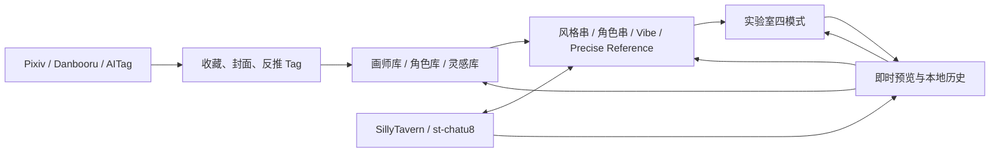

# VIBER_INTENT.md — Viber 创作意志与产品哲学

> **文档地位：产品宪法。** 本文不是功能清单，也不是一次需求的复述，而是从完整 Git 历史、`CHANGELOG.md`、`README.md` 与 `AI_WORKLOG.md` 中归纳出的长期意图。后续 AI 在设计、编码、审查和补文档前都必须阅读。实现细节与本文冲突时，先检查实现是否已经偏离产品方向；官方能力或用户最新明确指令变化时，以事实和用户最新指令为准，并同步修订本文。

## 0. 一句话北极星

**NAI Atelier 是一个由创作者掌控、在本地持续生长的 NovelAI 单人工坊：让“发现素材 → 形成想法 → 单张生成 → 观察反馈 → 微调或局部加工 → 沉淀为个人资产 → 再次创作”成为安静、连续、低摩擦、成本可控的心流。**

它不是公网产品，不是团队协作 SaaS，不是批量跑图器，不是模型博物馆，也不是把所有能力堆到一个页面上的控制台。

---

## 1. 历史不是背景，而是产品选择的证据

项目演进呈现出一条非常明确的收敛路径：

1. **从上游的多用户 Web 应用退回个人所有权。** 早期历史曾有账号、游客、管理员、VIP、配额、审计和云端部署思路。2026-06-27 建立个人分支并保护 `local-data`；2026-07-14 转为完全个人模式；2026-08-16 又删除 840 行不可达的多用户认证与管理死代码。它不是“暂时没做多用户”，而是经过实践后主动否定多用户复杂度。
2. **从 Prompt 管理器长成完整创作工坊。** 风格串、角色、Tag、AITag、Danbooru、Pixiv、WD Tagger、Vibe、Precise Reference、历史、灵感、SillyTavern 桥接逐步连成闭环；产品也最终定名为 **NAI Atelier**，强调的正是工坊而不是面板或平台。
3. **从功能可用走向心流无感。** 历史页即时出现新图、生成结果先于历史落盘显示、固定顶栏、连续滚动、提前两屏预取、真实比例瀑布流、返回原列表位置、当前预览直接成为封面——这些大量“小修复”共同指向同一件事：用户的注意力应留在作品与判断上，而不是等待、找回位置和搬运数据。
4. **从界面堆叠走向克制统一。** 重复标题、说明性副标题、空详情栏、重复 Agent 入口、伪输入框、低频按钮和多余菜单被持续移除；工具栏、语义色、图标、间距、明暗主题、手机触控与四个实验室模式反复统一。所谓“完成”不只是功能存在，而是它在全产品中说同一种视觉语言。
5. **从硬编码某一代模型走向拥抱当前能力。** V4/V4.5 参数、Vibe 与 Director/Precise Reference 奠定现代工作流，V5 又带来新的模型、提示词结构、多角色自由度与透明生成。项目进一步从官方 Web 应用同步模型清单、能力、预设、免费门槛和成本系数，说明正确方向是跟随新代能力，而非维护已经失去创作价值的旧模型入口。
6. **从模糊“免费”走向精确理解资源。** 本地 Anlas 预算、Vibe 编码确认、角色参考费用、共享队列、Key 隔离、Opus 额度实时刷新、失败不记账、官方常量同步健康检查被层层补齐。成本不是附属统计，而是创作决策的一部分。

因此，判断一个新功能是否合适，不能只问“能不能做”，还要问：**它是否延续了这条收敛路径，还是把项目拉回已被历史淘汰的平台化、批处理化和功能堆砌？**

---

## 2. 核心产品哲学

### 2.1 Local-First：电脑是工坊，手机是延伸的手

“本地优先”不是离线口号，而是一组清晰的所有权与边界：

- **电脑是唯一事实源。** 原图、D1/R2 数据、风格串、角色资料、Vibe 编码、参考图、历史、灵感、模型凭据和个人设置以电脑 `local-data` 为准。
- **浏览器不是数据库。** 浏览器缓存可清理、会过期，只承担会话草稿与加速；重要资产必须进入可备份的本地持久层。
- **手机不是第二套系统。** 手机通过家庭局域网访问同一台电脑，使用电脑的 VPN、密钥、原图和模型服务；手机只拿适配后的缩略图与交互，不复制一套权威数据。
- **GitHub 只保存代码。** 私人图片、Prompt、密钥与资料库不应为了“部署方便”被推上公网。备份对象是 `local-data`，不是仓库。
- **联网是取材和调用能力，不是交出所有权。** Pixiv、Danbooru、AITag、NovelAI 与模型供应商都是受控外部来源；素材一旦被选择、整理或编码，就应进入个人可管理的本地知识体系。

为什么不做公网/多用户系统：

1. **创作资料天然私密。** Prompt、浏览记录、角色偏好、图片与密钥没有必要暴露给公共服务。
2. **大图与长期资产更适合本地。** 原图历史、缩略图索引、Vibe 与参考图规模持续增长，本地保存避免重复上传、云存储费用与平台迁移风险。
3. **单人系统不需要组织复杂度。** 用户、角色、配额、审计、租户隔离会产生大量与创作无关的界面和维护负担；历史已经明确删除了这些重量。
4. **用户要的是连续可控，而不是“随处登录”。** 局域网手机访问已经覆盖跨设备使用，同时仍由电脑掌握网络、数据和费用边界。
5. **可修复、可备份、可迁移。** 本地文件和数据库让创作者可以看到真正的数据边界，不被某个公网服务的生命周期绑架。

**未来判断：** 任何要求新增公共注册、陌生人访问、云端权威副本、团队权限、排行榜或社交关系的方案，默认都偏离产品。除非用户明确改变方向，否则应寻找“本机服务 + 受保护局域网 + 可导入导出”的实现。

### 2.2 这是工坊，不是自动售货机

创作的核心单位是一次有意识的迭代：

```text
选择/组合素材 → 生成一张 → 立即看到 → 判断哪里有效 → 调整 → 再生成
```

项目偏好**即时单张反馈**，而不是在后台堆几十个任务：

- 新图一返回就先显示，历史保存稍后无感完成；这说明“看见结果”比流水线记账更优先。
- 生成按钮被移到作品下方并降低静止态强调，作品是视觉中心，按钮只是下一次动作。
- 当前预览可直接成为风格串封面，历史、Prompt 和参数可立即回流；每张图都是一次判断和沉淀机会。
- AITag 曾有“前 N 页后台索引”的机械流程，后来被替换为“看过留下、点开保存”；这正是从挂机收集转向有选择的资料生长。
- 画师/角色“抽卡”用于**发现候选与打破惯性**，不是把生图变成机械抽奖。发现可以随机，最终生成必须回到人的观察与选择。

批量能力并非绝对禁止：批量打标签、移动、删除、缓存、导入等**资料维护操作**可以节省机械劳动；受控的画师基准测试也可用于比较。边界在于：

- 批量维护帮助人整理已做出的选择；
- 批量跑图替人跳过“观察—调整”，破坏创作者心流，还可能放大共享账号并发、额度和误付费风险。

所以实验室默认不应出现张数、无限队列、定时挂机、自动换 Seed 连抽、失败自动花费重试等功能。若用户没有明确要求，AI 不得以“效率”为理由主动添加。

### 2.3 闭环优于孤立功能

一个能力只有接入创作循环才算真正完成。历史反复证明，仅增加入口但不能回流会造成手工搬运和数据孤岛。

理想闭环是：



关键不是模块数量，而是**低摩擦流向**：

- 外部图库图片能直接反推、进实验室、进灵感、设封面或成为参考资产；
- 画师与角色搜索既能查，也能组合、保存和再次调用；
- WD Tagger 在电脑本地处理图片，识别结果无需复制粘贴即可送入实验室；
- 历史保存原图与完整参数，可回到实验室继续改、进入灵感长期整理、创建 Vibe/参考或成为封面；
- Vibe 编码一次长期复用，风格串和历史保存快照，未来修改资料库不破坏旧作品的可复现性；
- SillyTavern/st-chatu8 与本项目双向同步风格串、封面、Vibe 和组合，并索引其历史原图，避免两套创作环境重复维护。

**未来功能必须回答两个问题：它从哪里获得内容？产物能流向哪里？** 如果答案只是“留在这个弹窗里”，设计大概率还没有完成。

---

## 3. 界面审美：安静、紧凑、统一，作品优先

### 3.1 “克制”不是空，而是把注意力还给作品

NAI Atelier 的视觉目标是**安静的现代工坊**：莫兰迪式低饱和、语义化主题色、轻量表面、清晰层级，而非高亮渐变和大卡片争抢注意力。

- 图片和正在编辑的 Prompt 是主角；导航、额度、状态和按钮应退居辅助层。
- 静止状态低强调，悬停、执行和异常时才提高反馈强度；生成动效只在生成中出现。
- 保存用稳定的绿色，Fork/一般主操作用主题色，危险操作用红色，完成/禁用回归中性灰。颜色表达语义，不表达“每个按钮都很重要”。
- 安全模式遮挡私人内容，但不破坏品牌和工作区结构；大图查看则应明确豁免，允许用户在主动进入查看时专注作品。

### 3.2 信息密度来自合理层级，不来自挤压

用户偏好较高信息密度，因为这是长期熟练使用的工具；但密度必须保持秩序：

- 顶栏固定、紧凑、单行优先，高频动作直接可达；低频设置进入与触发器相邻的弹层。
- 删除重复页面标题、营销式副标题、解释性废话、技术内部标记和空白详情栏。
- 不显示不可操作的“伪控件”；只读事实用文本，能调节的参数才用输入控件。
- 控件按创作语义分组，而不是按后端字段或开发方便分组。例如 Variety+ 属于 CFG 引导，不属于质量预设。
- 桌面可以紧凑，但手机触控区仍应可靠；手机不是桌面缩小版，而是同一语义在窄屏下重新编排。

### 3.3 顺滑感来自“位置与状态不背叛用户”

流畅不只是动画帧率，而是用户的空间记忆持续有效：

- 返回时恢复列表位置和目标卡片；切页、开详情、打开 Agent 不应让背景列表重载或丢失进度。
- 状态切换不造成工具栏宽度跳动、图片重排闪烁或生成按钮漂移。
- 滚动用于连续浏览，页码用于显式跳转；预取应发生在用户到达之前。
- 图片在列表中按真实比例完整呈现，不为了网格整齐裁掉创作信息；大图与下载使用原图。
- 同类页面共享相同的工具栏、详情层、图标、确认、语义色与响应式断点。
- 用户正在输入时，补全、翻译、异步响应和快捷键都不能抢键盘、吞标点或覆盖新内容。

**衡量标准：** 完成操作后，用户是否还知道自己在哪里、刚才发生了什么、下一步能做什么？若需要重新找位置、重新导入、重新理解布局，就是工作流债务。

---

## 4. 算力与成本哲学：最大化创作反馈，而非最大化消耗

### 4.1 两种资源，两个边界

必须明确区分：

- **Opus 免费生成额度**：V5 等受限模型即使处于免费档，也会消耗账号共享的 Opus 额度；它不是“无成本”，只是暂不扣 Anlas。额度还会被同 Key 的其他使用者消耗，因此生成前必须刷新真实状态。
- **Anlas**：明确的点数支出。超出免费门槛、Opus 透支、Vibe 新编码、Precise Reference 等会产生 Anlas 消耗；失败或取消不能记账。

界面和 AI 必须使用准确措辞：V5 免费档显示“消耗额度”，真正不占 Opus/Anlas 的路径才称“免费”；估算是本地估算，不冒充官方最终结算。

### 4.2 为什么 Steps 严格限制在 `<= 28`

项目官方运行时默认免费门槛为 `freeMaxSteps = 28`，并会从 NovelAI 官方 Web 应用同步真实值。将控件上限锁定 28 有三层意义：

1. **把常规探索稳定留在免费边界内。** 第 29 步不是普通的“再精细一点”，而可能让整次生成跨入 Anlas 计费。
2. **鼓励用构图、Prompt、Seed、模型与参考方式解决问题。** 无意识堆步数常常只是增加成本，并没有等比例增加作品质量。
3. **让预期可靠。** 参数面板、Agent、费用估算、网关校验和最终请求共享同一边界，避免界面看似免费、实际付费。

如果官方门槛改变，应通过受保护的官方常量同步链更新，而不是在某一个输入框里孤立修改。除非用户明确要求探索付费高步数，否则不要放宽此上限，更不能把“高级模式”当借口悄悄绕过。

### 4.3 为什么默认优先 `832 × 1216`

`832 × 1216 = 1,011,712` 像素，贴近当前约百万像素的免费面积上限，同时宽高都是 64 的倍数；它在竖构图中尽量利用免费像素，又给边界计算留下小幅余量。对应的横图 `1216 × 832` 保持同面积，`1024 × 1024 = 1,048,576` 则正好贴合默认 `freeMaxArea`。

这体现的不是对某个魔法尺寸的迷信，而是尺寸选择原则：

1. **先贴合官方免费像素上限；**
2. **再选择模型友好的 64 倍数；**
3. **在竖、横、方三类真实构图中尽量保留有效分辨率；**
4. **尺寸、Steps、模型和当前 Opus 状态必须一起估算，不能只看某一个字段。**

默认值应让常规探索获得接近上限的画面信息，而不是用过小图片浪费免费空间，也不是用略超门槛的“更整齐尺寸”制造意外扣费。官方门槛变化时，预设与费用说明应一起审计。

### 4.4 点数要花在刀刃上

项目不是“永不付费”，而是反对**无意识、重复、不可复用的付费**。

值得消费的典型场景：

- **Vibe 编码：** 新的图片/模型/Information Extracted 组合花 2 Anlas 编码一次，之后本地永久复用；通过 SHA-256 去重、并发合并和失败恢复避免重复付费。
- **Precise Reference：** 每张参考图每次生成固定额外费用，只有确实需要精细保持角色或画风时才启用，并在提交前展示明细。
- **超出免费边界的精修：** 用户明确知道目标、确认当前变化值得付费时，可以用更昂贵的模型、尺寸或编辑能力完成关键作品。

常规探索则应优先：免费面积、`<= 28` 步、单张迭代、复用已有 Vibe、利用本地 Tag/预设/历史，以及不重复上传或编码。

所有付费路径必须满足：**生成前看得懂、按当前 Key 隔离、共享额度够新、失败不扣、本地记录可追溯、Agent 不可代替用户确认。**

---

## 5. 模型代际：只为仍有创作意义的能力付维护成本

### 5.1 V3 及更早模型已经退出创作面

项目的现役生成体系是 **V4 / V4.5 / V5**。V3 或更早模型不应重新出现在模型选择器、新建预设、实验室能力矩阵或 Agent 推荐中，也不应为了“兼容更多”把现代工作流降级到旧提示词与旧能力。

允许保留的只有**读取历史资产所需的最低限度兼容**，例如识别旧 PNG/JSON 元数据并尽可能导入文本；兼容读取不等于恢复旧模型生成入口。遇到旧配置时，应迁移到最接近的现役语义或明确提示限制，而不是让老模型长期污染 UI、测试矩阵和能力判断。

为什么坚决代际切换：

- 新模型在画面理解、构图、审美和提示词服从上已经形成能力断代；维护旧入口带来的复杂度大于实际创作收益。
- V4/V4.5 引入现代 Prompt 结构、多角色与 Vibe/Director 工具链；V5 又扩展角色数量、自由定位、透明输出和新提示词语义。它们不是同一模型换皮，而是不同创作方式。
- 混用旧模型规则会产生危险的“看似可选”：同一个开关在某模型无效、同一个预设被错误套用、同一个参考工具静默丢字段。
- 精简代际让 UI 能根据真实能力隐藏不支持模块，而不是把所有控件常驻后再用警告补洞。

### 5.2 拥抱体系，不等于盲目追最新

V4、V4.5、V5 各自有现实角色：

- **V4 / V4.5：** 成熟 Tag 工作流、Vibe；V4.5 还承载 Precise/Character Reference 等现有精细参考能力。
- **V5：** 更强的新代生成、多角色自由度、透明背景及新的 Prompt 表达；同时必须尊重当前官方能力中 Vibe/角色参考等可能尚未开放的边界。
- **未来 V6+：** 可由官方运行时同步发现，但未知模型先按保守能力处理，不能凭名字猜支持某项付费或参考能力。

因此，模型行为必须来源于**官方运行时能力表**：模型清单、Vibe、角色参考、透明、流式、多角色上限、质量/UC 预设、免费门槛和费用系数应同源。官方公告与模型专属文档高于通用经验；项目经验必须明确标注，不能伪装成官方规则。

---

## 6. 实验室四模式：共享工坊语言，保持各自纯粹

四种模式同级存在，共享左右工作区、Prompt 语言、参数组件、预览、历史和主题，但不能因“复用组件”而互相泄漏工具或状态。

| 模式 | 核心角色 | 必须保持的纯粹性 |
| --- | --- | --- |
| **文生图** | 从 Prompt、风格串、角色、Vibe/参考开始构图，是新作品和可复用预设的主入口 | 不要求底图；风格串/角色串详情固定落在此模式；完整配置可保存回库 |
| **图生图** | 对整张底图做受控重解释，主要用 Strength/Noise 决定保留与变化 | 不显示或启用蒙版画笔；不要假装局部编辑；底图和 Prompt 都必须显式 |
| **局部重绘** | 对已知局部问题做外科式修改，可使用普通或 Focused Inpainting | 蒙版、选区、上下文和回贴坐标必须准确；不能影响未选区域；工具只在此模式开放 |
| **扩图** | 扩展画布与世界边界，让构图向外生长 | 默认只处理新增边缘；手动调整蒙版需显式开启；不能伪装成 Focused Inpainting |

共同规则：

- 每个模式有独立草稿、Prompt、负面 Prompt、模型与编辑参数；切模式不应互相覆盖。
- 右侧统一以作品预览为中心，底图/蒙版编辑属于左侧“底图与导入”；不要让编辑 Canvas 抢走最终结果的视觉位置。
- Tag 辅助、反推、元数据和预设导入必须作用于当前模式，而不是隐藏的文生图状态。
- 仅在能够完整保存该模式资产时提供“保存到库”；不允许保存半套配置制造不可复现数据。
- 历史永远追加新结果，不覆盖原图；保存真实请求文本、参数、父历史、操作类型和必要资产引用。
- 安全模式、桌面/手机、明暗主题、Key/费用、模型能力和异常恢复必须覆盖四种模式，不能只修文生图。

---

## 7. 资料库的自生长机制

“自生长”不是自动抓取越多越好，而是**每次真实使用都会留下可复用的知识**：

- 画师/角色完整目录提供发现面，但只有生成预览、收藏、固定封面或自定义还原时才形成个人资产。
- Pixiv/Danbooru/AITag 是外部观察窗；浏览留下轻量缓存，点开、收藏、反推、导入时逐级沉淀，不做无边界镜像站。
- WD Tagger 把视觉观察转成可编辑 Tag；中文词库、补全与翻译降低理解门槛，但不得干扰原始输入。
- 历史收藏是低摩擦收件箱，灵感库是经过整理的长期知识库；两者不可合并成一个含义模糊的“收藏”。
- 风格串不是画师名列表，而是一份可组合、可追踪来源、可复现的创作配置；“画师串”更名为“风格串”正是这一认知升级。
- SillyTavern 互通以去重、增量和权威来源规则保持两端一致；不复制其约 11GB 原图，只索引原位置，体现“互通而不重复占有”。

未来增加新来源时，优先设计渐进沉淀：**看过可缓存、选择才收藏、整理才入库、昂贵转换只做一次、旧作品始终可复现。**

---

## 8. 对 AI 协作的期待：理解创作者，再写代码

### 8.1 禁止“自作聪明”的典型方式

AI 不得因为常见产品都这样做，就擅自加入：

- 批量生图、挂机队列、自动连抽、自动高成本重试；
- 公网账号、多用户权限、云端权威存储、团队协作；
- V3/早期模型选择器、“兼容全部模型”的无效选项；
- 与现有语义重复的新页面、新弹窗、新状态栏或第二套组件；
- 不能操作的只读输入框、解释开发内部状态的技术文案；
- 为“以后也许需要”预留的抽象、开关、兼容别名和废弃路径；
- 未经确认的付费调用、删除、迁移、外部同步或密钥操作。

“更多功能”不是默认价值；**更短的创作路径、更少的状态歧义和更可靠的成本边界**才是。

### 8.2 需求推演必须以真实场景为单位

收到一个看似局部的要求时，先还原用户正在做什么。例如“把 none 放第一项”背后不是数组排序，而是四模式、全部模型的“关闭预设”心智一致；“设置跟 Key 走”背后包括额度、预算、队列、统计、迟到事件和结算；“统一输入框”背后包括四模式、中文输入法、补全开关、桌面/手机和明暗主题。

实现前至少回答：

1. 用户此刻处于发现、组合、生成、观察、编辑还是沉淀阶段？
2. 这个改动是否减少一次等待、跳转、重复输入或误付费机会？
3. 同一组件还有哪些模式、页面和入口复用？
4. 当前模式、模型、Key、桌面/手机、明暗主题、安全模式、加载/失败状态是否都成立？
5. 默认值、旧数据、会话草稿、持久化、请求 payload、历史回放和最终展示是否同一语义？
6. 官方能力与本地估算是否同源？有没有把经验误写成官方事实？
7. 产物能进入哪个闭环？返回时用户的位置和未保存内容是否保留？

### 8.3 完整改动的最低标准
### 8.3 验证梯度的权衡与效率原则（Pragmatic Verification）

“贴近改动表面进行验证”不是盲目使用最笨重的工具。**验证的目的是建立信心与防止倒退，而非制造漫长的等待与心流中断。** AI 必须掌握分级验证的权衡：

1. **分级验证（Pragmatic Verification）**：
   - **普通 UI / 样式 / 局部逻辑**：执行精准静态代码自审、TypeScript 类型检查（`npx tsc -b`）与定向单元测试（Vitest），追求 1~3 分钟内的敏捷反馈闭环。**严禁**为了普通的样式修补、按钮隐藏或局部文案改动，动辄启动全套打包构建 + Headless 真实浏览器端到端模拟，造成 20~30 分钟的冗长等待与心流中断。
   - **复杂全流程 / 核心状态机 / 破坏性重构**：只有当涉及复杂 Canvas 蒙版绘制与坐标回贴算法、多端数据同步协议、跨系统持久化迁移或涉及破坏性重构时，才采用全套构建 + 端到端真机/浏览器像素级验收。
2. **避免盲目写反逻辑与单测假阳性**：
   - 单测不能只断言节点存在或浅层快照。在处理 Tailwind 响应式断点（如 `hidden lg:flex` vs `lg:hidden`）或显示/隐藏逻辑时，必须具备精确的代码自审意识与逻辑推演能力，避免写反条件。
   - **重型流程不能代替轻量、精准的逻辑思考**。依赖笨重的外部工具链来碰运气找 bug，是工程能力不足的体现；先在脑海与代码中建立精确的状态转移模型，再选用最经济高效的工具验证。

### 8.4 完整改动的最低标准

一个改动不能只让“眼前局部看似正确”。必须沿真实链路检查：

```text
入口 → 本地状态 → 持久化/迁移 → 编译后的 Prompt 或请求参数
→ 网关校验 → 费用确认与结算 → NovelAI 响应
→ 即时预览 → 本地历史 → 再导入/回放 → 桌面与手机展示
```

并非每次都修改整条链，但必须确认哪些环节受影响。若修复同类一致性，主动同步所有明确相关的低风险位置；若涉及产品方向、付费、删除或迁移，则停在授权边界前与用户讨论。

验证策略应精准匹配改动风险：界面与交互结合精确自审与定向单测，费用逻辑跑边界测试，复杂重构做端到端链路验证，bug 修复先复现再证明不再发生。不要用“能编译”替代行为证据，也不要用“过度测试”扼杀迭代效率。
---

## 9. 面向未来的决策准绳

当文档没有直接答案时，按以下顺序裁决：

1. **创作者主权**：数据、密钥、费用与最终选择是否仍由用户掌握？
2. **心流连续**：是否缩短“想法到反馈再到下一次调整”的距离？
3. **单张有效反馈**：是否帮助观察和判断，而非鼓励无脑增加样本量？
4. **成本可预期**：是否默认靠近免费边界，并在必要付费时让价值和代价同时可见？
5. **现役模型价值**：是否发挥 V4/V4.5/V5 的真实差异，而非为旧模型和未知能力增加噪音？
6. **闭环与自生长**：结果是否能沉淀、复用、追溯，又避免重复存储与重复付费？
7. **克制统一**：能否复用现有语言、减少一个入口或状态，而不是增加第二套？
8. **完整一致**：相关模式、终端、主题、Key、能力与历史是否一起成立？
9. **可逆和可维护**：六个月后能否看懂数据真源、删除废路径并安全迁移？

若一个方案在“通用软件功能”上更强，却在这些问题上更弱，应拒绝它。

---

## 10. AI 开工前的极简检查

- [ ] 我正在维护的是**本地单人工坊**，不是公网平台。
- [ ] 我能用一句话说明这个改动如何改善真实创作循环。
- [ ] 我没有擅自加入批量跑图、旧模型、平台化或无用抽象。
- [ ] 常规生成仍优先 `<= 28` 步与免费像素边界，付费含义准确。
- [ ] V4/V4.5/V5 的能力按官方运行时判断，V3 只做必要历史读取兼容。
- [ ] 四种实验室模式保持独立语义，共享组件没有造成状态或工具泄漏。
- [ ] 同类入口、桌面/手机、明暗主题、安全模式、Key 与异常状态已同步检查。
- [ ] 结果可进入历史/资料库/实验室闭环，用户位置和草稿不会无故丢失。
- [ ] 界面让作品优先，高频动作直接、低频动作收纳、颜色和控件语义统一。
- [ ] 我已用真实场景验证，而不是只证明代码可以编译。

**最终目标不是替用户做更多决定，而是让用户每一次有意识的创作决定更快抵达作品。**
