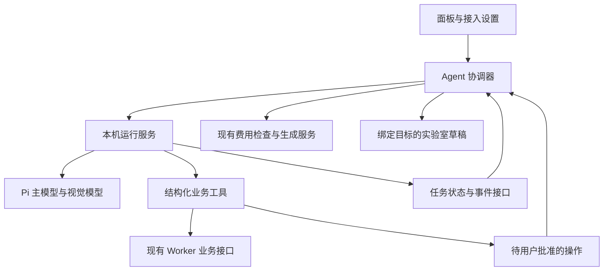

# 内置 Agent 全链路审查与优化计划

审查日期：2026-10-03。基线提交：`4376fe2`，基线版本：`1.17.0`。审查工具：Codex（GPT-6）。

本计划面向 NAI Atelier 的日常个人创作：让用户能顺利接入自己的模型服务，知道 Agent 正在处理哪份作品，放心停止或接续任务，并准确判断已经发生的修改与费用。结论是保留现有业务工具与本地数据体系，优先重做任务协调和 API 接入体验，再整理创作上下文与工具范围。单独美化聊天面板无法解决当前主要问题。

用户已授权提出较大幅度调整。本次完成审查与可执行计划，未修改运行时代码；以下方案尚未实现，不能将计划描述为现有能力。

## 审查范围与证据边界

完整阅读产品意图与协作规则，并对照 README、CHANGELOG、AI_WORKLOG。沿前端入口、配置表单、客户端协议、本机网关、Pi 适配器、业务工具、Worker 数据接口、实验室应用与历史回放审查。

| 层 | 主要文件 | 审查重点 |
| --- | --- | --- |
| 全局入口 | `App.tsx`、`components/chain/PresetSourceBadges.tsx` | 跨页面挂载、当前编辑对象、关闭与重开 |
| 接入设置 | `components/PromptAgentSettings.tsx` | 服务配置、模型发现、连接测试、保存与选用 |
| 聊天工作台 | `components/PromptAgentPanel.tsx` | 发送、停止、附件、确认、轮询、回放、错误 |
| 客户端 | `services/promptAgent.ts`、`types.ts` | 流式事件、错误传播、会话与草稿契约 |
| 本机服务 | `scripts/prompt-agent.mjs`、`scripts/media-gateway.mjs` | 凭据、运行生命周期、预算、视觉模型、工具与确认 |
| 数据接口 | `worker/routes/historyRoutes.ts` 及业务路由 | 查询规模、写入边界、历史与资料读取 |
| 创作应用 | `components/ChainEditor.tsx`、实验室相关服务 | 四模式草稿、费用确认、冲突保护与撤销 |
| 模型适配与知识 | 已安装的 Pi 适配器、`scripts/novelai-agent-knowledge.mjs` | 协议选择、能力来源、系统指令与项目经验 |

已执行 42 项前端定向测试、40 项后端 Agent 定向测试，全部通过；另用合成数据和模拟网络完成 8 个缺陷复现。后端审查在临时源码副本执行，没有复制、读取或修改真实 `local-data`，内置私人预设使用缺失时的中性回退。没有调用真实 LLM、NovelAI 生图或 Vibe 编码，没有操作外部账号。

本次是代码链路审查、组件测试和隔离复现，不是实网供应商认证，也不是桌面／手机浏览器逐像素验收。供应商最新模型、价格、服务可用性和系统代理行为没有实网验证；文中关于价格与模型的事实仅指当前项目实现。优先级是本项目内的实施顺序，不能等同于公网漏洞评级。

## 应保留的基础

- 凭据采用独立 AES-256-GCM 密钥，公开配置不返回保存的明文 API Key；局域网认证和模型凭据分开。
- Agent 只有结构化业务工具，没有通用 Shell、任意文件操作或任意图片地址入口；历史和参考图使用项目资产接口。
- 实验室修改先进入服务端草稿，成功后整体应用，已有编辑版本检查与一次撤销能力。
- 已有危险操作确认、低消耗与 NovelAI 费用检查、Vibe 去重及共享生成服务，适合继续复用。
- 会话预设修订冻结、中文输入法保护、延迟落盘、流式工具展示、主题变量和移动触控已有基础，不应在重构时倒退。

这些基础仍存在下述链路缺口，不能由“部件已具备”推断“端到端已经可靠”。

## 最高优先级问题

### 生图回执缺少确认状态

位置：`scripts/prompt-agent.mjs:3326`、`:2521`；`components/PromptAgentPanel.tsx:610`；`components/ChainEditor.tsx:1819`。

`request_generation` 创建待确认记录，但前端生成分支直接执行 `onRequestGeneration`，随后发送 `finalize`。后端要求记录的 `approved === true`，这一分支没有发送 `confirm`；回执错误又被前端 `.catch(() => {})` 隐藏。隔离复现 A 已证明回执被拒绝。即使生成结果已经出现，Agent 工具仍可能等待到十分钟超时，再报告取消。

修复应统一生图、编码和危险操作的握手：准备 → 用户决定 → 执行 → 完成／失败／取消。取消直接结束等待；成功只完成一次，不重发生成请求。免费生成的确认语义也须明确：当前 `cost === 0` 的常规路径直接生成，README 的“亲自点击确认后执行”描述并不完全成立。建议 Agent 请求始终提供一次紧凑确认，标明免费、消耗 Opus 额度或 Anlas；复用现有确认框，不叠加第二个费用弹窗。

验收：成功生成、拒绝生成、费用检查失败、执行异常、回执迟到均进入唯一终态；没有十分钟悬挂，也没有重复生成。只用模拟生成服务验证。

### 确认令牌没有绑定具体后果

位置：`scripts/prompt-agent.mjs:2640`、`:1972`。

待确认记录只保留会话、定时器和回调，没有保存批准的 action、resourceId、payload。执行端校验会话与 approved 后使用客户端重新传来的操作。隔离复现 B 中，对“删除一条风格串”的批准被用于模拟“清空历史”，仍获接受。当前 UI 通常会传原参数，但后端没有保证“只执行用户看见并批准的那件事”。这不表示模型拥有直接发 HTTP 或任意调用删除接口的能力。

修复应将确认记录绑定到 runId、操作、对象、规范化参数、Key 指纹和失效时间；执行只读取服务端保存的内容。消费令牌必须先于异步执行，重复请求返回原结果或明确拒绝；切 Key、切目标、停止任务和过期使批准失效。会影响真实 Key 的配置更新不在本轮执行。

验收：改 action、改对象、改清理条件、跨会话、跨任务、并发重复执行和过期批准全部拒绝，原操作执行一次。

## 高优先级问题

| 编号 | 已观察的实现与依据 | 用户影响 | 优化与验收 |
| --- | --- | --- | --- |
| H01 | `services/promptAgent.ts:449` 将 JSON 解析和 `onEvent` 放在同一个 try/catch；面板收到 error 会抛异常。复现 F：回调异常被吞，run 正常返回 | 服务端失败被当作坏事件跳过，用户可能只看到空回复或“准备就绪” | 只容忍 JSON 语法错误；业务异常正常传播。收到 error、处理 action 抛错、缺少终态的 EOF 都有明确状态 |
| H02 | `scripts/prompt-agent.mjs:1231` 从预设读取上下文与输出上限，默认 128k；真实 run 调用也未传实际 model。复现 C：8k 模型仍使用 128k 预算 | 小上下文模型更易报超限，大模型历史又可能提前裁剪 | 预算统一以当前运行模型为准；包含完整工具 schema、图片与系统开销，并与实际输出参数一致。8k／32k／128k／大上下文边界回归 |
| H03 | `components/PromptAgentPanel.tsx:342` 回放只拼文本；`:381` 轮询只刷新状态／最终消息。网关发出的 done/error 不经过持久化 taskEmit，任务存储没有最终草稿 | 重连后看见 Agent“完成”，实验室修改却没有恢复；执行中没有持续文本恢复，running 还被回放文案称为异常中断 | task API 返回可恢复状态、事件游标和最终产物；恢复后对原目标显式应用或提示冲突。正常执行、断线、进程重启分开表达 |
| H04 | `scripts/prompt-agent.mjs:2131` 按 session 存最多 500 事件，没有任务隔离和 runId。复现 H：旧任务与新任务事件共存；requestId 被脱敏后不能用于接续确认 | 回放混入旧任务；在确认阶段断线后无法判断哪个请求仍有效 | 每轮具有 runId 与递增事件序号；恢复通过状态接口取得有效确认摘要，历史审计不暴露可执行令牌。不复放旧 action 造成副作用 |
| H05 | `scripts/prompt-agent.mjs:3761` 独立视觉 Agent 未接主任务取消；`:2504` abort 只停止主 Agent，等待确认也没有立即取消；主流程没有明确总时限或轮数限制 | “停止”后视觉请求或确认等待可能继续，费用与等待不易预期 | 单次运行持有取消控制器，覆盖主模型、视觉、工具网络和等待确认；设有界轮数、输出与空闲超时。停止不能撤回供应商已处理的调用，应据实显示 |
| H06 | `types.ts` 的 PromptAgentDraft 不含模式／目标；`ChainEditor.tsx:1801` 取文生图状态，`:1819` 估价与执行也是文生图路径，四模式共用入口 | 用户处于重绘或扩图时，Agent 修改的可能是文生图草稿；请求出图也可能执行另一种模式 | 引入目标对象与当前 mode，编辑模式先支持提示词／参数建议，缺少底图／蒙版就明确拒绝执行。完整编辑生成随后接共用生成流程，禁止猜测蒙版或自动转文生图 |
| H07 | `PromptAgentPanel.tsx:540` 发送 clientSettings 不含 splitPromptFields，后端 `:777` 默认拆分模式 | 单一全局输入下，Agent 仍按 base／subject 拆分，违背当前编辑器语义 | 显式传真实输入布局、模式和模型能力；两个布局与四模式对照测试，不靠缺省猜测 |
| H08 | `scripts/prompt-agent.mjs:1845` 连接测试先强制 GET `/models`。复现 G：404 直接失败，不进行已填写模型的推理测试 | 某些仅开放推理接口的兼容服务明明可以使用，却显示连接失败 | 模型发现与功能测试解耦；手填 ID 可以直接测试。诊断分网络、鉴权、协议、文本、工具与图片接受，不把列表不可用等同于推理不可用 |
| H09 | `scripts/prompt-agent.mjs:1811` 保存默认选第一模型；`PromptAgentSettings.tsx:845` 编辑接口也走保存并选用；DeepSeek 登录只存 Key，不验证推理 | 编辑请求头或名称会换掉全局默认模型；“已配置”容易被理解为“验证可用” | 保存／设为默认明确区分；编辑保留现有模型。状态分已保存、未验证、验证通过、验证失败，验证记录绑定配置指纹 |
| H10 | `scripts/prompt-agent.mjs:2462` 回放每个 toolCall 都写 state=done，不关联 toolResult。复现 E：失败工具恢复为完成 | 当场失败，重开对话后变成绿色完成，无法据此判断资料是否改过 | 按 toolCallId 合并结果、错误和终态；没有结果的标成中断／未知，不冒充成功 |
| H11 | `scripts/prompt-agent.mjs:3671` 加入 startingAgents 后，预设冻结等 await 在生命周期 try/finally 外。复现 D：模拟启动 I/O 异常后集合未清理 | 会话一直提示正在运行；积累后占住最多三个并发名额 | 从取得运行租约开始覆盖完整 finally，停止启动中任务也有路径；注入每个初始化失败并检查名额归还 |
| H12 | `scripts/prompt-agent.mjs:3163` 可直接提高 Anlas 本地预算；`:3172` 可关闭共享队列，仅依靠模型指令判断用户是否授权 | 这些设置会改变后续费用或并发保护，虽不是即时扣费，仍需用户掌控 | 读设置不打扰；提高预算、关闭队列等展示变化与后果后确认。不得由模型为了完成任务自行放松保护；不新增复杂权限平台 |
| H13 | `scripts/prompt-agent.mjs:211` 检查 DNS 后，`:2681` 又用域名 fetch；没有固定到已检查 IP。IPv6 检查也依赖部分字符串前缀 | 公网读取保护仍有 DNS 二次解析及地址形式覆盖缺口；本轮未进行实网攻击验证 | 复用已有安全下载思想，规范化地址、逐跳校验、固定连接与 SNI；代理／TUN 虚拟 DNS 另有受控路径。用合成 DNS／连接器测试，不探测真实内网 |

H02 的输出预算还必须落实到流式调用配置，不能只修 Inspector 数字。H05 的限额需要明确 LLM 费用独立于 NovelAI Anlas，不能用 Anlas 预算冒充模型服务预算。

## 中优先级问题

| 编号 | 证据与体验问题 | 建议 |
| --- | --- | --- |
| M01 | `detectModelCapabilities` 的 unknown 在表单中显示为“自动”；自动来源包括元数据、项目内置目录和名称推断，获取模型并不是实测。连接测试只证明图片请求被接受，没有证明理解图像 | 保留“未知／推断／声明／人工／已测”区别；推断不自动打开昂贵视觉路由。模型列表可手工补充，不强迫一次配置全部能力 |
| M02 | `sanitizeCustomProvider` 将所有自定义价格清零，UI 只在 cost.total 为真时显示价格 | 价格未知显示“费用未知”，不能当免费；可选手动价格估算，Token 与费用分开，总览包含主模型、视觉和连接测试 |
| M03 | `normalizeThinkingLevel` 为新会话选择最高支持强度；主运行缺少清晰输出／轮数控制 | 默认选择适中且明确的策略，记住用户手动偏好；最高强度可选。不要把每次资料查找都变成长推理 |
| M04 | Worker `/api/agent/library` 全量读表，`search_project_library` 再在 Node 过滤；每次 `listSessions` 读取所有完整会话文件 | 查询与分页下推 Worker，先返回摘要再按 ID 获取完整条目；会话摘要可先做不改存储格式的内存缓存。禁止通过删会话或清数据提速 |
| M05 | 工具仍有 `manage_aitag` 的长时页数索引入口、`save_artist_profile` 的生成预览要求；与现行“看过留下”和目录不生成基准图的产品意图不一致 | 删除过时可执行入口、相关描述和测试分支；保留已有数据兼容读取，不清理私人历史资产。先确认复用接口影响，避免扩大到图库工作流 |
| M06 | `PromptAgentPanel.tsx:809` 超大／格式不符附件被静默跳过；运行中追加只发送文本，不发送当前图片 | 当场说明拒绝原因；图片先压缩预览、标明将交给哪个服务。执行中附件明确留待下一轮，或禁止带图追加，不能显示已发送却遗漏 |
| M07 | 输入、附件、编辑状态由面板统一 state 保存；会话切换没有完整按会话管理，面板关闭会卸载 | 每会话保留会话草稿，切换不串图、不串输入；关闭重开恢复文字。图片仅作有限会话缓存，需要重新选择时明确说明，不新增复制历史 |
| M08 | 自定义服务更改、凭据、选择与预设写配置使用不同路径；只有预设路径有 configWriteTail，CUSTOM_PROVIDERS 又是模块全局 Map | 一个服务实例持有 provider registry 和串行配置提交，写成功后再发布运行状态；注入写失败与并发请求验证。不要趁机迁移现有密钥文件 |
| M09 | 几十个完整工具每轮可用，常驻技术块包含大量创作经验；runtimeContext 在运行开始构建，随后改模型／草稿没有重建 | 核心约束常驻，模型知识按需读取；本轮状态每次组装时更新。工具分任务范围，先统计真实 schema Token 与行为再收敛，不能仅凭减少工具数宣称提速 |
| M10 | 没有已配置服务时，聊天空态依然以开始对话为主；设置把注入预设卡片放在服务接入之前，仍保留通用 OAuth 页面但目录只有 DeepSeek API Key | 首次空态直接带到“连接模型服务”；首页优先展示当前服务与可用性，注入管理留高级区。删除不可达 OAuth UI 时先检查兼容需求，保留独立会话预设能力 |
| M11 | “重新生成／编辑重发”回退聊天消息，不回滚已经完成的项目写入；实验室撤销也只恢复草稿 | 明确“重新回答，不撤销已完成资料修改”；写工具建立幂等约束或先读再判重。撤销提示说清范围，不承诺整项目事务 |

## API 接入的目标体验

### 现有界面怎样接入

现在可从「系统设置 → 项目 Agent → 连接服务」进入。内置 DeepSeek 走「常用服务商登录」填写它自己的 API Key；其他服务走「添加自定义接口」。LLM Key 与 `pst-` 开头的 NovelAI Key 是两套凭据，配置 NovelAI 不会自动让 Agent 可用。

自定义接口需要名称、协议、Base URL 和至少一个模型 ID。Base URL 填供应商给出的 API 根路径，不填网页地址或完整聊天端点；版本路径应与该协议和供应商要求一致。当前界面以 `/v1` 举例，不能据此要求所有协议都手工追加同一后缀。HTTP 仅接受电脑本机回环地址；手机访问时 `localhost` 指向发请求的电脑。第三方鉴权通常放 API Key 框，附加头仅填供应商确有要求的非敏感字段。

「获取模型」会联网读取列表；列表失败时可手填真实模型 ID。「测试连接」会执行模型请求与工具探测，可能收费；当前代码还要求 `/models` 成功，应注意 H08。保存后应核对全局默认模型；已经存在的对话独立保存其主模型，需要在面板模型菜单中切换，不会因全局默认改变自动换模型。

这一说明仅解释现有实现，不代表已验证任何具体供应商。不要为了审查而代用户点击收费测试。

### 建议的接入流程

保持一个接入窗口，不增加独立配置中心。基本区域只显示名称、地址、协议、Key 与模型选择。上下文、最大输出、推理、识图、额外请求头和价格放在展开的高级区域。内置 DeepSeek 可直接进入 Key 输入，不先经过只有一个选项的供应商列表。

- 地址变化时显示按适配器计算的请求地址预览，识别误贴 `/chat/completions`、`/responses`、网页路径或重复版本段；不要猜测性改写供应商的反向代理路径。
- 获取列表可以失败，手填模型始终可用；大量返回模型先搜索／选择，再加入配置，不能全量自动加入后又被后端 50 项限制静默截断。
- 保存默认只保存；新服务可明确勾选“设为默认”，编辑已有服务保留原选择。已存在会话继续使用自身模型，在入口说明作用范围。
- 功能测试按钮明确写“测试模型，可能收费”；测试哪个模型由用户选择。视觉请求另行明确开启，不自动拿主模型的工具能力要求去拒绝仅用作视觉的模型。
- 结果就地保留：网络可达、鉴权、文本、工具、图片请求接受分别给出通过／失败／未测；不能只用短暂 toast 总结。
- 错误包含可执行下一步：地址或协议检查、Key／权限、模型 ID、429 等待、供应商 5xx、系统代理；保存请求摘要与耗时供日志导出，移除 Key、敏感头与 URL 查询凭据。
- 未验证可保存；测试失败不覆盖旧可用配置，修改后清除旧“验证通过”状态。空 Key 的本地模型仍能用。

首条对话只显示紧凑的服务名称、模型与准备状态。用户应能辨认自己正在使用哪个供应商，而不是只看剥掉来源的模型尾名。

## 目标架构与运行体验

保留本机 Node 网关、Worker、Pi 适配器与既有 UI 组件。建议抽出小范围模块：服务注册与验证、运行生命周期与上下文、确认执行、业务工具注册、任务状态与事件。文件拆分是服务于边界，不能先拆出大量无实际用途的接口。

前端由应用级的单个 Agent 协调器持有正在执行的任务与恢复逻辑，面板只是展示与输入。现有桌面停靠和手机贴边入口继续保留；编辑器通过目标适配器提供草稿，不让多个编辑器各自持有同一会话的隐含执行状态。

每轮目标包含会话、runId、资料 ID、模式与草稿版本。完成时应用到原目标；用户手动修改后保留两份内容，提供查看差异、应用选定修改或放弃的紧凑操作。不要只提示“未覆盖”后丢弃 Agent 的成果。自动应用无冲突且用户请求的草稿修改，保留一次撤销；写回资料、生成、编码和删除按各自后果确认。

任务状态至少区分准备中、执行中、等待确认、正在执行已批准操作、完成、失败、取消、服务中断。网络离线不是服务中断；重连从最后游标获取新事件，展示完整状态。确认归属必须能处理电脑与手机同时打开，同一请求最多被一个执行者消费。浏览器关闭后继续的任务若需要新确认，应可见地进入等待，超时记录真实原因，不能向无人可接收的连接发出请求后伪装成已取消。

四模式改造分两步：先保证识别当前模式和编辑对应 Prompt／参数；随后接入当前模式的真实底图、蒙版状态、坐标转换与共用生成。图片只用资产引用，不把原图不断放入聊天历史。用户未指定编辑区域时，Agent 提建议，不能自动绘制蒙版或切换模式生成。

## 分阶段实施计划

| 阶段 | 交付内容 | 涉及问题 | 规模与依赖 | 完成条件 |
| --- | --- | --- | --- | --- |
| 1 可靠性修复 | 统一确认握手、绑定后果与单次消费、修复错误传播和工具回放、启动清理 | 两项最高优先级，H01、H10、H11 | 中；可在现有结构完成，首批提交 | 隔离复现 A／B／D／E／F 对应的正确行为测试全部通过，无重复收费／删除 |
| 2 API 接入 | 基本／高级表单、手填与发现解耦、分项验证、保存与默认分离、配置事务 | H08、H09、M01、M02、M08、M10 | 中；可与任务设计独立实施 | 兼容列表 404、空 Key 本地服务、多模型、仅视觉服务；配置不误切模型，不自动收费测试 |
| 3 任务生命周期 | 应用级协调、取消传播、每轮状态与游标、断线恢复、成本与循环上界 | H03、H04、H05、M03、M07 | 大；依赖阶段 1 | 页面关闭／重开、手机断线、双端接续、停止与进程中断都有准确终态，最终产物可恢复 |
| 4 创作上下文 | 真实模型预算、输入布局、目标绑定、四模式 Prompt、冲突差异与精确应用 | H02、H06、H07、M09 | 大；依赖阶段 3 的目标契约 | 四模式不会互相改写；8k 模型不会按 128k 截断；产物不覆盖手动编辑 |
| 5 工具与数据查询 | 保护设置确认、移除产品拒绝的工具入口、分页搜索、幂等写入、安全网页连接 | H12、H13、M04、M05、M11 | 中到大；依赖阶段 1，按模块拆提交 | 查询规模有界；失败／重复请求不伪造成功，已有数据和资产兼容读取 |
| 6 界面收口与验证 | 附件反馈、当前目标与服务、真实任务摘要、移动键盘与主题状态、文档 | M06 及全部可见交互 | 中；依赖前五阶段 | 用户完成接入、修改、观察、生成、停止、恢复全流程，视觉与语义一致 |

这些规模是工程判断，不是工期承诺。每阶段拆成独立任务提交，按 feat／fix／refactor 递增版本并更新中文日志。先以阶段 1 建立完整握手，避免直接同时替换存储、执行器与界面。

阶段 3 若需要改变 `local-data` 内部持久化结构，实施前必须按照 AGENTS.md 单独确认迁移方案；优先评估维持现有文件位置、兼容读取的方案。本计划不批准删除、移动或批量改写现有会话，不调整 D1/R2 存储键。

## 验收矩阵

| 场景 | 核心断言 | 验证方式 |
| --- | --- | --- |
| 新用户无服务 | 直接给接入入口，不让用户先发消息才发现没 Key | 组件交互 |
| 三种协议 | 地址预览对应适配器；已填模型可绕过列表发现；错误分项 | 模拟 HTTP／Pi 适配器 |
| 配置编辑与模型切换 | 保存不误换默认；已有会话作用域准确；测试状态失效 | 服务与组件回归 |
| 视觉自动／手动 | 指明供应商与费用未知；图片接受不冒充理解；停止传播 | 模拟模型与工具 |
| 文本与工具错误 | error 被展示；EOF 缺终态不报成功；工具重开仍为失败 | 客户端流与真实面板回归 |
| 生图／编码／删除 | 批准只对应那次后果；取消／异常／超时都结束；重复执行一次 | 前端确认＋后端控制＋模拟业务服务 |
| Key 切换 | 确认期间变更使旧收费批准失效，队列与预算保持原有指纹语义 | 共用费用服务定向测试 |
| 长对话 | 预算来自真实模型，包含 schema／图片，裁剪保留工具组与用户轮次 | 边界与实际请求组装 |
| 四种模式和预设入口 | 当前模式内容完整，角色、参考和坐标规则同源；不能误生文生图 | 工作台与生成服务定向测试 |
| 关闭、刷新与双端 | 事件去重，最终草稿恢复到原目标；待确认操作不重复 | 模拟断线，随后必要的浏览器验收 |
| 手动输入冲突 | 用户修改保留，Agent 产物仍可查看，撤销范围准确 | 组件状态与目标版本测试 |
| 手机与外观 | 360／390px、软键盘、亮暗、大字号、安全模式、减少动画可操作 | 定向样式自审，最终浏览器抽查 |
| 大资料库 | 搜索分页，摘要有界，不读取整份会话／整库 Prompt 才开始响应 | 隔离规模数据与计数断言 |
| 联网读取 | DNS 变化、IPv4／IPv6、重定向、代理、取消与限时均守边界 | 合成连接器测试 |

普通表单／文案修改采用定向 Vitest；网关和 Worker 实现修改运行 `npm run test:gateway`，官方常量保护区改动另加 live-sync。复杂生命周期重构完成后才执行全构建与必要浏览器链路验收。提交的密钥扫描、ESLint、TypeScript 检查交给 pre-commit，不重复运行。

验收数据全部合成。真实供应商验证必须由用户明确选择模型并批准其潜在费用；计划不以“测试”为理由自动调用已保存 Key。

## 本次复现记录与测试缺口

| 复现 | 隔离检查 | 结果 |
| --- | --- | --- |
| A | 创建 request_generation，再按当前前端行为仅 finalize | 被后端拒绝，待确认未完成 |
| B | 模拟批准删除一条 chain，再用同令牌请求 clear_history | 模拟 Worker 收到清空路径；未调用真实数据接口 |
| C | 将 8192 上下文模型传给 assemblePromptContext | 预算仍为 128000 |
| D | 模拟 run 启动时 readSession 抛 I/O 异常 | startingAgents 保留该会话 |
| E | 保存 toolCall 与 isError toolResult，再加载历史 | 工具显示 done |
| F | 合成 NDJSON error，回调按面板行为抛异常 | 客户端吞异常并正常返回 |
| G | 模拟已填模型的接口 GET models 返回 404 | 功能探测未执行，连接测试直接失败 |
| H | 连续追加两轮事件再取任务 | 旧事件仍在，没有 runId 隔离 |

前端基线命令：`npx vitest run components/PromptAgentPanel.test.ts components/PromptAgentSettings.lab.test.ts services/promptAgent.lab.test.ts`，42／42 通过。

后端基线命令在临时源码副本执行：`node --test --test-name-pattern 'prompt agent|creative lab|creative preset|assemble|context' scripts/media-gateway.test.mjs`，40／40 通过。没有运行无关测试或全量构建。隔离复现使用本次临时脚本，不将断言错误行为继续存在的脚本作为产品回归测试提交。

现有前端 Agent 面板测试只有 4 项，主要验证标题与注入展示；设置及客户端测试主要覆盖预设实验室。后端确认测试证明“工具会要求确认”，没有证明真实前端的批准与完成能闭环。这解释了为什么测试全绿而关键使用路径仍有缺陷。

## 实施边界与待评审取舍

用户直接要求的是后端到前端的全面审查、实际 API 接入体验与优化计划，本次已覆盖。主动补齐了费用与确认、视觉取消、断线恢复、四模式上下文、查询规模、测试有效性和产品意图一致性。

建议采用应用级协调器、分项连接验证、Agent 生成始终一次确认、无冲突自动应用草稿以及较适中的默认思考强度；这些是建议的产品选择，尚未写成已确认的长期偏好。完整编辑模式生成可作为后续独立功能，不需要为了它阻塞前期可靠性修复。

需要单独评审的事项是：涉及会话／任务持久化结构时的迁移方案、具体 LLM 费用上限与默认思考策略、编辑模式自动生成的最终交互。现有授权足以设计与修复普通代码；不代替用户批准真实收费请求、私有数据迁移、删除资产、账号／密钥操作或发布。

建议首先完成阶段 1，再交付阶段 2 的接入体验。后续每批都以“用户知道自己接了什么服务、Agent 在处理哪份内容、做过什么、是否还能停止与恢复”作为完成标准。
